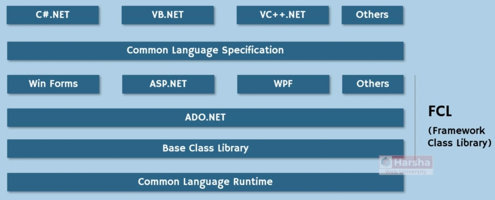

# Architecture

## Core of .NET

### Versions

- **.NET Framework**: 4.5.2, 4.6, 4.6.1, 4.6.2, 4.7, 4.7.1, 4.7.2, 4.8
- **.NET Core**: 2.1, 3.1
- **.NET**: 5.0, 6.0

!!! info

    - .NET Framework 4.8 was the last version
    - .NET Core after version 3.1 was renamed into the .NET 5.0
    - Never .NET Core 4.X or .NET 4.X was released to prevent name complexity with .NET Framework 4.X

### CLR & FCL

| CLR                                                   | FCL                                                                          |
|-------------------------------------------------------|------------------------------------------------------------------------------|
| **Common Language Runtime**                           | **Framework Class Library**                                                  |
| Run Time Engine that is used to execute applications. | Object-Oriented Collection of Classes that are used to develop applications. |

- CLR: Runner of IL code in the Linux, Windows, etc
- FCL: All the predefined codes inside of .Net

### Common Language Infrastructure (CLI)

## Common Language Specification (CLS)

Contains a set of rules (concepts) that are common to all .NET languages such as C#.NET, VB.NET, etc.

Common rules of CLS:

- CTS (Common Type System): Contains data types such as Int32, Int64, Single, Double, etc.
- Classes & Objects
- Reference Variables
- Method Parameters
- Generics

## Framework Class Library (FCL)

### Base Class Library (BCL)

Contains a set of pre-defined classes that can be used in all types of .net applications & languages for general I/O operations, type conversion, creation of threads etc.

Examples:

- Console
- String
- StringBuilder
- Convert
- Thread
- Task

### ADO.NET (Data Access)

Contains a set of pre-defined classes that can be used in all types of .net applications & languages for connecting to databases, retrieving data from databases, inserting, updating, deleting rows etc.

Examples:

- SqlConnection
- SqlCommand
- SqlDataAdapter
- SqlDataReader

### ASP.NET

Predefined libraries just for the web development

Contains a set of pre-defined classes that can be used in Web Applications for development of GUI elements such as page, textbox, button, checkbox, radio button, dropdownlist etc.

Examples:

- Page
- Label
- Button
- TextBox

### Win Forms and WPF

Predefined libraries just for the windows application development

**Win Forms**: Contains a set of pre-defined classes that can be used in Windows GUI applications for development of GUI elements such as form, textbox, button, checkbox, radio button, dropdownlist etc.

Examples:

- Form
- Label
- Button
- TextBox

**WPF**: Contains a set of pre-defined classes that can be used in Rich Windows GUI applications for development of GUI elements such as window, textbox, button, checkbox, radio button, dropdownlist etc.

Examples:

- Window
- Label
- Button
- TextBox

!!! info

    WPF is newer than Win Forms and contains more complex functionalities

## Common Language Runtime (CLR)

- "Execution Engine" for all .net languages.
- Code-Execution Environment that executes all types of .net applications.
- Applications developed in any .net language runs based on "CLR" only.
- CLR is a part of .NET Framework; pre-installed in Windows.

Components:

1. **Class Loader**:

   - Loading classes from compiled source code to memory.
   - Loads a class, when it is needed (before creating object).

2. **Memory Manager**:

   - Allocating necessary memory for objects.
   - When an object is created in the code, certain amount of memory will be allocated for the object in application's "heap".

3. **Garbage Collector**:

   - Freeing (deleting) memory of objects.
   - Identifies all unreferenced objects and delete them in memory (RAM).

4. **JIT (Just-In-Time) Compiler**:

   - Convert the MSIL code into Native Machine Language.
   - Compiles the code of a class, when it is needed (before executing that particular class).

5. **Exception Manager**:

   - Raise notifications while run-time errors.
   - Creates exception logs.

6. **Thread Manager**:

   - Create threads (background process) to execute the code.
   - The entire program is treated as "Main thread".
   - Developer can create sub-threads (child threads) to do background processes.

7. **Security Manager**:

   - Verifies whether the application has permission to access system resources or not.
   - Before executing the application, it verifies whether the application has not been attacked by malicious programs & has necessary permissions to access files/folders and hardware resources.

## AOT (ahead-of-time)

### AOT

Ahead-of-time (AOT) compilation refers to an umbrella of technologies which generate code at application build time, instead of run-time.

### Native AOT

Native AOT is similar to .NET's existing AOT technologies, but it produces only native artifacts.
In fact, the Native AOT runtime does not know how to read the .NET assembly file formats – everything is platform-native.
The executable file format parsing is fully handled by the underlying operating system.

Native compiled apps startup is faster since they execute already compiled code in a single file!
AOT enables some scenarios like:

- Copying a single file executable from one machine and run on another (of the same kind) without installing a .NET runtime.
- Creating and running a docker image that contains a single file executable (e.g. just one file in addition to Ubuntu).
- Compiling dotnet managed libraries into shared or static libraries that can be consumed from other languages without COM or library wrappers. (Like c++ or Rust)
- Smaller compilation output sizes.

### Native AOT vs ReadyToRun

**ReadyToRun** assemblies have **native code with native data structures + IL code**.
Such an approach - when you have both native, and IL code allows to execute Tiered Compilation and perform optimizations in runtime.
**Native AOT** in opposite produces **only native artifacts**.
It does not have IL code and can't be recompiled in any way with Tiered Compilation.

### Native AOT vs JIT

JIT executes on the end-user/server machine, and AOT usually (ngen.exe is an exception, for example) runs on the developer machine after Roslyn compilation.
