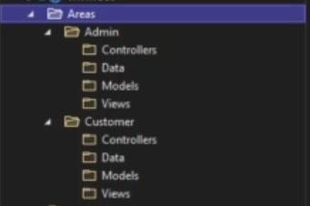

# Area

## Description

- We can split our application into the multiple sub MVC or RazorPage projects with area
- It's useful when we have different functionalities for admins and regular users
- In the bellow we can see a project with two areas:

    

- By adding area feature into the project, we should change our default url pattern to something like this:

    ```csharp
    app.MapControllerRoute(
        name: "default",
        pattern: "{area=Customer}/{controller=Home}/{action=Index}/{id?}"
    );
    ```
