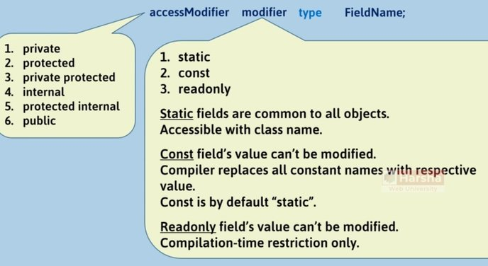

# Field

## Description



Access modifiers:

| **Access Modifier**    | **In the same class** | **In the child classes at the same assembly** | **In the other classes at the same assembly** | **Child classes at other assembly** | **Other classes at other assembly** |
| ---------------------- | --------------------- | --------------------------------------------- | --------------------------------------------- | ----------------------------------- | ----------------------------------- |
| **private**            | Yes                   | No                                            | No                                            | No                                  | No                                  |
| **protected**          | Yes                   | Yes                                           | No                                            | Yes                                 | No                                  |
| **private protected**  | Yes                   | Yes                                           | No                                            | No                                  | No                                  |
| **internal**           | Yes                   | Yes                                           | Yes                                           | No                                  | No                                  |
| **protected internal** | Yes                   | Yes                                           | Yes                                           | Yes                                 | No                                  |
| **public**             | Yes                   | Yes                                           | Yes                                           | Yes                                 | Yes                                 |

!!! info

    Default access modifier is private

## Modifiers

=== "Static"

    Static fields are stored outside the object. Static fields are common to all objects of a class.

    ```csharp
    class BankAccount {
        long accountNumber;
        string accountHolderName;
        double currentBalance;
        static string bankName;
    }
    ```

    | **Category**        | **Instance Fields**                                             | **Static Fields**                                                   |
    | ------------------- | --------------------------------------------------------------- | ------------------------------------------------------------------- |
    | **Storage**         | Stored in Objects                                               | Stored in Class's memory                                            |
    | **Related to**      | Represents data related to objects.                             | Represents common data that belongs to all objects.                 |
    | **Declaration**     | Declared without "static" keyword.<br>Syntax: `type fieldName;` | Declared with "static" keyword.<br>Syntax: `static type fieldName;` |
    | **Accessible with** | Accessible with object (through reference variable).            | Accessible with class name only (not with object).                  |

=== "Constant"

    Constant Fields are like static fields, that are common to all objects of the class.

    - We can't change the value of constant field.
    - Constant Fields are accessible with class name (not with object).
    - Constant Fields are not stored in the object; will not be stored anywhere.
    - Constant Fields will be replaced with its value, while compilation; so it will not be stored anywhere in memory.
    - Constant Fields must be initialized, in line with declaration (with a literal value only).
    - Constants can also be declared as 'local constants' (in a method).

=== "Readonly"

    Readonly Fields are like instance fields, that is stored in every object, individually.

    - We can't change the value of a readonly field.
    - Readonly Fields are accessible with a reference variable (with object).
    - Readonly Fields must be initialized, either "in-line with declaration" or "in the constructor".

=== "Key Points"

    Fields are variables that are declared in the class; but stored in objects.

    - `private`, `protected`, `private protected`, `internal`, `protected internal`, `public`
    - `static`, `const`, `readonly`
    - Instance fields are individual for each object; Static fields are common (one-time) for **all** objects.
    - Constants must be initialized along with declaration; Readonly fields must be initialized either **along with declaration** or **in instance constructor**.
