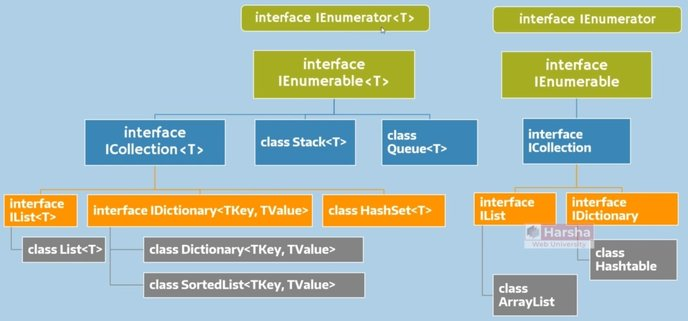

# Overview

## Description

Collections are the standard way to store and manipulate a group of elements (primitive values or objects).

- Collections are internally objects of specific 'collection classes' such as Lists, Dictionary, SortedList, etc.
- Collections can store unlimited elements.
- You can add, remove elements at any time.
- You need not specify the size (number of elements) while creating a collection.
- You can search, sort, copy collections using various built-in methods.

| Index | Collection |
| ----- | ---------- |
| [0]   | value0     |
| [1]   | value1     |
| [2]   | value2     |
| ...   | ...        |

## Collection Hierarchy

