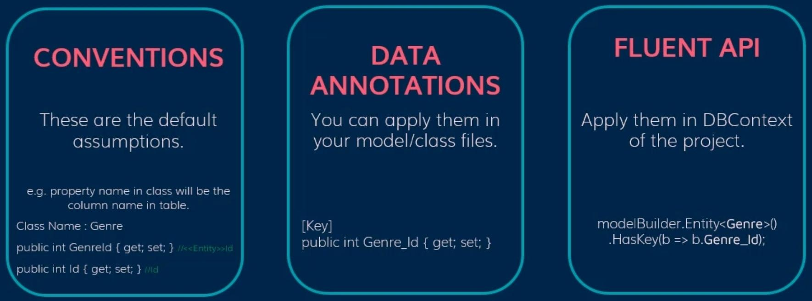

# Model & Fields

## Mappings

This means mapping one class and its properties to the database table and its fields



=== "Conventions"

    Will be done automatically by EF

=== "Annotations"

    This will be done by the C# annotations

=== "Fluent API"

    This will be done inside of the DbContext class and within the below method

    ```csharp
    protected override void OnModelCreating(ModelBuilder modelBuilder) {
    ...
    ```

    Or we can create separate config classes for each model

    ```csharp
    public class AdvertismentConfig : IEntityTypeConfiguration<Advertisment> {
        public void Configure(EntityTypeBuilder<Advertisment> builder) {
            builder.Property(c => c.Price).HasConversion(c => c.Value.Value, d => Price.FromLong(d));
            builder.Property(c => c.OwnerId).HasConversion(c => c.Value.ToString(), d => UserId.FromString(d));
            builder.Property(c => c.ApprovedBy).HasConversion(c => c.Value.ToString(), d => UserId.FromString(d));
            builder.Property(c => c.Text).HasConversion(c => c.Value, d => AdvertismentText.FromString(d));
            builder.Property(c => c.Title).HasConversion(c => c.Value, d => AdvertismentTitle.FromString(d));
        }
    }
    ```

    We should add them inside the `OnModelCreating` method

    ```csharp
    modelBuilder.ApplyConfiguration(new FluentBookConfig());
    modelBuilder.ApplyConfiguration(new FluentBookDetailsConfig());
    modelBuilder.ApplyConfiguration(new FluentBookAuthorConfig());
    ```

## Model

=== "Table Name"

    - Convention: By default, EF will use the DbSet property name for the table name, for example in the below code EF will use Categories for table name

        ```csharp
        public DbSet<Category> Categories { get; set; }
        ```

    - Data Annotation:

        ```csharp
        [Table("tb_Category")]
        public class Category
        ```

    - Fluent API:

        ```csharp
        protected override void OnModelCreating(ModelBuilder modelBuilder) {
            modelBuilder.Entity<Category>().ToTable("tb_Category");
        }
        ```

=== "ToView"

    - Fluent API:

        ```csharp
        protected override void OnModelCreating(ModelBuilder modelBuilder) {
            modelBuilder.Entity<BookDetailsFromView>().HasNoKey().ToView("GetOnlyBookDetails");
        }
        ```

## Fields

=== "Primary Key"

    - Convention: By default EF will use the `Id` field or `<ModelName>Id` field as primary key without need any annotation

        ```csharp
        public class Category {
            public int Id { get; set; }
        }
        ```

    - Data Annotation: For the fields other than Id or `<ModelName>Id`, we can explicitly define our primary key like the below

        ```csharp
        [Key]
        public int CategoryId { get; set; }
        ```

    - Fluent API:

        ```csharp
        protected override void OnModelCreating(ModelBuilder modelBuilder) {
            modelBuilder.Entity<Category>().HasKey(c => c.CategoryId);
        }
        ```

        Example 1: The below code will create a composite-key

        ```csharp
        modelBuilder.Entity<BookAuthor>().HasKey(ba => new { ba.AuthorId, ba.BookId });
        ```

        Example 2: The below code will tell EF that this table doesn't have primary key

        ```csharp
        modelBuilder.Entity<BookDetailsFromView>().HasNoKey();
        ```

=== "ForeignKey"

    - Convention: EF will create FK and CategoryId field in the below code

        ```csharp
        public class Book {
            public Category Category { get; set; }
        }
        ```

    - Data Annotation: If want to have a field name other than CategoryId, we can use the below code

        ```csharp
        public class Book {
            [ForeignKey("Category")]
            public int CategoryId { get; set; }
            public Category Category { get; set; }
        }
        ```

=== "One-to-One Relation"

    - Convention:

        ```csharp
        public class Book {
            public BookDetail BookDetail { get; set; }
        }

        public class BookDetail {
            public Book Book { get; set; }
        }
        ```

    - Data Annotation:

        ```csharp
        public class Book {
            [ForeignKey("BookDetail")]
            public int BookDetailId { get; set; }
            public BookDetail BookDetail { get; set; }
        }

        public class BookDetail {
            public Book Book { get; set; }
        }
        ```

    - Fluent API:

        ```csharp
        public class Book {
            public int BookId { get; set; }
            public int BookDetailId { get; set; }
            public BookDetail BookDetail { get; set; }
        }

        public class BookDetail {
            public Book Book { get; set; }
        }

        protected override void OnModelCreating(ModelBuilder modelBuilder) {
            modelBuilder.Entity<Books>().HasKey(b => b.BookId);
            modelBuilder.Entity<Books>()
                .HasOne(z => z.BookDetail)
                .WithOne(z => z.Book)
                .HasForeignKey<Books>("BookDetailId");
        }
        ```

=== "One-to-Many Relation"

    - Convention:

        ```csharp
        public class Book {
            public Publisher Publisher { get; set; }
        }

        public class Publisher {
            public List<Books> Books { get; set; }
        }
        ```

        !!! info

            Can be List<> or ICollection<>

    - Data Annotation:

        ```csharp
        public class Book {
            [ForeignKey("Publisher")]
            public int PublisherId { get; set; }
            public Publisher Publisher { get; set; }
        }

        public class Publisher {
            public List<Books> Books { get; set; }
        }
        ```

    - Fluent API:

        ```csharp
        public class Book
        {
            public int BookId { get; set; }

            public int PublisherId { get; set; }
            public Publisher Publisher { get; set; }
        }

        public class Publisher
        {
            public List<Books> Books { get; set; }
        }

        protected override void OnModelCreating(ModelBuilder modelBuilder)
        {
            modelBuilder.Entity<Books>().HasKey(b => b.BookId);
            modelBuilder.Entity<Books>()
                .HasOne(z => z.Publisher)
                .WithMany(z => z.Books)
                .HasForeignKey(z => z.PublisherId);
        }
        ```

=== "Many-to-Many Relation"

    - Convention:

        ```csharp
        public class Book {
            public virtual ICollection<BookAuthor> Authors { get; set; }
        }

        public class Author {
            public virtual ICollection<BookAuthor> Books { get; set; }
        }

        // Intermediate table
        public class BookAuthor {
            public int BookId { get; set; }
            public Book Book { get; set; }

            public int AuthorId { get; set; }
            public Author Author { get; set; }
        }
        ```

        !!! info

            Can be ICollection<> or List<>

    - Fluent API:

        ```csharp
        public class Book {
            public virtual ICollection<BookAuthor> Authors { get; set; }
        }

        public class Author {
            public virtual ICollection<BookAuthor> Books { get; set; }
        }

        // Intermediate table
        public class BookAuthor {
            public int BookId { get; set; }
            public Book Book { get; set; }

            public int AuthorId { get; set; }
            public Author Author { get; set; }
        }

        protected override void OnModelCreating(ModelBuilder modelBuilder) {
            modelBuilder.Entity<BookAuthor>().HasKey(b => new { b.BookId, b.AuthorId });

            modelBuilder.Entity<BookAuthor>()
                .HasOne(z => z.Book)
                .WithMany(z => z.Authors)
                .HasForeignKey(z => z.BookId);

            modelBuilder.Entity<BookAuthor>()
                .HasOne(z => z.Author)
                .WithMany(z => z.Books)
                .HasForeignKey(z => z.AuthorId);
        }
        ```

=== "Column"

    - Data Annotation:

        ```csharp
        [Column("BookISBN")]
        public string ISBN { get; set; }
        ```

    - Fluent API:

        ```csharp
        protected override void OnModelCreating(ModelBuilder modelBuilder) {
            modelBuilder.Entity<Category>()
                .Property(c => c.ISBN)
                .HasColumnName("bookISBN");
        }
        ```

=== "Required"

    - Data Annotation:

        ```csharp
        [Required]
        public string Title { get; set; }
        ```

    - Fluent API:

        ```csharp
        protected override void OnModelCreating(ModelBuilder modelBuilder) {
            modelBuilder.Entity<Category>()
                .Property(c => c.Title)
                .IsRequired();
        }
        ```

=== "MaxLength"

    - Data Annotation:

        ```csharp
        [MaxLength(50)]
        public string Title { get; set; }
        ```

    - Fluent API:

        ```csharp
        protected override void OnModelCreating(ModelBuilder modelBuilder) {
            modelBuilder.Entity<Category>()
                .Property(c => c.Title)
                .HasMaxLength(50);
        }
        ```

=== "NotMapped"

    - Data Annotation:

        ```csharp
        [NotMapped]
        public double DiscountedPrice { get; set; }
        ```

    - Fluent API:

        ```csharp
        protected override void OnModelCreating(ModelBuilder modelBuilder) {
            modelBuilder.Entity<Category>()
                        .Ignore(c => c.DiscountedPrice);
        }
        ```

=== "DatabaseGenerated"

    **Identity**: The Identity option specifies that the value will only be generated by the database when a value is first added to the database.
    Entity Framework Core will not implement a value generation strategy.
    Database providers differ in the way that values are automatically generated.
    E.g.
    Identity, GUID.

    - Data Annotation:

        ```csharp
        [DatabaseGenerated(DatabaseGeneratedOption.Identity)]
        public ... { get; set; }
        ```

    - Fluent API:

        ```csharp
        protected override void OnModelCreating(ModelBuilder modelBuilder) {
            modelBuilder.Entity<...>()
                        .ValueGeneratedOnAdd(...);
        }
        ```

    **None**: The None option prevents values from being generated by the database automatically in cases where they would otherwise be created.

    - Data Annotation:

        ```csharp
        [DatabaseGenerated(DatabaseGeneratedOption.None)]
        public ... { get; set; }
        ```

    - Fluent API:

        ```csharp
        protected override void OnModelCreating(ModelBuilder modelBuilder) {
            modelBuilder.Entity<...>()
                        .ValueGeneratedNever(...);
        }
        ```

    **Computed**: The Computed option specifies that the property's value will be generated **by the database** when the value is first saved, and subsequently regenerated every time the value is updated.

    - Data Annotation:

        ```csharp
        [DatabaseGenerated(DatabaseGeneratedOption.Computed)]
        public ... { get; set; }
        ```

    - Fluent API:

        ```csharp
        protected override void OnModelCreating(ModelBuilder modelBuilder) {
            modelBuilder.Entity<...>()
                        .ValueGeneratedOnAddOrUpdate(...);
        }
        ```
