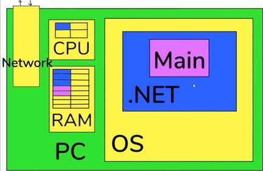

# Async & Await

## Description

- Each method with the Async keyword will automatically convert into an object of IAsyncStateMachine class
- This object will be saved in the thread pool (RAM)
- From the .NET (blue box) means the machine .NET Runtime
