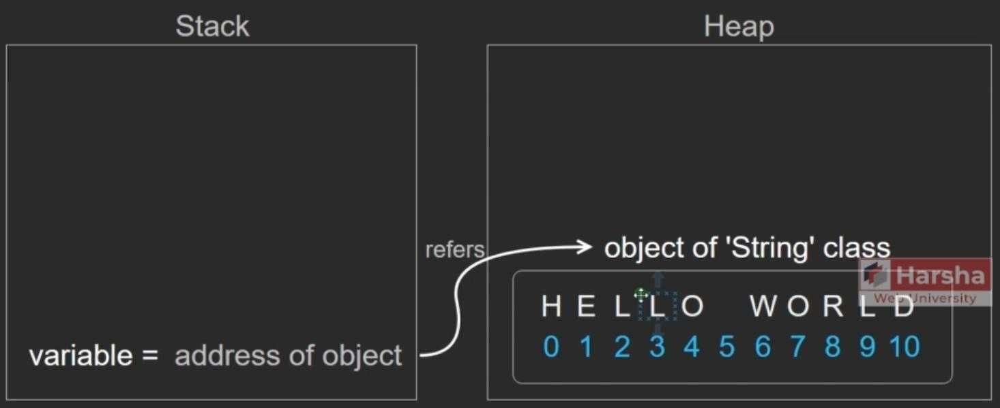

# String

## Description

The `System.String` is a class that represents an array of Unicode characters.

- String stores a set of characters as `char[]`.
- Max no. of characters in the string: 2 billion.
- String is immutable. That means, it can't be modified.

```csharp
string referenceVariable = "Hello123";
```



## Methods

| Property                    | Description                                                                 |
| --------------------------- | --------------------------------------------------------------------------- |
| `int Length { get; }`       | This property returns the no. of characters of the string.                  |
| `char [int index] { get; }` | This indexer returns the single character at the specified character index. |

| Method                                                                | Description                                                                                                                                                                                                                                                                                                      |
| --------------------------------------------------------------------- | ---------------------------------------------------------------------------------------------------------------------------------------------------------------------------------------------------------------------------------------------------------------------------------------------------------------- |
| `string ToUpper()`                                                    | Returns the same string in upper case.                                                                                                                                                                                                                                                                           |
| `string ToLower()`                                                    | Returns the same string in lower case.                                                                                                                                                                                                                                                                           |
| `string Substring(int startIndex, int length)`                        | Returns a string with a set of characters starting from the "startIndex" up to the "length" no. of characters. The "length" parameter is optional.                                                                                                                                                               |
| `string Replace( string oldString, string newString )`                | Returns a string after replacing all occurrences of oldString with newString.                                                                                                                                                                                                                                    |
| `string[] Split( char separator )`                                    | Returns a string[] after splitting the current string into an array of characters. At each occurrence of separator character, a new string is formed. At last, all the pieces of strings are converted as a string[].                                                                                            |
| `string Trim()`                                                       | Returns the same string after removing extra spaces at the beginning and end of the current string. It returns the same string if no spaces are found at L.H.S. and R.H.S. of the current string.                                                                                                                |
| `string ToCharArray()`                                                | Returns the same string as an array of characters (char[]).                                                                                                                                                                                                                                                      |
| `string Join(string separator, IEnumerable<T> values)`                | Returns a string with joined values with separator in between each value.                                                                                                                                                                                                                                        |
| `bool Equals( string otherString )`                                   | Returns a Boolean value that indicates whether the current string and the specified otherString are equal or not (each character will be compared).                                                                                                                                                              |
| `bool StartsWith( string otherString )`                               | Returns a Boolean value that indicates whether the current string begins with the specified otherString.                                                                                                                                                                                                         |
| `bool EndsWith( string otherString )`                                 | Returns a Boolean value that indicates whether the current string ends with the specified otherString.                                                                                                                                                                                                           |
| `bool Contains( string otherString )`                                 | Returns a Boolean value that indicates whether the current string contains the specified otherString anywhere.                                                                                                                                                                                                   |
| `int IndexOf( string otherString, int startIndex )`                   | Returns the index of the first character of the specified otherString, where the otherString exists in the current string. The searching process starts from the specified startIndex. The startIndex is optional. In case the specified otherString doesn't exist in the current string, the method returns -1. |
| `int LastIndexOf( string otherString, int startIndex)`                | It is the same as IndexOf(), but the searching process takes place from Right-To-Left direction, starting from the startIndex.                                                                                                                                                                                   |
| `static bool IsNullOrEmpty( string value )`                           | It determines whether the given string value is null or empty ("").                                                                                                                                                                                                                                              |
| `static bool IsNullOrWhiteSpace( string value )`                      | It determines whether the given string value is null or white space (" ").                                                                                                                                                                                                                                       |
| `static string Format( string format, object arg0, object arg1, ...)` | Returns the string after substituting the specified argument values at the specified placeholders. A placeholder is represented as {indexOfArgument}.<br><br>Ex: `string.Format("{0} Oriented {1}", "Object", "Programming")` <br>//Object Oriented Programming                                                  |
| `string Insert(int startIndex, string value)`                         | Returns a new string object which inserts the new string value at the specified index in the existing string object.                                                                                                                                                                                             |
| `string Remove( int startIndex, int count )`                          | It returns a new string object after removing the specified count of characters at the specified startIndex, from the current string object.                                                                                                                                                                     |

## StringBuilder

The `System.Text.StringBuilder` is a class that represents an appendable string.

- The `Capacity` property of `StringBuilder` represents the number of characters that can be stored in the string builder, based on current memory allocation.
- When more characters than the current `Capacity` are added, `StringBuilder` automatically increases the `Capacity` property, doubling its size.
- The default value of `Capacity` is 16. The programmer can assign its value via constructor or set accessor of the `Capacity` property.

```text
  H  E  L  L  O  _  _  _  _  _
  0  1  2  3  4  5  6  7  8  9

Length     ---> [5]
Capacity   ---> [10]
```

```csharp
StringBuilder sb = new StringBuilder("initial string", capacity);
sb.Append("additional string");
```

Features:

| **Constructor**                             | **Description**                                                                          |
| ------------------------------------------- | ---------------------------------------------------------------------------------------- |
| `StringBuilder()`                           | It initializes the `StringBuilder` type of object with the default capacity (16).        |
| `StringBuilder(int capacity)`               | It initializes the `StringBuilder` type of object with the specified capacity.           |
| `StringBuilder(string value)`               | It initializes the `StringBuilder` type of object with the specified value.              |
| `StringBuilder(string value, int capacity)` | It initializes the `StringBuilder` type of object with the specified value and capacity. |

| **Property**                     | **Description**                                                                                                                    |
| -------------------------------- | ---------------------------------------------------------------------------------------------------------------------------------- |
| `int Length { get; set; }`       | This property gets/sets the length (number of characters) in the string builder.                                                   |
| `char [int index] { get; set; }` | This indexer gets/sets the single character at the specified character index.                                                      |
| `int Capacity { get; set; }`     | This property returns the number of characters that can be stored (memory allocated) in the current string builder. Default is 16. |
| `int MaxCapacity { get; }`       | This property represents the maximum number of characters up to which the capacity can be extended. Default is `int.MaxValue`.     |

| **Method**                                           | **Description**                                                                                                                           |
| ---------------------------------------------------- | ----------------------------------------------------------------------------------------------------------------------------------------- |
| `string Append(string value)`                        | Adds the given string value at the end of the current value of string builder.                                                            |
| `string Insert(int startIndex, string value)`        | Returns a new string object which inserts the new string value at the specified index in the existing string object.                      |
| `string Remove(int startIndex, int count)`           | Returns a new string object after removing the specified count of characters at the specified start index from the current string object. |
| `string Replace(string oldString, string newString)` | Returns a string after replacing all occurrences of `oldString` with `newString`.                                                         |
| `string ToString()`                                  | Returns the current value of the string builder as a string object.                                                                       |

vs Normal String:

| When to use 'String'                                                                                                 | When to use 'String Builder'                                                                                                                          |
| -------------------------------------------------------------------------------------------------------------------- | ----------------------------------------------------------------------------------------------------------------------------------------------------- |
| When you would like to make fewer changes to the string.                                                             | When you would like to have an unknown or extensive number of changes to a string (e.g., making changes/concatenations to the string through a loop). |
| When you perform a limited number of concatenation operations.                                                       | When you perform extensive concatenation operations.                                                                                                  |
| When you want to perform extensive search operations using methods such as `IndexOf`, `Contains`, `StartsWith`, etc. | When you perform fewer search operations on strings.                                                                                                  |
