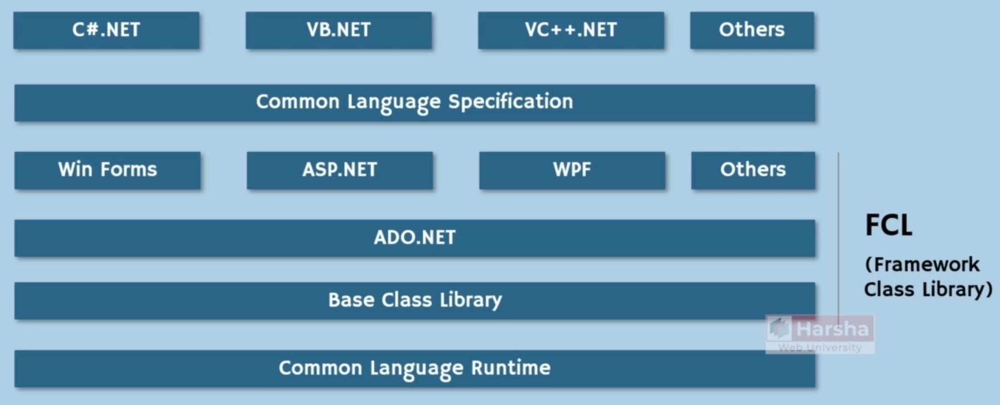

# Architecture

## Core of .NET

### Versions

- .NET Framework 4.8 was the last version
- .NET Core after version 3.1 was renamed into the .NET 5.0
- Never .NET Core 4.X or .NET 4.X was released to prevent name complexity with .NET Framework 4.X

### CLR & FCL

- CLR: Runner of IL code in the Linux, Windows, etc
- FCL: All of the predefined codes inside of .Net

### Common Language Infrastructure (CLI)

## Common Language Specification (CLS)

## Framework Class Library (FCL)

### Base Class Library (BCL)

### ADO.NET (Data Access)

### ASP.NET

Predefined libraries just for the web development

### Win Forms and WPF

Predefined libraries just for the windows application development

TIP: WPF is newer than Win Forms and contains more complex functionalities

## Common Language Runtime (CLR)

### Overview

### Components

## AOT (ahead-of-time)

### AOT

Ahead-of-time (AOT) compilation refers to an umbrella of technologies which generate code at application build time, instead of run-time.

### Native AOT

Native AOT is similar to .NET’s existing AOT technologies, but it produces only native artifacts. In fact, the Native AOT runtime does not know how to read the .NET assembly file formats – everything is platform-native. The executable file format parsing is fully handled by the underlying operating system.

Native compiled apps startup is faster since they execute already compiled code in a single file! AOT enables some scenarios like:

- Copying a single file executable from one machine and run on another (of the same kind) without installing a .NET runtime.
- Creating and running a docker image that contains a single file executable (e.g. just one file in addition to Ubuntu).
- Compiling dotnet managed libraries into shared or static libraries that can be consumed from other languages without COM or library wrappers. (Like c++ or Rust)
- Smaller compilation output sizes.

### Native AOT vs ReadyToRun

**ReadyToRun** assemblies have **native code with native data structures + IL code**. Such an approach - when you have both native, and IL code allows to execute Tiered Compilation and perform optimizations in runtime. **Native AOT** in opposite produces **only native artifacts**. It does not have IL code and can’t be recompiled in any way with Tiered Compilation.

### Native AOT vs JIT

JIT executes on the end-user/server machine, and AOT usually (ngen.exe is an exception, for example) runs on the developer machine after Roslyn compilation.
