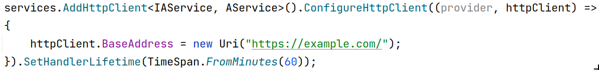

# DI

## Description

First we should create a builder with the below code inside of the Program.cs file

Then with one of the below approaches we can inject our class into the application

## DB

## Custom DI

### AddSingleton

Will create once per process

### AddScoped

Will create once per request

### AddTransient

Will create once per reference

### AddHostedService

A hosted service is more than just a singleton service. The runtime "knows" about it, can tell it to start by calling StartAsync or stop by calling StopAsync() whenever eg the application pool is recycled. The runtime can wait for the hosted service to finish before the web application itself terminates.

- One huge difference is that AddSingleton() is lazy while AddHostedService() is eager.
- A service added with AddSingleton() will be instantiated the first time it is injected into a class constructor. This is fine for most services, but if it really is a background service you want, you probably want it to start right away.
- A service added with AddHostedService() will be instantiated immediately, even if no other class will ever want it injected into its constructor. This is typical for background services, that run all the time.
- Also, it seems that you cannot inject a service added with AddHostedService() into another class.

## Http Client

## Configurations (Content of appsettings.json)

### Options Pattern

First we should create a class like the StripeSettngs in the below image, then with using the GetSection method simply we can receive any data from appsettings.json file

Now we can easily inject the class configuration by the below code:

### Direct Way

Another way for reading from appsettings.json file without any middle class is like the bellow:

## Builtin Injectable Classes

### IHttpContextAccessor

- The current session request object
- Injection syntax:

  

### IDataProtectionProvider

- Will use for data encryption and decryption
- Injection syntax:

  
