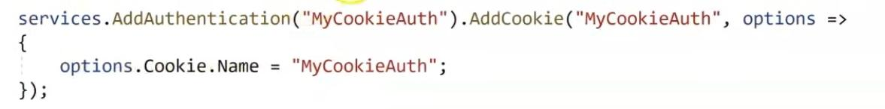

# Identity

## Identity and Role

Claim:

The personal information inside one identity

For example:

- first name
- last name
- id number
- national id

Identity:

Identity objects represent users

Role (Legacy):

Roles represent memberships and security contexts

Principal:

The principal object encapsulates both an identity object and a role

## User Object

Description:

- User is a builtin property in the ASP.NET controllers
- We can access to the User by HttpContext also

Methods:

- **HasClaim:** will check does user have specific claim or not

## Authentication

Authentication Service:

- **AddAuthentication:** will tell ASP.NET to use which authentication service (MyCookieAuth) for authenticating the user
- **AddCookie:** will tell ASP.NET to set the user data in where when we are authenticating the user with the MyCookieAuth authentication service
- Another example

  

IAuthenticationService:

Every class that wants to implement a new authentication service, should implement this interface, for example by using the AddCookie method, APS.NET will add a cookie based authentication service into its authentication services.

SignIn:

Will tell ASP.NET to authenticate the user (claimsPrincipal) with the MyCookieAuth authentication service

Authentication Middleware:

Will tell ASP.NET to use my authentication service choice in the AddAuthentication, and try to authenticate the current user

## Authorization

Authorization Service & Policy:

- **AddAuthorization:** will tell ASP.NET that we want to update the default authorization service
- **AddPolicy:** will add a new access policy
- **RequireClaim (static perm):** will tell ASP.NET that for passing the MustBelongToHRDepartment policy, the user should have a Department claim with the HR value in his/her identity
- **RequireRole:** except from RequireClaim we can use the below code for checking does the user has specific role or not

  

- **Requirements.Add (dynamic perm):** will tell ASP.NET that for passing the HRManagerOnly policy, the user should pass the custom HRManagerProbationRequirement requirement
- 1st example

  

- 2nd example

  

Authorize Annotation:

- User should be at least authenticated to access to this page:

  

- User should be authenticated and pass the MustBelongToHRDepartment policy to access to this page

  

- User should be authenticated and has the Manager role to access to this controller

  

- User can access to an action in the controller that is authorization required

  

IAuthorizationService:

Authorization Middleware:

## Identity Framework

Description:

Microsoft package for easier work with user and its related actions like sign-in, sign-out, change password, and etc.

- The down side of it is that it’s tied with EF framework

Usage:

- **AddIdentity:** will add the core functionality of identity framework
- **AddDefaultTokenProviders:** will add bunch of authentication ways

- Three helper classes of identity framework that we can DI them in our controllers
- **UserManager:**

   - get or update or save a user
   - add a claim to a user
   - remove a claim from a user
   - add a role to a user
   - remove a role from a user

- **SignInManager:** will help us to sign-in or sign-out a user
- **RoleManager:** will help us to add or remove a role
