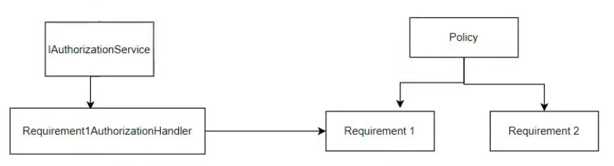

# Identity

## Identity and Role

### Claim

The personal information inside one identity

For example:

- first name
- last name
- id number
- national id

```csharp
var claims = new List<Claim> {
    new Claim(ClaimTypes.Name, "admin"),
    new Claim(ClaimTypes.Email, "admin@mywebsite.com")
};
```

### Identity (Collection of Claims)

Identity objects represent users

```csharp
var identity = new ClaimsIdentity(claims, "MyCookieAuth");
```

### Role (Legacy)

Roles represent memberships and security contexts

```csharp
new IdentityRole { Name = vm.Name }
```

### Principal

The principal object encapsulates both an identity object and a role

```csharp
ClaimsPrincipal claimsPrincipal = new ClaimsPrincipal(identity);
```

```csharp
var grandmaClaims = new List<Claim>()
{
    new Claim(ClaimTypes.Name, "Bob"),
    new Claim(ClaimTypes.Email, "Bob@fmail.com"),
    new Claim("Grandma.Says", "Very nice boi."),
};

var licenseClaims = new List<Claim>()
{
    new Claim(ClaimTypes.Name, "Bob K Foo"),
    new Claim("DrivingLicense", "A+"),
};

var grandmaIdentity = new ClaimsIdentity(grandmaClaims, "Grandma Identity");
var licenseIdentity = new ClaimsIdentity(licenseClaims, "Government");

var userPrincipal = new ClaimsPrincipal(new[] { grandmaIdentity, licenseIdentity });
```

## User Object

### Description

- User is a builtin property in the ASP.NET controllers
- We can also access to the User by HttpContext

### Methods

| Helper Method | Description                                     |
|---------------|-------------------------------------------------|
| HasClaim      | will check does user have specific claim or not |

## Authentication

### Authentication Service

```csharp
builder.services
    .AddAuthentication("MyCookieAuth")
    .AddCookie("MyCookieAuth", options => {options.Cookie.Name = "MyCookieAuth"});
```

- **AddAuthentication:** will tell ASP.NET to use which authentication service (MyCookieAuth) for authenticating the user
- **AddCookie:** will tell ASP.NET to set the user data in where when we are authenticating the user with the MyCookieAuth authentication service
- Another example

  ```csharp
  builder.services
      .AddAuthentication(CookieAuthenticationDefaults.AuthenticationScheme)
      .AddCookie(CookieAuthenticationDefaults.AuthenticationScheme);
  ```

### IAuthenticationService


Every class that wants to implement a new authentication service, should implement this interface, for example by using the AddCookie method, APS.NET will add a cookie based authentication service into its authentication services.

### SignIn

```csharp
await HttpContext.SignInAsync("MyCookieAuth", claimsPrincipal);
```

Will tell ASP.NET to authenticate the user (claimsPrincipal) with the MyCookieAuth authentication service

### Authentication Middleware

```csharp
app.UseAuthentication();
```

Will tell ASP.NET to use my authentication service choice in the AddAuthentication, and try to authenticate the current user

## Authorization

### Authorization Service & Policy


```csharp
builder.services.AddAuthorization(options => {

    options.AddPolicy("AdminOnly",
        policy => policy.RequireClaim("Admin"));

    options.AddPolicy("MustBelongToHRDepartment",
        policy => policy.RequireClaim("Department", "HR"));

    options.AddPolicy("HRManagerOnly", policy => policy
        .RequireClaim("Department", "HR")
        .RequireClaim("Manager")
        .Requirements.Add(new HRManagerProbationRequirement(3)));
});
```

- **AddAuthorization:** will tell ASP.NET that we want to update the default authorization service
- **AddPolicy:** will add a new access policy
- **RequireClaim (static perm):** will tell ASP.NET that for passing the MustBelongToHRDepartment policy, the user should have a Department claim with the HR value in his/her identity
- **RequireRole:** except from RequireClaim we can use the below code for checking does the user has specific role or not

  ```csharp
  options.AddPolicy("AdminAccess", policy => policy.RequireRole("Admin"));
  ```

- **Requirements.Add (dynamic perm):** will tell ASP.NET that for passing the HRManagerOnly policy, the user should pass the custom HRManagerProbationRequirement requirement
- 1st example

  ```csharp
  builder.AddPolicy("manager", pb =>
  {
      pb.RequireAuthenticatedUser()
        .AddAuthenticationSchemes(CookieAuthenticationDefaults.AuthenticationScheme)
        .RequireClaim("role", params allowedValues: "manager");
  });
  ```

- 2nd example

  ```csharp
  options.AddPolicy("UserAccess", policy =>
      policy.RequireAssertion(context =>
          context.User.IsInRole("Admin")
          || context.User.IsInRole("Manager")
          || context.User.IsInRole("User")));
  ```

### Authorize Annotation

- User should be at least authenticated to access to this page:

  ```csharp
  [Authorize]
  public class IndexModel : PageModel
  ```

- User should be authenticated and pass the MustBelongToHRDepartment policy to access to this page

  ```csharp
  [Authorize(Policy = "MustBelongToHRDepartment")]
  public class HumanResourceModel : PageModel
  ```

- User should be authenticated and has the Manager role to access to this controller

  ```csharp
  [Authorize(Roles = "Manger")]
  public class ManagerController : Controller
  ```

- User can access to an action in the controller that is authorization required

  ```csharp
  [AllowAnonymous]
  public ActionResult VacationPolicy()
  ```

### IAuthorizationService



### Authorization Middleware

```csharp
app.UseAuthorization();
```

## Identity Framework

### Overview


Microsoft package for easier work with user and its related actions like sign-in, sign-out, change password, and etc.

- The down side of it is that it's tied with EF framework

### Usage

```csharp
builder.Services.AddIdentity<IdentityUser, IdentityRole>()
    .AddDefaultTokenProviders();
```

- **AddIdentity:** will add the core functionality of identity framework
- **AddDefaultTokenProviders:** will add bunch of authentication ways

```csharp
UserManager<IdentityUser> userMgr,
SignInManager<IdentityUser> signMgr
RoleManager<IdentityRole> roleManager
```

- Three helper classes of identity framework that we can DI them in our controllers
- **UserManager:**

   - get or update or save a user
   - add a claim to a user
   - remove a claim from a user
   - add a role to a user
   - remove a role from a user

- **SignInManager:** will help us to sign-in or sign-out a user
- **RoleManager:** will help us to add or remove a role
