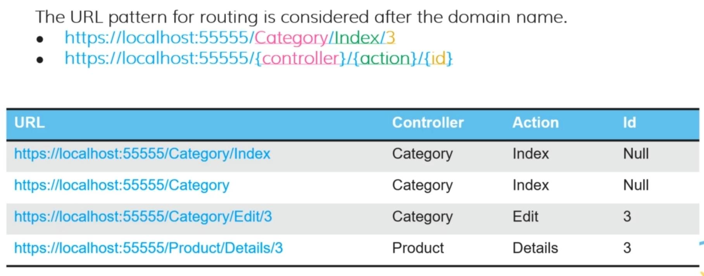
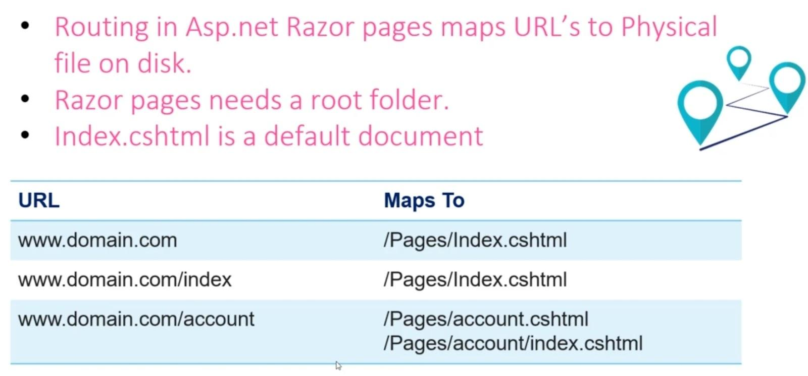

# Routing

## Description

### For MVC

- We should have a file followed the `<ControllerName>Controller.cs` naming convention inside the Controllers directory
- Inside the Views directory, we should have a directory followed the `<ControllerName>` convention that contains one `<ActionName>.cshtml` file for each action method inside the controller

### For Razor Page

- All of the pages and codes are combined in one directory named Pages
- For each page there are two files, `<PageName>.cshtml` and `<PageName>.cshtml.cs`
