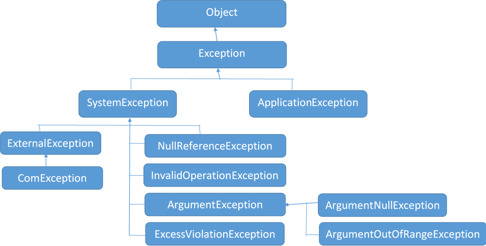

# Exception Handling

## Description

**Exception** is a run-time error that occurs during the execution of an application.

```csharp
// Typical try-catch-finally block

try {
    statement1;
    statement2;
    statement3;
    ...
}
catch (ExceptionClassName variable) {
    // do something with exception variable
    // or show error message
}
finally {
    // do some cleaning process
}
```

- When an exception occurs, the current application terminates abruptly.
- **Exception Handling** avoids the abrupt termination of the application in case of an exception.
- When CLR is unable to execute a statement, it is treated as an exception.
- `try` and `catch` blocks are mandatory.
- `finally` block and multiple `catch` blocks are optional.
- `try` block contains all the actual code, where exceptions may occur.

   - Multiple `try` blocks for one `catch` block is not allowed.
   - Nested `try` blocks are allowed.

- `catch` block contains error handling code; it executes only when a particular type of exception is raised during the execution of the `try` block.

   - Multiple `catch` blocks are allowed.

- `finally` block executes after the successful completion of the `try` block or after any `catch` block. It is optional.
- `throw` keyword is used to throw built-in or custom exceptions in case of invalid values found.

## Custom Exception

Custom Exception class is a class that is derived from any one of the exception classes (such as `System.Exception` or any other exception class).

If none of the pre-defined exception classes meet your requirement, you can create a user-defined exception class (custom exception class).

```csharp
throw new CustomExceptionClassName(...);
```

## Catch When (Catch Filter)

- New feature introduced in C# 7.1
- The `catch` block catches the exception, only when the given condition is `true`.
- "Catch-when" is also known as "Exception Filters".

```csharp
try
{
    // statements
}
catch (ExceptionType referenceVariable) when (condition)
{
    // error handling
}
```

## Popular Exceptions



| Exception Class             | Description                                                                                         | Points                                                                                                                                                                                                    |
|-----------------------------|-----------------------------------------------------------------------------------------------------|-----------------------------------------------------------------------------------------------------------------------------------------------------------------------------------------------------------|
| FormatException             | Represents an error when a string cannot be converted to a number due to invalid characters.        | - Occurs in methods like `Convert` or `Parse` with incorrect string values. <br> - It's a bad practice to throw FormatException implicitly or explicitly.                                                 |
| IndexOutOfRangeException    | Represents an error when an index was provided outside the valid range for an array.                | - Occurs when accessing an array with a wrong index value, less than 0 or greater than or equal to the array size. <br> - It's a bad practice to throw IndexOutOfRangeException implicitly or explicitly. |
| NullReferenceException      | Represents an error when you try to access a property, indexer, or method through a null reference. | - It's a bad practice to throw this exception implicitly or explicitly.                                                                                                                                   |
| ArgumentNullException       | Represents an error when a null value is passed as an argument to a method.                         | - It's a good practice to throw this exception implicitly or explicitly.                                                                                                                                  |
| ArgumentOutOfRangeException | Represents an error when a numeric value is passed beyond the acceptable range of a method.         | - It's a good practice to throw this exception implicitly or explicitly.                                                                                                                                  |
| ArgumentException           | Represents an error when an argument value is invalid as per validation rules or requirements.      | - Is the parent of the ArgumentNullException and ArgumentOutOfRangeException exceptions <br> - It's a good practice to throw this exception implicitly or explicitly.                                     |
| InvalidOperationException   | Represents an error when it is invalid to call a method given the current state of the object.      | - It's a good practice to throw this exception implicitly or explicitly.                                                                                                                                  |
