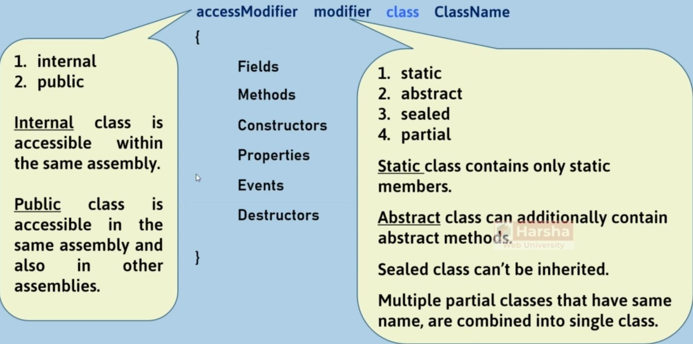

# Class

## Syntax



- Default access modifier: `internal`
- Properties: `getter` and `setter`
- Assembly means one project, so one solution will have multiple assemblies

## Modifiers

### Sealed

**Sealed class** is a class which is instantiable, but not inheritable. You can use a sealed class when you don't want to let other developers create child classes for the specific class.

```csharp
sealed class Class1
{
}

class Class2 : Class1  // not possible
{
}
```

| Feature                           | Normal Class | Abstract Class | Sealed Class |
|-----------------------------------|--------------|----------------|--------------|
| Can Inherit from Other Classes    | Yes          | Yes            | Yes          |
| Can Inherit from Other Interfaces | Yes          | Yes            | Yes          |
| Can be Inherited                  | Yes          | Yes            | No           |
| Can be Instantiated               | Yes          | No             | Yes          |
| Non-Static Fields                 | Yes          | Yes            | Yes          |
| Non-Static Methods                | Yes          | Yes            | Yes          |
| Non-Static Constructors           | Yes          | Yes            | Yes          |
| Non-Static Properties             | Yes          | Yes            | Yes          |
| Non-Static Events                 | Yes          | Yes            | Yes          |
| Non-Static Destructors            | Yes          | Yes            | Yes          |
| Constants                         | Yes          | Yes            | Yes          |
| Static Fields                     | Yes          | Yes            | Yes          |
| Static Methods                    | Yes          | Yes            | Yes          |
| Static Constructors               | Yes          | Yes            | Yes          |
| Static Properties                 | Yes          | Yes            | Yes          |
| Static Events                     | Yes          | Yes            | Yes          |
| Virtual Methods                   | Yes          | Yes            | No           |
| Abstract Methods                  | No           | Yes            | No           |
| Non-Static Auto-Impl Properties   | Yes          | Yes            | Yes          |
| Non-Static Indexers               | Yes          | Yes            | Yes          |

### Partial

**Partial Class** is a class that splits into multiple files. Each file is treated as a "part of the class."

```csharp
// File1.cs
partial class ClassName
{
    member1
}

// File2.cs
partial class ClassName
{
    member2
}

// Compiled source code in assembly
class ClassName
{
    member1
    member2
}
```

- At compilation time, all partial classes that have the same name, become a "single class".
- All the partial classes (that want to be a part of a class) should have the same name and should be in the same namespace and the same assembly, and should have the same access modifier (such as 'internal' or 'public').
- Duplicate members are not allowed in partial classes.
- Any attributes/modifiers (such as abstract, sealed) applied on one partial class will be applied to all partial classes that have the same name.
- The 'partial' keyword can be used only before the keywords 'class', 'struct', 'interface', and 'void'.
- Each partial class can be developed individually by different developers/teams.
- In WinForms/WebForms, the 'Designer-generated code' will be kept in one partial class; the 'code written by the developer' will be kept in another partial class with the same name, so both become a single class at compilation time.

### Static

Static class is a class that can contain only "static members".

- If you don't want even a single 'instance member' (non-static member), then use 'static class'.
- We can avoid accidental creation of object for the class, by making it a "static class".

```csharp
static class ClassName
{
    static fields
    static methods
    static constructors
    static properties
    static events
}
```

| Feature                           | Normal Class | Abstract Class | Interface | Sealed Class | Static Class |
|-----------------------------------|--------------|----------------|-----------|--------------|--------------|
| Can Inherit from Other Classes    | Yes          | Yes            | No        | Yes          | No           |
| Can Inherit from Other Interfaces | Yes          | Yes            | Yes       | No           | No           |
| Can be Inherited                  | Yes          | Yes            | Yes       | No           | No           |
| Can be Instantiated               | Yes          | No             | No        | Yes          | No           |
| Non-Static Fields                 | Yes          | Yes            | No        | Yes          | No           |
| Non-Static Methods                | Yes          | Yes            | Yes       | Yes          | No           |
| Non-Static Constructors           | Yes          | Yes            | No        | Yes          | No           |
| Non-Static Properties             | Yes          | Yes            | No        | Yes          | No           |
| Non-Static Events                 | Yes          | Yes            | No        | Yes          | No           |
| Non-Static Destructors            | Yes          | Yes            | No        | Yes          | No           |
| Constants                         | Yes          | Yes            | No        | Yes          | Yes          |
| Static Fields                     | Yes          | Yes            | No        | Yes          | Yes          |
| Static Methods                    | Yes          | Yes            | No        | Yes          | Yes          |
| Static Constructors               | Yes          | Yes            | No        | Yes          | Yes          |
| Static Properties                 | Yes          | Yes            | No        | Yes          | Yes          |
| Static Events                     | Yes          | Yes            | No        | Yes          | Yes          |
| Virtual Methods                   | Yes          | Yes            | No        | No           | No           |
| Abstract Methods                  | No           | Yes            | Yes       | No           | No           |
| Non-Static Auto-Impl Properties   | Yes          | Yes            | No        | Yes          | No           |
| Non-Static Indexers               | Yes          | Yes            | No        | No           | No           |

## Constructor

### public Constructor vs static Constructor

| **Category**      | **Public Constructor**                                                                                         | **Static Constructor**                                                                                                                                             |
|-------------------|----------------------------------------------------------------------------------------------------------------|--------------------------------------------------------------------------------------------------------------------------------------------------------------------|
| Initialization    | Initializes instance fields.                                                                                   | Initializes static fields.                                                                                                                                         |
| Execution Timing  | Executes automatically every time a new object is created for the class.                                       | Executes only once, i.e., when the first object is created for the class or when the class is accessed for the first time during the execution of the main method. |
| Access Modifier   | `"Private"` by default; we can use any of the access modifiers.                                                | `"Public"` by default; the access modifier can't be changed.                                                                                                       |
| Logic Containment | Can contain any initialization logic that should be executed every time a new object is created for the class. | Can contain any initialization logic that should be executed only once, i.e., when a new object is created for the class.                                          |

```csharp
// Public constructor
public ClassName(Parameter1, Parameter2, ...)
{
   ...
}

// Static constructor
static ClassName()
{
   ...
}
```

### Implicit vs Explicit

| Implicit Constructor (after compilation)                                                                                                                                                                                    | Explicit Constructor (While coding)                                                                                   |
|-----------------------------------------------------------------------------------------------------------------------------------------------------------------------------------------------------------------------------|-----------------------------------------------------------------------------------------------------------------------|
| If there is a class without a constructor, then the constructor automatically provides an empty constructor, while compilation, which initializes nothing. It is called as "Implicit Constructor" or "Default Constructor". | The constructor (parameter-less or parameterized) while created by the developer is called as "Explicit Constructor". |
| It is just to satisfy the rule "Class should have a constructor".                                                                                                                                                           | In this case, the C# compiler doesn't provide any implicit constructor.                                               |

```csharp
// Implicit constructor
public ClassName() {
}

// Explicit constructor
public ClassName( with or without parameters ) {
}
```

### Parent Class Constructor

```csharp
class ParentClassName
{
    public ParentClassName(param1, ...)
    {
        // constructor body
    }
}

class ChildClassName : ParentClassName
{
    public ChildClassName(....) : ParentClassName(arg1, arg2, ...)
    {
        // constructor body
    }
}
```

### Object Initializer

Special syntax to initialize fields / properties of a class, along with creating the object.

- Executes after the constructor.
- It is only for initialization of fields / properties, after creating the object; it can't have any initialization logic.

```csharp
new ClassName() { field1 = value, field2 = value, ... }
```

Execution sequence:

```text
new Class() ---> Constructor ---> Object Initializer
```

## Destructor & Dispose

### Destructor (Reverse of Constructor)

Destructor is a special method of the class, which is used to close un-managed resources (such as database connections and file connections), that are opened during the class execution.

```csharp
~ClassName()
{
    // body here...
}
```

- Is like `__delete__` in Python
- Destructor doesn't de-allocate any memory; it just will be called by CLR (.net runtime engine) automatically, just before a moment of deleting the object of the class.
- Destructor's name should be same as class name, started with `~` (tilde) character.
- A Destructor is unique to its class i.e. there cannot be more than one destructor in a class.
- Destructor can't have parameters or return value.
- Destructor is `public` by default, we can't change its access modifier.
- Destructor doesn't support any other modifiers such as `virtual`, `abstract`, `override` etc.
- Destructors can be defined only in classes; but not in structs, interfaces etc.
- Destructors can't be overloaded or inherited.
- Destructors are usually called at the end of program execution.

### Dispose

The `IDisposable` interface of the `System` namespace has a method called `Dispose`, which is used to close un-managed resources that are created during the lifetime of the object.

- Is like context manager in Python

```csharp
// Implementing System.IDisposable interface
class ClassName : System.IDisposable
{
    public void Dispose()
    {
        // Close un-managed resources here
    }
}

// Creating object with IDisposable
using (ClassName referenceVariable = new ClassName())
{
    // Your code here
}
```

You can prefix the `using` keyword before the local variable declaration in order to call the `Dispose` method when that variable goes out of scope.

!!! info

    New feature introduced in C# 8.0

```csharp
public void Method()
{
    using ClassName referenceVariable = new ClassName();

    // do work here

} // Dispose will be called automatically here
```

### Destructor vs Dispose

| **Concept** | **Description**                                                                                                                   |
|-------------|-----------------------------------------------------------------------------------------------------------------------------------|
| Destructor  | Clears unmanaged resources just before deleting the object; i.e. generally at the end of application execution.                   |
| Dispose     | Clears unmanaged resources after the specific task (work) is completed; so no need to wait till the end of application execution. |

## Generic Class

### Description

Generic class is a class, which contains one or more "type parameters". You must pass any data type (standard data type/structure/class) while creating an object for the generic class.

```csharp
class ClassName<T> {
    public T FieldName;
}

ClassName<int> referenceVariable = new ClassName<int>();
```

### Generic Constraints

**Generic Constraints** are used to specify the types allowed to be accepted in the **generic type parameter**.

- `where T : class`
- `where T : struct`
- `where T : ClassName`
- `where T : InterfaceName`
- `where T : new()`

```csharp
class ClassName<T> where T : class
{
    public T FieldName;
}

ClassName<int> referenceVariable = new ClassName<int>();   // error
```

Example:

```csharp
public class MarksPrinter<T1, T2> where T1 : Student where T2 : Employee
```

### Covariance

Covariance allows you to supply child type, where the parent type is expected.

- Implemented with the `out` keyword for the generic type parameter of an interface.
- In this case, the generic type parameter can be used for return types of methods or properties created in the interface.

```csharp
InterfaceName<ParentType> variable = new ClassName<ChildType>();
```

Example:

```csharp
// "out" indicates covariance in the interface

namespace System.Collections.Generic
{
    public interface IEnumerable<out T> : IEnumerable
    {
        IEnumerator<T> GetEnumerator();
    }
}
```

### Contravariance

Contravariance allows you to supply a parent type, where the child type is expected.

- Implemented with the `in` keyword for the generic type parameter of an interface.
- In this case, the generic type parameter can be used for parameter types of methods created in the interface.

```csharp
InterfaceName<ChildType> variable = new ClassName<ParentType>();
```

Example:

```csharp
// "in" indicates contravariance in the interface

public interface IComparable<in T>
```

## Anonymous Type (Anonymous Object)

When you create an object with a set of properties along with values; automatically, the C# compiler creates a class (with a random name) with specified properties. It is called as 'anonymous type' or 'anonymous classes'.

```csharp
class RandomClassName
{
    public type Property1 { get; set; }
    public type Property2 { get; set; }
}
```

- Useful when you want to quickly create a class that contains a specific set of properties.
- Anonymous types are created by the C# compiler automatically at compilation time.
- The data types of properties of anonymous types will be automatically taken based on the value assigned into the property.
- Anonymous types are derived from `System.Object` class directly.
- Anonymous types are by default sealed class.
- Properties of anonymous types are by default readonly properties.
- Anonymous types can't contain other members such as normal properties, events, methods, fields, etc.
- Properties of anonymous types will be always `public` and `readonly`.
- You can't add additional members of anonymous types once the compiler creates it automatically.
- `null` can't be assigned into a property of an anonymous type.
- The data type of anonymous objects is always given as `var`.
- Anonymous types can't be casted to any other type, except into `System.Object` type.
- You can't create a field, property, event, or return type of a method parameter type as of an anonymous type.
- It is recommended to use the anonymous objects within the same method in which they are created.
- You can pass anonymous type object to method as parameter as `System.Object` type; but it's not recommended.

Example:

```csharp
// Creating Anonymous Object (based on anonymous type)
var referenceVariable = new { Property1 = value, Property2 = value, ... };
```

## Tuple

### Tuple Class

The `System.Tuple` class represents a set of values of any data type.

- Introduced in C# 4.0.
- Useful to return multiple values from a method **or** to pass multiple values to a method.
- Represents a set of values quickly without creating a separate class.
- Alternative to anonymous objects (to be used as parameter types / return types).

```csharp
// Step 1: Object of Tuple class
var referenceVariable = new Tuple<type1, type2, ...>( ) { value1, value2, ... };

// Step 2: Accessing Elements
referenceVariable.Item1     // returns value1
referenceVariable.Item2     // returns value2
```

- Tuple stores only a set of values (of any data type); but doesn't store property names.
- So you should access them as `Item1`, `Item2`, etc.; which doesn't make sense sometimes.
- Tuple supports up to 8 elements only by default.
- You can store more than 8 values by using nested tuples (tuple inside tuple).
- Tuples are mainly used to pass multiple values to a method as parameter; and also return multiple values from a method.
- It's very useful for returning multiple value from a method
- Also we can use it for accepting multiple values in one method parameter

Example:

```csharp
// Create a new Tuple that stores person name and age
Tuple<string, int> person = new Tuple<string, int>("Scott", 20);

// Access values from tuple
Console.WriteLine(person.Item1); // Scott
Console.WriteLine(person.Item2); // 20
```

### Value Tuple

'Value Tuples' are an advancement to the 'Tuple' class with simplified syntax.

- Introduced in C# 7.1.
- Supports unlimited values.
- You will access elements with real field names; instead of Item1, Item2, etc.
- Can be used as method parameters/return values; much like the Tuple class.
- In this cases we will store all the tuple elements in one variable.

```csharp
// Step 1: Creating Value Tuple
(type fieldName1, type fieldName2, ...) referenceVariable = (value1, value2, ...);

// Step 2: Accessing Elements
referenceVariable.fieldName1 // returns value1
referenceVariable.fieldName2 // returns value2
...
```

### Deconstruction

Deconstruction allows you to assign elements of value tuple into individual local variables.

- In this case we will directly store the tuple elements into multiple variable.

```csharp
// Step 1: Create Value Tuple
(type fieldName1, type fieldName2, ...) referenceVariable = (value1, value2, ...);

// Step 2: Deconstruction
(type variableName1, type variableName2, ...) = referenceVariable;
```

### Discard

Discard allows you to skip a value which you don't require, by using underscore ( `_` ).

```csharp
// Step 1: Create Value Tuple
(type fieldName1, type fieldName2) referenceVariable = (value1, value2);

// Step 2: Deconstruction with Discard
(type variableName1, _) = referenceVariable;
```
