# Delegate & Event

## Delegate

Description:

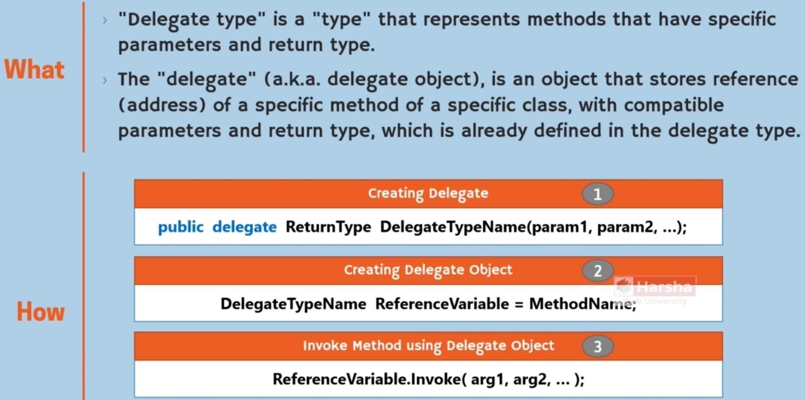

Example:

Key Points:

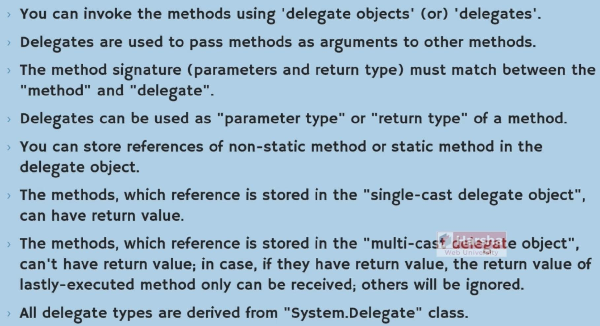

Mulit-Cast vs Single-Cast:

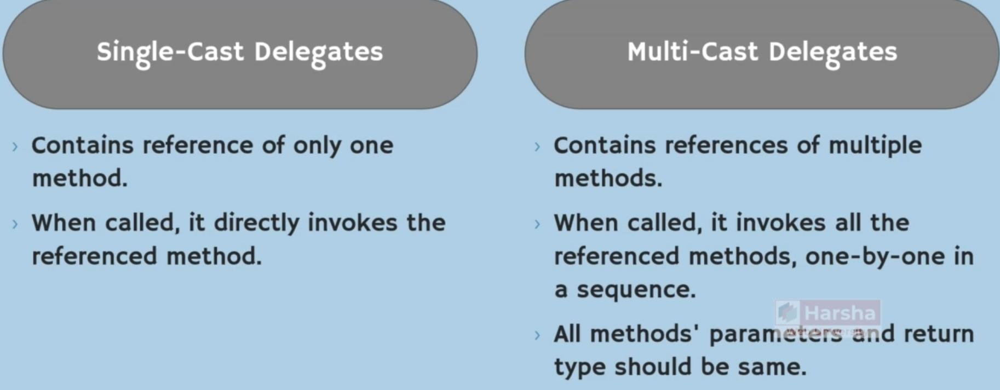

Predefined Delegate Types:

Func:

Action:

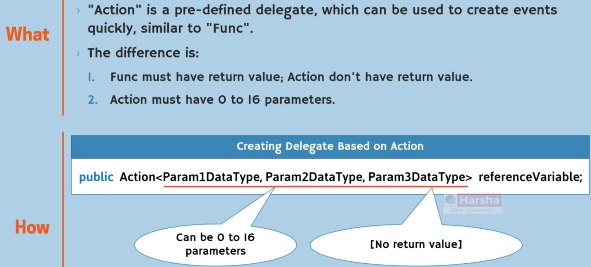

Predicate:

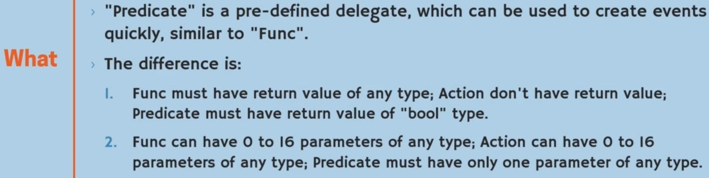

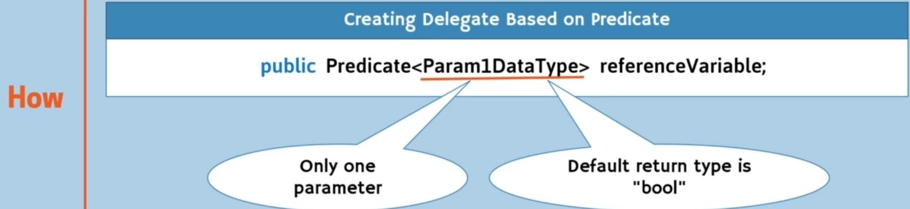

EventHandler:

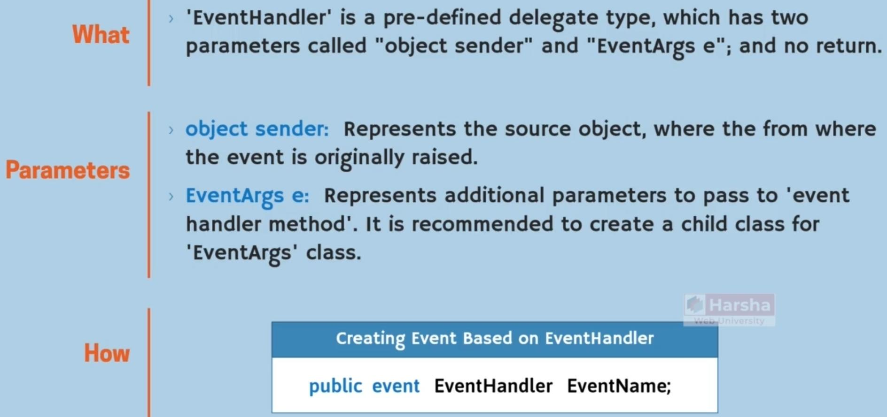

Expression Trees:

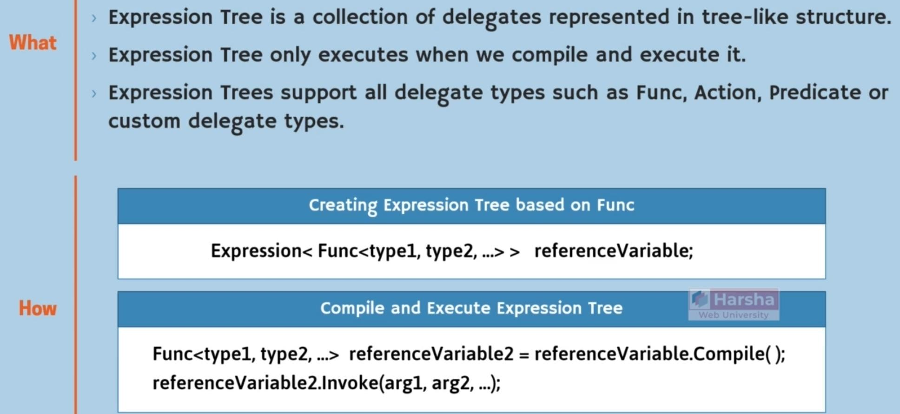

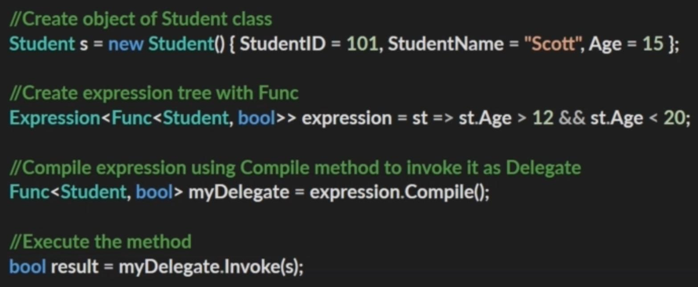

## Events

Syntax:

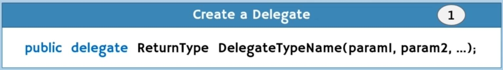

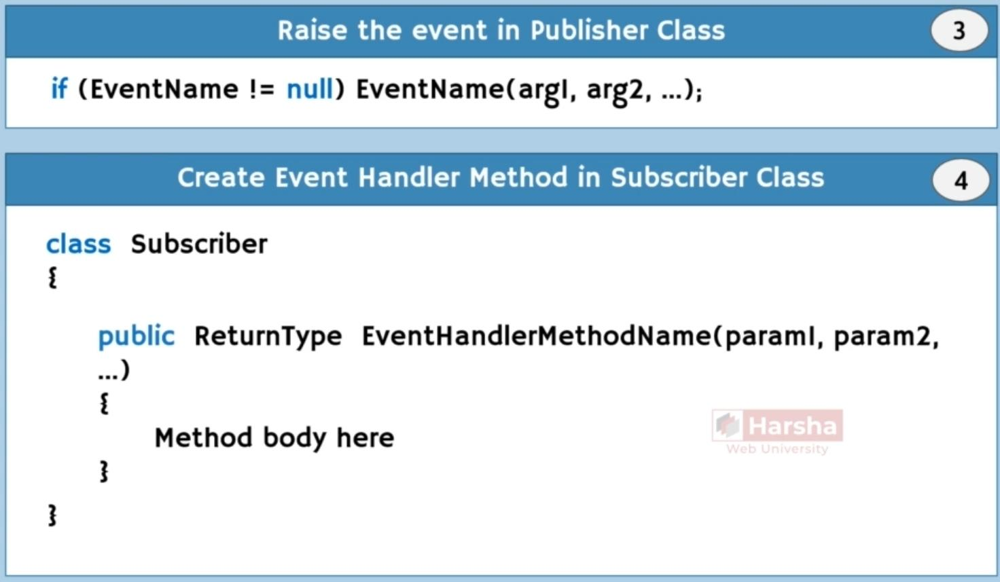

Description:

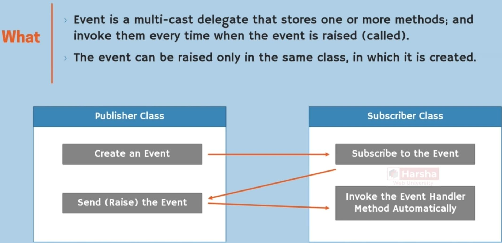

Key Points:

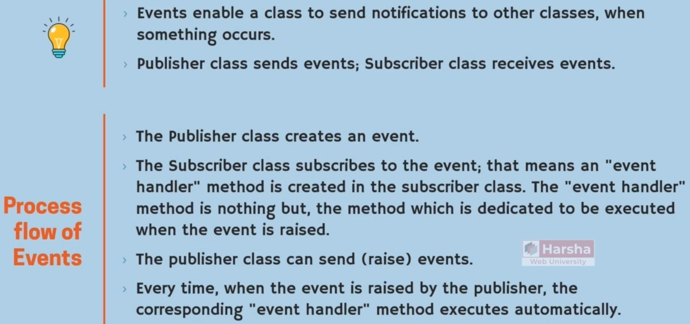

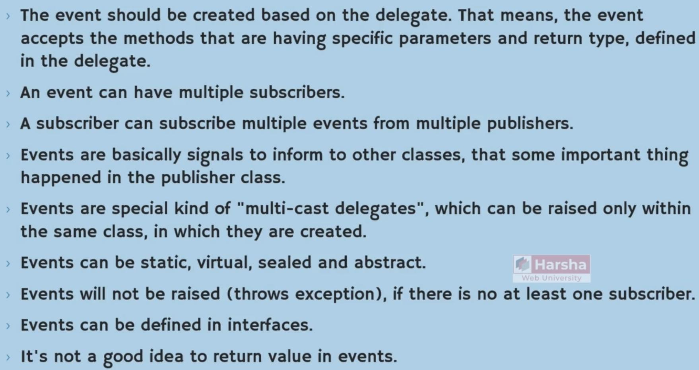

Auto Implemented Event:

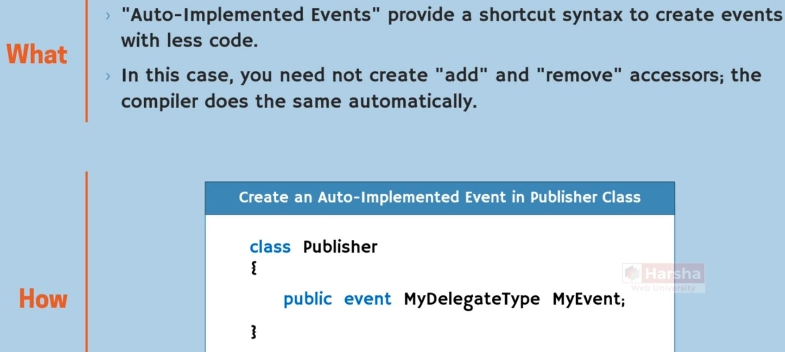

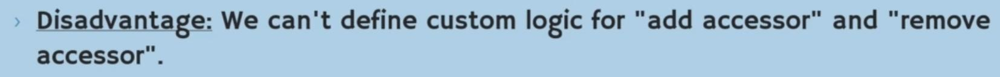

Anonymous Functions:

Anonymous Method:

**Important note:** don’t use it, instead use “lambda expressions”

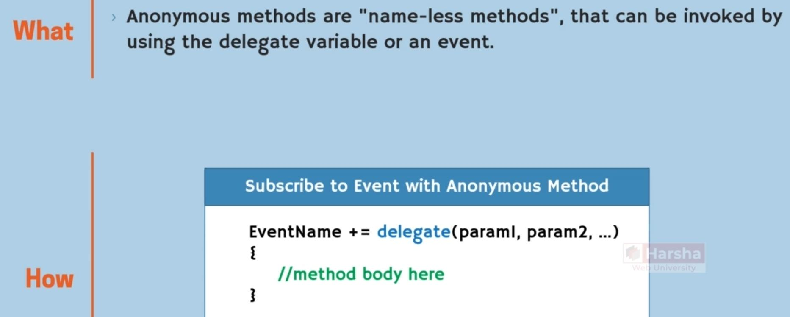

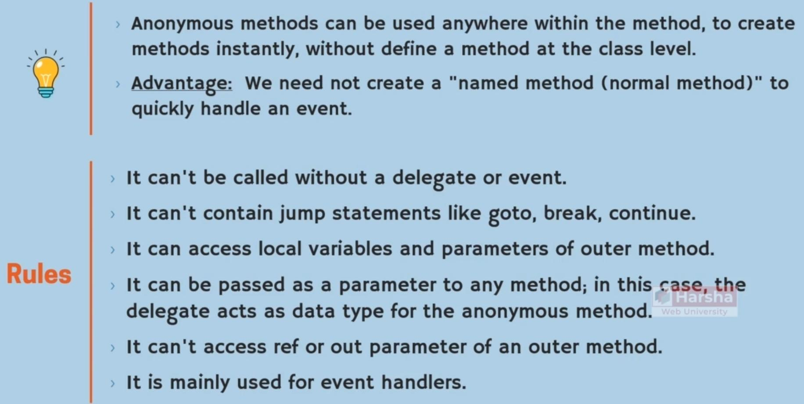

Lambda Expressions:

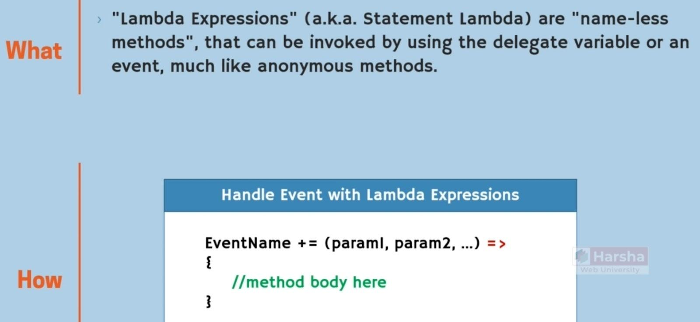

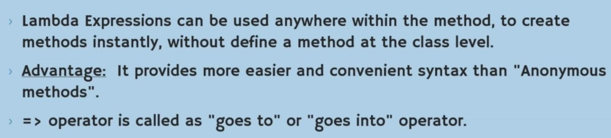

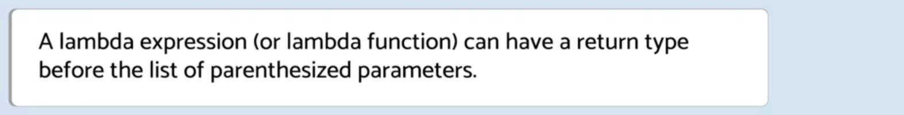

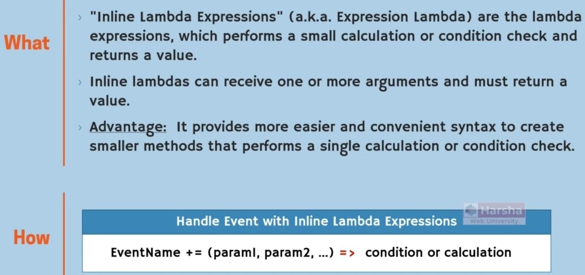

Static Anonymous Function:

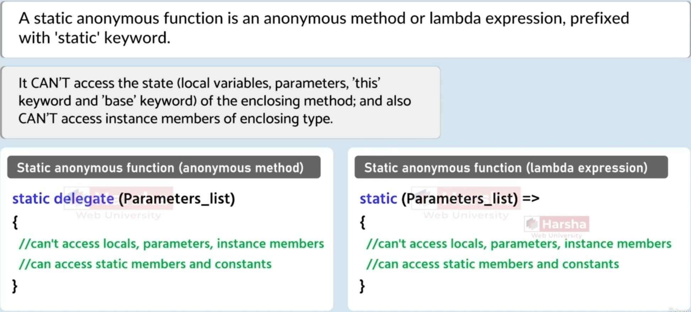
