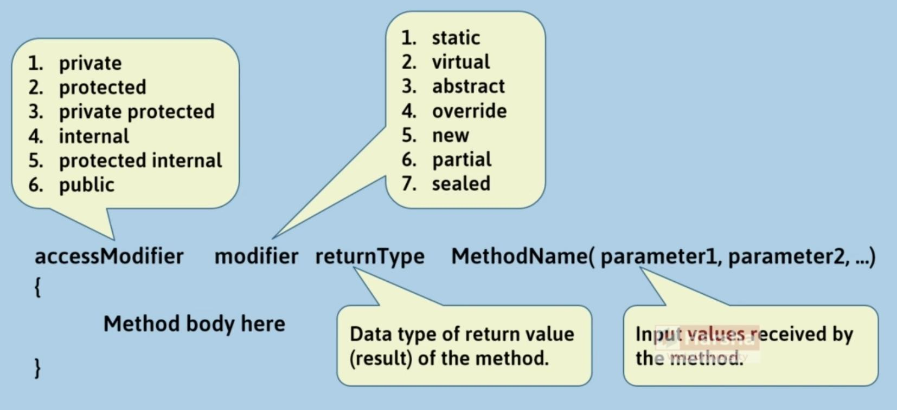

# Method

## Syntax



## Parameters

### Parameters and Local Variables

Parameters:

- The variables that are being received from the "method caller" are called as "parameters".
- The parameters are stored in the Stack of the method.
- For every method call, a new stack will be created.

Local Variables:

- The variables that are declared inside the method are called as "Local variables". Local variables can be used only within the same method.
- Local variables are stored in the same stack, just like parameters.
- The stack will be deleted at the end of method execution. So all local variables and parameters will be deleted.

### Passing by Reference

- If you pass a **"reference variable"** as an argument, the reference (address) of the object will be passed to the method.
- The parameter's data type will be the **class name**.
- If you make any changes to the object in the method, those changes will also affect the object in the caller method, as you are accessing the same object in the heap.

### Named Argument

```csharp
MethodName(ParameterName : value, ParameterName : value);
```

- `MethodName` represents the method being called.
- `ParameterName` represents the parameters that are being passed, followed by their respective values.

### Parameter Modifiers

ref:

- The **"Argument"** will be assigned into the "Parameter" **and vice versa**.
- The **Argument** must be a variable and **must be pre-initialized**.

```csharp
// Method Definition
AccessModifier Modifier ReturnDataType MethodName(ref DataType Parameter1, ...)
{
    ...
    Parameter1 = value;
}

// Method Calling
MethodName(ref Argument1, ...)
```

out:

- The **"Argument"** will not be assigned into the **"Parameter"** but only reverse.
- The Argument must be a variable; The Argument can be un-initialized.

```csharp
// Method Definition
AccessModifier Modifier ReturnDataType MethodName(out DataType Parameter1, ...)
{
    ...
    Parameter1 = value;
}

// Method Calling
MethodName(out Argument1, ...)
```

in:

- The **"Argument"** will be assigned into the **"Parameter"**, but the parameter becomes **read-only**.
- We can't modify the value of the parameter in the method; if you try to change, a compile-time error will be shown.
- New feature of **C# 7.2**

```csharp
// Method Definition
AccessModifier Modifier ReturnDataType MethodName(in DataType Parameter1, ...)
{
    ...
    Parameter1 = value; //error, we can't change the value of parameter
}

// Method Calling
MethodName(in Argument1, ...)
```

params:

- All the set of arguments will be at-a-time received as an array into the parameter.
- The "params" parameter modifier can be used only for the last parameter of the method; and can be used only once for one method.

```csharp
// Method Definition
AccessModifier Modifier ReturnDataType MethodName( params DataType[] Parameter1, ...)
{
    ...
    Parameter1[index]   //To access value based on index
}

// Method Calling
MethodName( Argument1, Argument2, Argument3...)
```

## Modifiers

### Static

| **Type**                 | **Instance Methods**                                                               | **Static Methods**                                                                        |
|--------------------------|------------------------------------------------------------------------------------|-------------------------------------------------------------------------------------------|
| **Association**          | Associated with Objects                                                            | Associated with class.                                                                    |
| **Manipulates**          | Manipulates instance fields.                                                       | Manipulates static fields.                                                                |
| **Declaration**          | Declared without "static" keyword. <br> `returnType methodName( ) { }`             | Declared with "static" keyword. <br> `static returnType methodName( ) { }`                |
| **Accessible with**      | Accessible with object (through reference variable).                               | Accessible with class name only (not with object).                                        |
| **Can access (fields)**  | Can access both instance fields and static fields.                                 | Can't access instance fields; but can access static fields only.                          |
| **Can access (methods)** | Can access both instance methods and static methods.                               | Can't access instance methods; but can access static methods only.                        |
| **"this" keyword**       | Can use "this" keyword, as there must be "current object" to call instance method. | Can't use "this" keyword, as there is no "current object" while calling instance methods. |

### New (Method Hiding)

It is a concept, which is used to hide (overwrite) the parent class's method, by creating another method in the child class with the same name and same parameters.

Method hiding is done automatically; but it is recommended to use the "new" keyword (but not must).

```csharp
// Creating parent class
class ParentClassName
{
    public void MethodName(param1, ...)
    {
    }
}

// Creating child class
class ChildClassName : ParentClassName
{
    public new void MethodName(param1, ...)
    {
    }
}
```

### Override & Virtual (Method Overriding)

It is a concept, which is used to extend the parent class's method, by creating another method in the child class with the same name and same parameters.

```csharp
// Creating parent class
class ParentClassName
{
    public virtual void MethodName( param1, ... )
    {
    }
}

// Creating child class
class ChildClassName : ParentClassName
{
    public override void MethodName( param1, ... )
    {
        base.MethodName();
    }
}
```

### Sealed

Sealed Methods must be "override methods"; which can't be overridden in the corresponding child classes.

Use sealed methods to prevent overriding those particular methods in the corresponding child classes.

```csharp
// Creating parent class
class ParentClassName
{
    public virtual void MethodName( param1, ... )
    {
    }
}

// Creating child class 1
class ChildClass1 : ParentClassName
{
    public sealed override void MethodName()
    {
    }
}

// Creating child class 2
class ChildClass2 : ChildClass1
{
    public override void MethodName()   // Doesn't compile!
    {
    }
}
```

### Abstract

Abstract methods are declared in parent class, with **"abstract"** keyword.

- Implemented in child classes, with **"override"** keyword.
- When the parent class doesn't want to provide the definition of a method;
- It wants to let child classes implement the method.

```csharp
// Parent Class [Abstract Class]
abstract class AbstractClassName
{
    AccessModifier abstract ReturnDataType MethodName(param1, ...);
}

// Child Class of Abstract Class
class ChildClassName : AbstractClassName
{
    AccessModifier override ReturnDataType MethodName(param1, ...)
    {
    }
}
```

### Partial

Partial Methods are "declared in one partial class" (just like abstract methods), and "implemented in another partial class", having the same name.

- Assume, there are two developers; the first developer develops the first partial class; second developer develops the second partial class.
- The partial method lets the first developer to declare a partial method in one partial class; and the second developer implements the partial method in the other partial class.
- Partial Methods can only be created in partial class or partial structs.
- Implementation of partial methods is optional. If there is no implementation of partial methods in any parts of the partial class, the method calls are removed by the compiler, at compilation time.
- If you are building large class libraries and decide extension of methods to other developers, partial methods can be used.

```csharp
// First Partial Class
partial class ClassName
{
    partial void MethodName(param1, ...)
}

// Second Partial Class
partial class ClassName
{
    partial void MethodName(param1, ...)
    {
        // method body here
    }
}

// Third Partial Class
partial class ClassName
{
    public void OtherMethod()
    {
        this.MethodName(arg1, ...);  // calling the partial method
    }
}
```

## Method Types

### Method Overloading

Writing multiple methods with the same name in the same class, with different parameters.

- Caller would have several options while calling a method.
- The difference between parameters of all the methods that have the same name is a MUST.

```csharp
MethodName()
MethodName(int)
MethodName(string)
MethodName(int, string)
MethodName(string, int)
MethodName(string, string, int)
etc.
```

### ref Return

The reference of return variable will be assigned to receiving variable.

```csharp
// Method definition
AccessModifier Modifier ReturnDataType MethodName(...)
{
    return ref variable;
}

// Method calling
ref variable = MethodName();
```

### Generic Method

**Generic Method** is a method that has one or more generic parameter(s).

You can restrict what type of data types (class names) are allowed to be passed while creating the object.

```csharp
public void MethodName<T>
{
  // Method body
}

MethodName<datatype>(valueHere);
```

### Indexer Method


- Indexers are always created with the `this` keyword.
- Indexers are generally used to access a group of elements (items).
- Parameterized properties are called indexers.
- Indexers are implemented through `get` and `set` accessors along with the `[ ]` operator.
- An indexer must have one or more parameters.
- `ref` and `out` parameter modifiers are not permitted in an indexer.
- An indexer cannot be static.
- An indexer is identified by its signature (syntax of calling), whereas a property is identified by its name.
- Indexers can be overloaded.

### Extension Method

**Extension method** is a method injected (added) into an existing class (or struct or interface), without modifying the source code of that class (or struct or interface).

- Is like monkey patching in python
- You must create a **static class** with a **static method**; that it will be added as a **non-static method** to the specified class.
- This feature is introduced in **C# 3.0**.
- The first parameter of the extension must include the keyword **this**, followed by the **class name** or **structure name** to which you want to add the extension method.
- The parameter with the **this** keyword represents the current object, just like the **this** keyword in instance methods.
- An extension method can have any number of additional parameters, but the **this** keyword parameter is obligatory.

```csharp
static class ClassName
{
     public static ReturnType MethodName(this ClassName ParameterName, ...)
     {
         // Method body here
     }
}
```

### Iterator (yield)

Iterator is a method that yields returns of elements one-by-one.

- Iterator is used to iterate over a set of elements.
- Iterator can be a method or get accessor of a property.
- Iterator can't be a constructor or destructor.
- Iterator can't contain `ref` or `out` parameters.
- Multiple `yield` statements can be used within the same iterator.
- Iterators are generally implemented in custom collections.
- While using the iterator, you must import the `System.Collections.Generic` namespace.

```csharp
public IEnumerable<type> MethodName()
{
    for (int i = 0; i < 10; i++)
    {
        yield return value;  // Returns an element but pauses the execution of the method.
    }
}
```

Example:

```csharp
public List<double> Prices { get; set; } = new List<double>() { 90, 34, 12, 80 };

// Iterator method
public IEnumerable<double> Method()
{
    double sum = 0;
    foreach (double price in Prices) {
        sum += price;
        yield return sum;  //90, 124, 136, 216
    }
}
```

### Module Initializer

Allows you to run some code with 'global initialization logic' at application startup, when the application loads into memory.

The initializer method must be:

- Either **"internal"**, **"protected internal"**, or **"public"** only.
- Static method
- Parameterless method
- Return type is **void**
- Not be a generic method
- Cannot be a local function

The initializer class must be:

- Either **"internal"** or **"public"** only.
- Can be a static class (optionally)
- Not be a generic class

```csharp
using System.Runtime.CompilerServices;

class class_name
{
    [ModuleInitializer]
    internal static void method_name()
    {
        // Code goes here
        // Would execute at application startup (before the `Main` method)
    }
}
```
