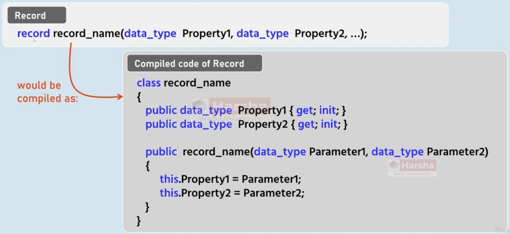
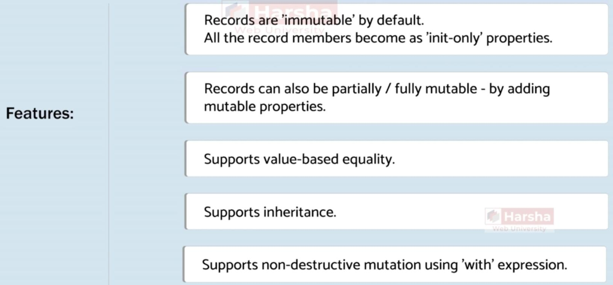
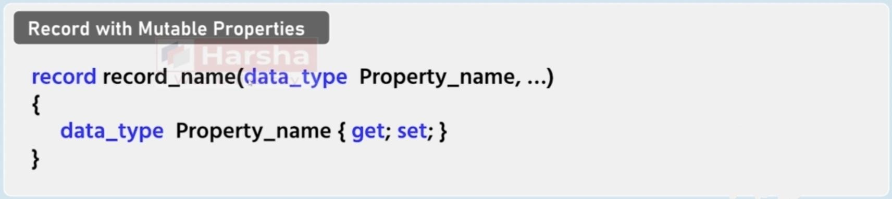
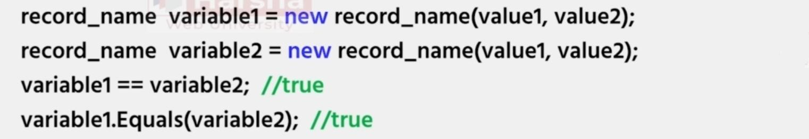
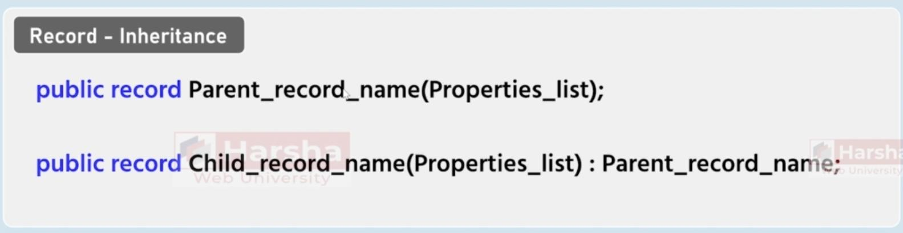
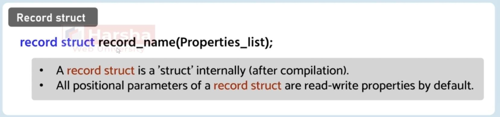
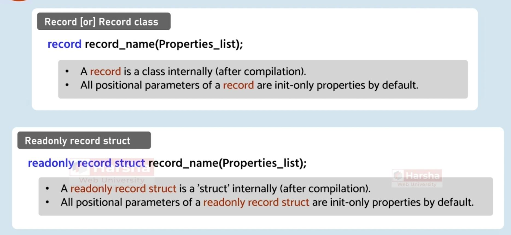

# Record

## Description

- Is a shortcut for creating immutable classes

## Features

## Mutable Properties

## Equality

## Inheritance

## Nested Record

## Deconstruction

Records by default supports deconstruction

## Record Struct

## Record vs Record Struct

- The property of **normal records** are by default **init only**
- The property of **readonly record** structs are by default **init only**
- The property of **normal record structs** by default **has setter and getter**
