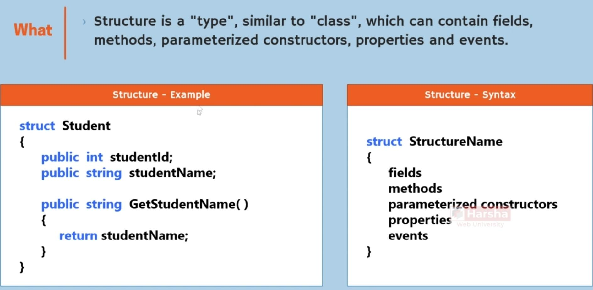
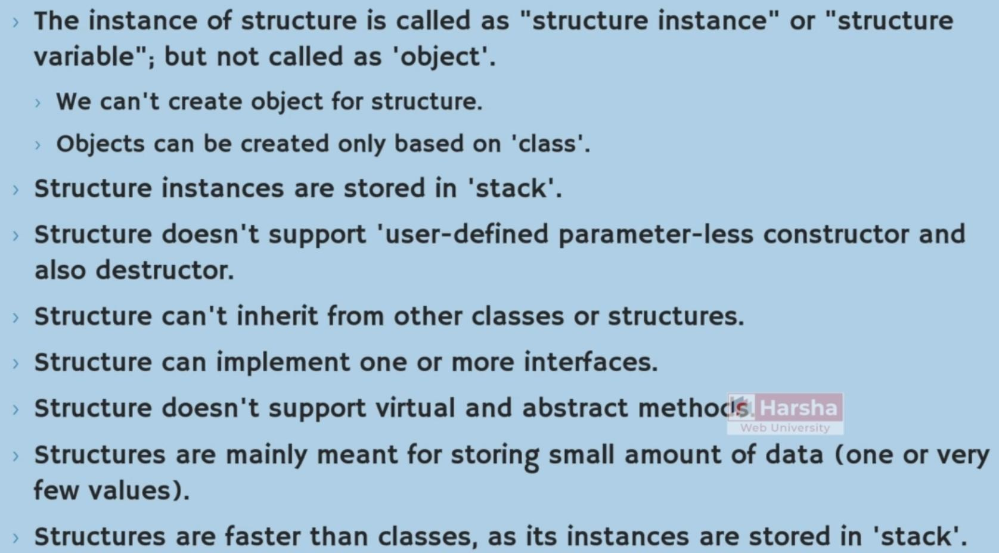
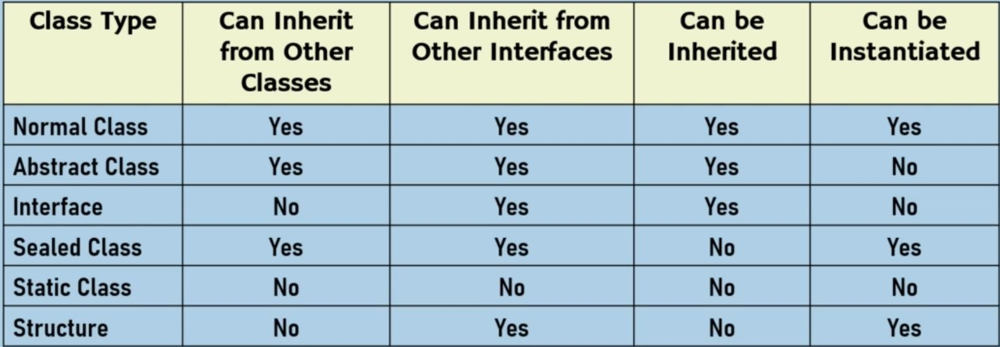
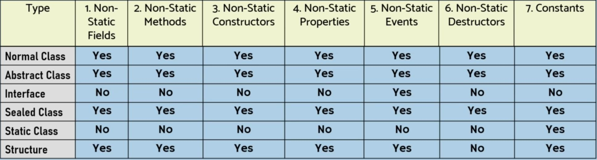
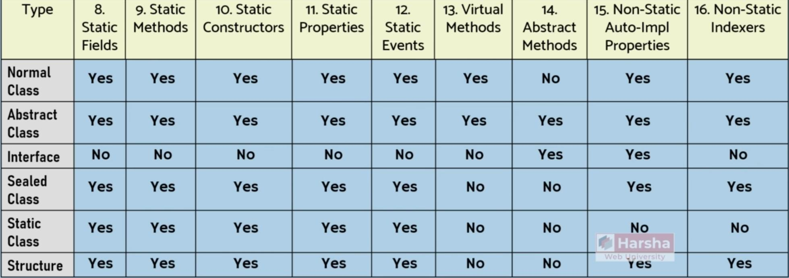
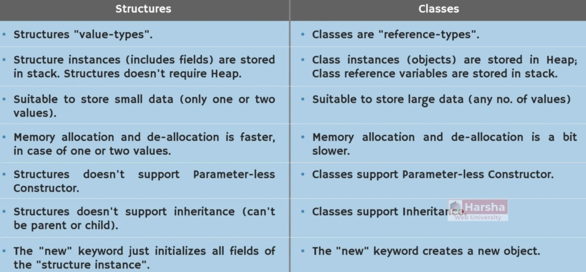
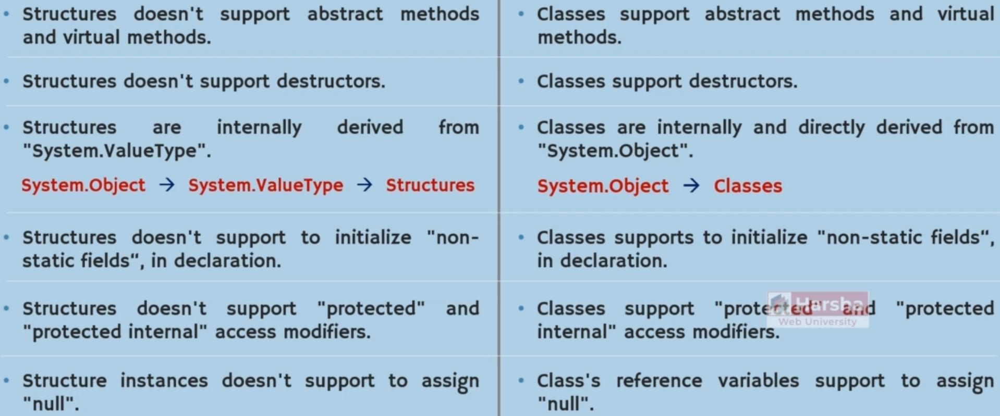
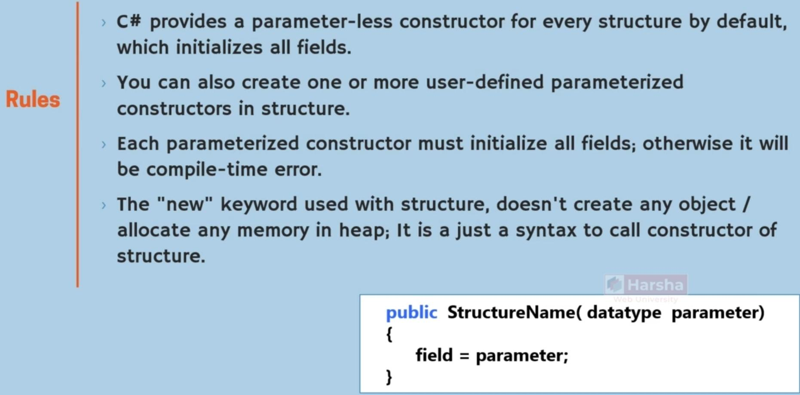
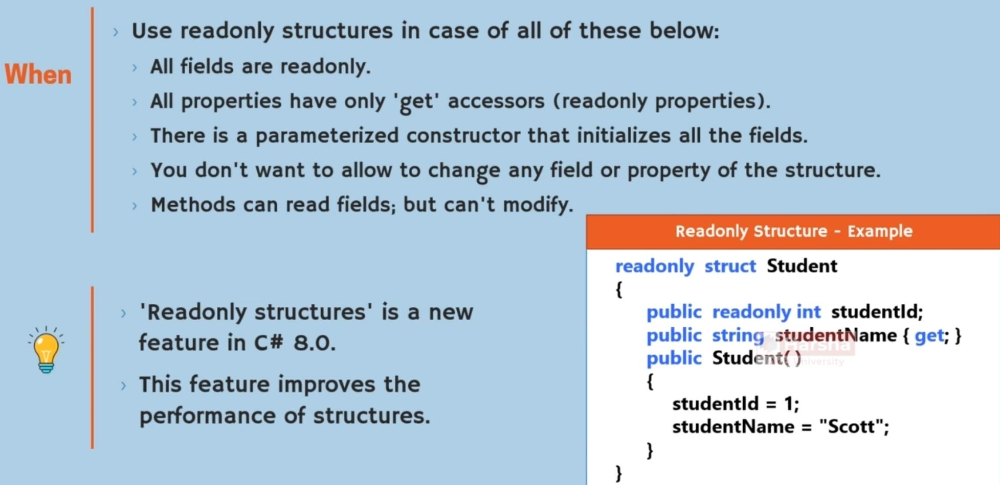

# Structure

## Description

## Key Points

- Structures are value type but classes are reference type
- Will store in stack
- Is good for one or two fields
- Can inherit from interfaces but can't inherit from other classes or structures

## Structures vs Classes

## Constructor

!!! info

    بدون استفاده از constructor اصلا نیازی به instantiate کردن و استفاده از کلیدواژه new نیست، مثل زیر:

    

## Readonly Structure

