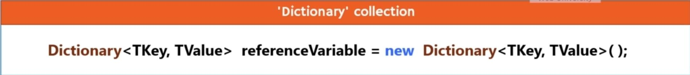
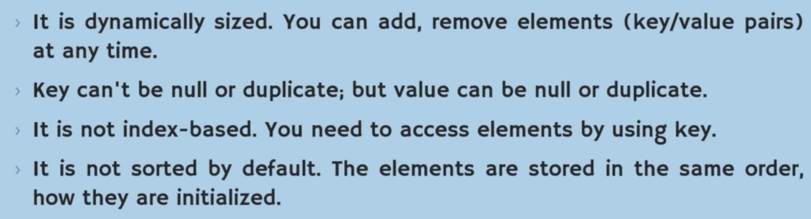
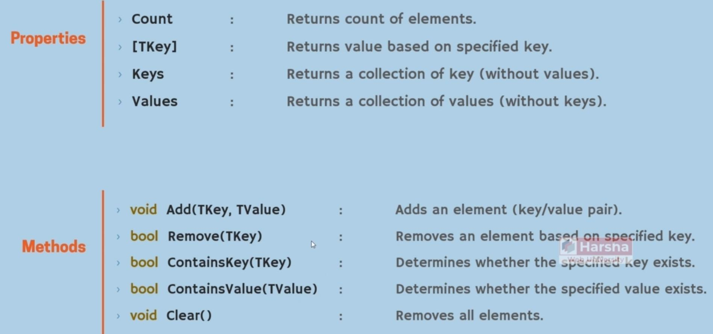
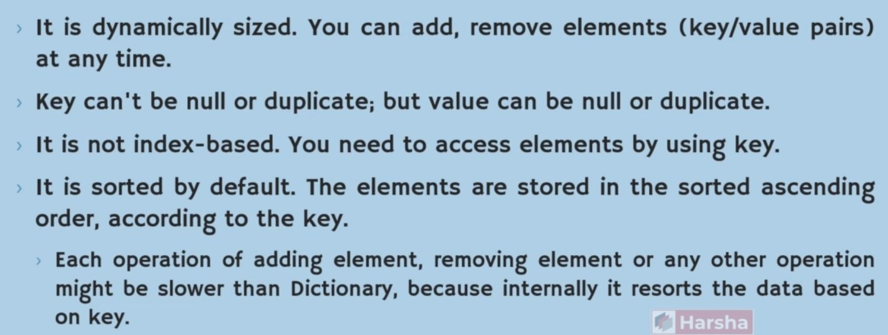
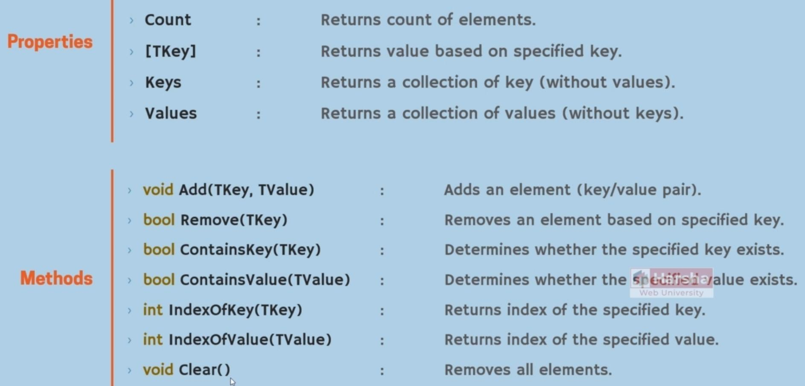
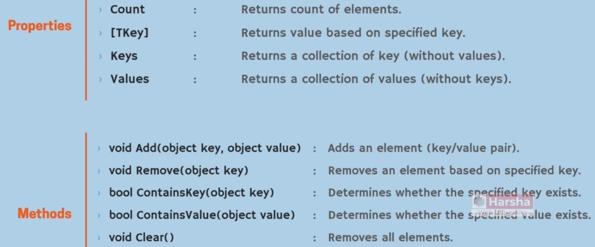
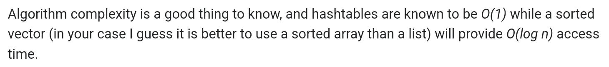

# Dictionary & SortedList & Hashtable

## Dictionary

Syntax:

Description:

Features:

Overview:

- All of the shared features can be used for the Dictionary

## SortedList

Syntax:

Description:

- Will use BinarySearch in the background

Features:

Overview:

- All of the shared features can be used for the SortedList
- The below features are specific to the SortedList

IndexOfKey:

IndexOfValue:

vs Dictionary:

- Dictionary: fast insert, slow search
- SortedList: slow insert, fast search
- Dictionary will use linear search for finding key
- SortedList will sort the keys after each new insert

## Hashtable

Syntax:

Description:

- GetHashCode method of the key value will be used in the index calculation process
- when we want to using the objs of our custom class as the key inside a hashtable, we should implement the GetHashCode method of that class
- Elements with the same calculated index will be stored in the same index with the linked list data structure
- Each time, when the size of hashtable changes, all of the exists indexes will calculated automaticaly

Features:

Overview:

Type Conversion:

- Hashtable will return System.Object instance, becuse we can store any type of data in hashtables
- After retriving data from hashtable (with \[TKey\] or foreach loop), we should covert the result

vs SortedList:

- Hashtable O(1) is faster than SortedList O(log n) in retiriving data
- Both of them have cost in data insert

## Shared Features

\[TKey\]:

Keys:

Values:

Add:

Remove:

ContainsKey:

ContainsValue:

Clear:

