# LINQ

## Description

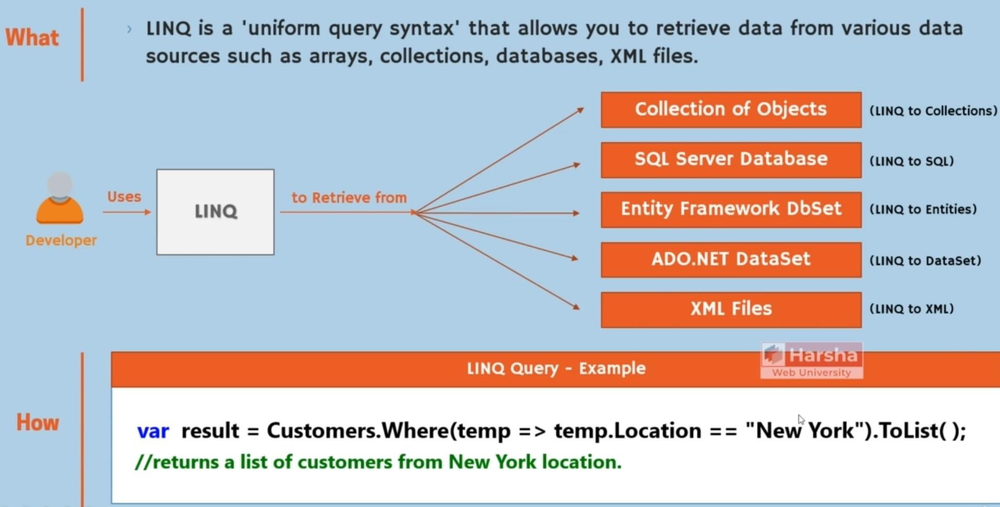

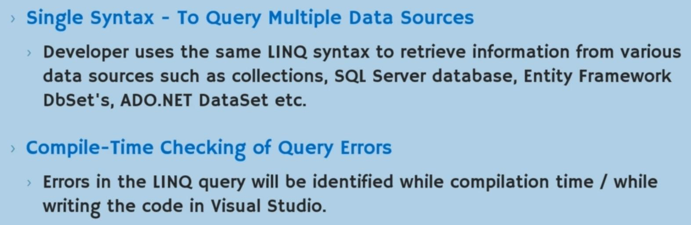

- LINQ = Language Integrated Query

## Operators & Extension Methods

### Overview

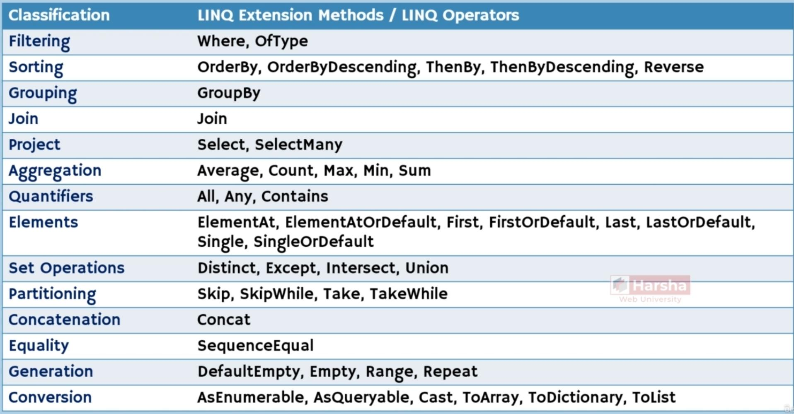

### OrderBy & ThenBy (Ascending or Descending)

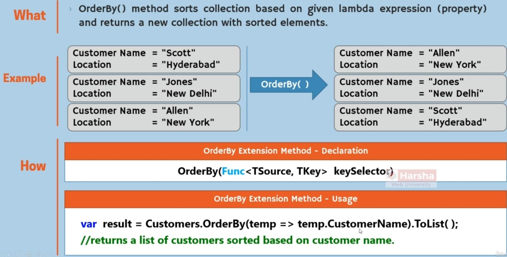

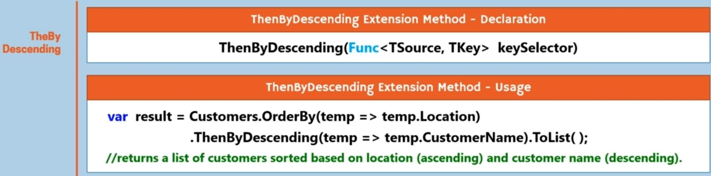

### First

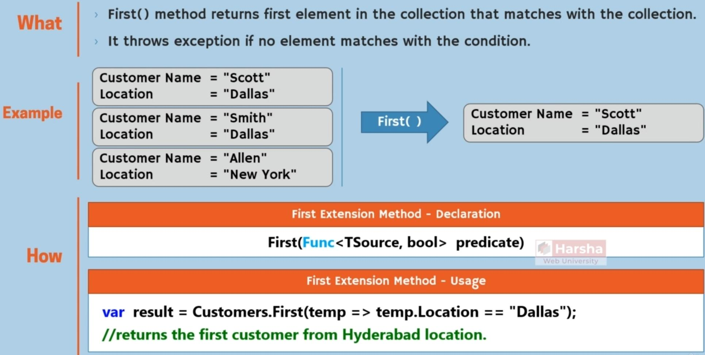

### FirstOrDefault

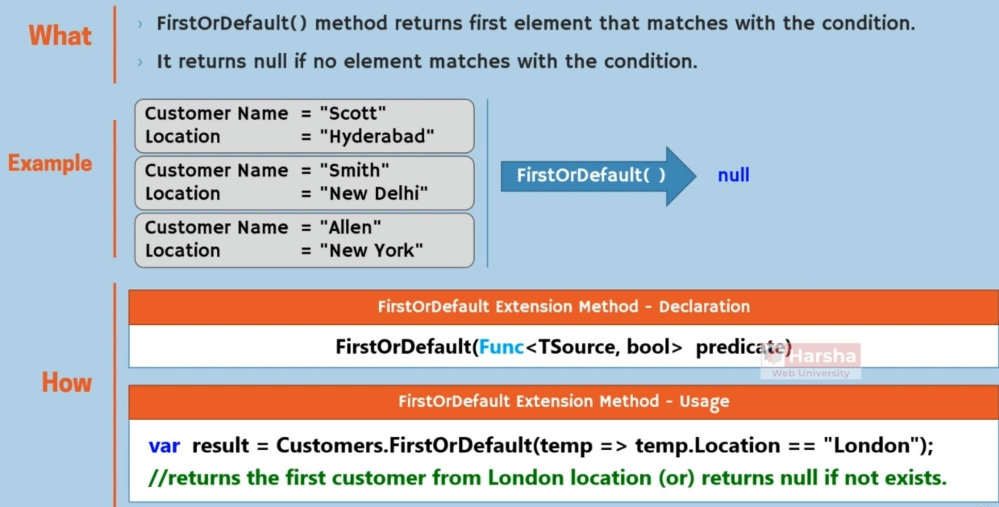

### Last

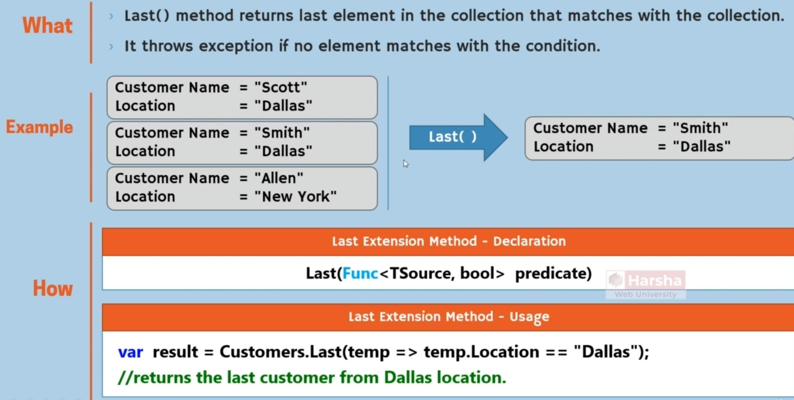

### LastOrDefault

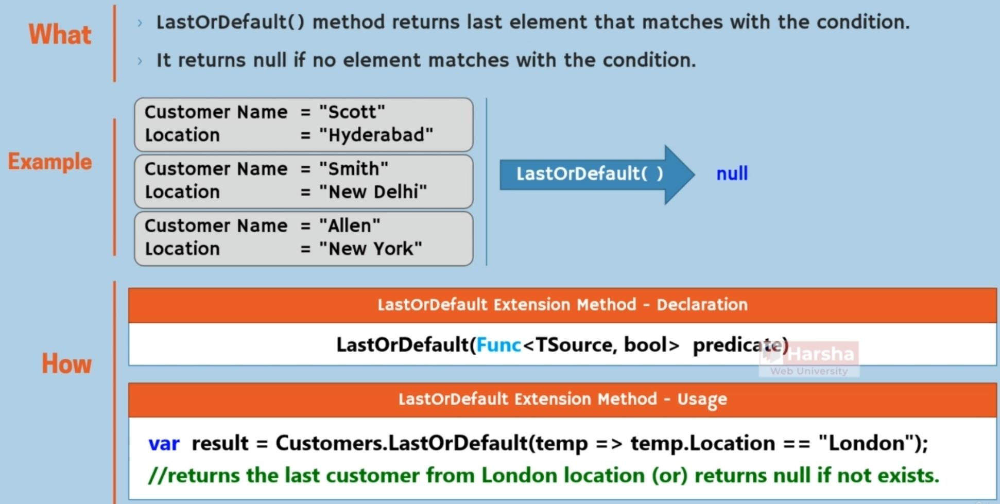

### ElementAt

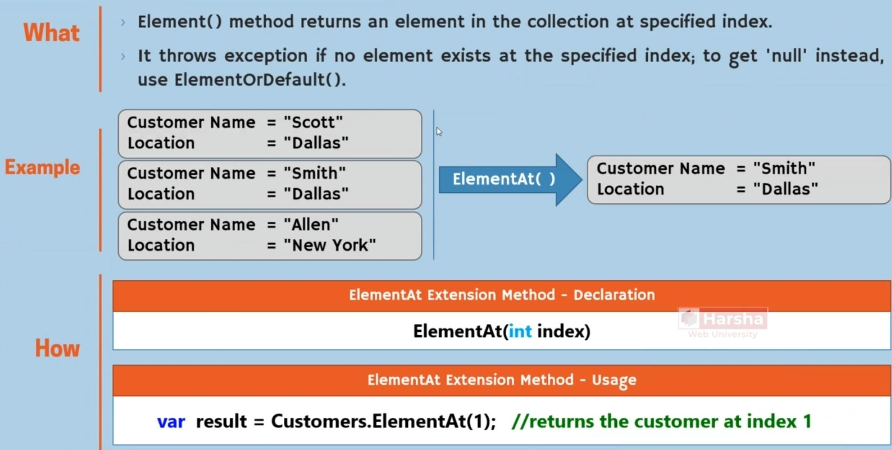

### Single

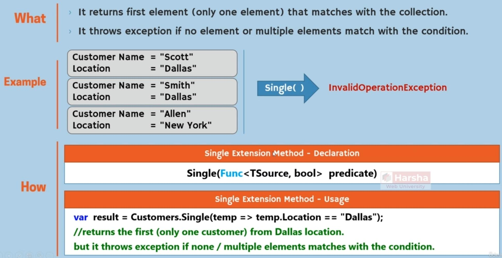

### SingleOrDefault

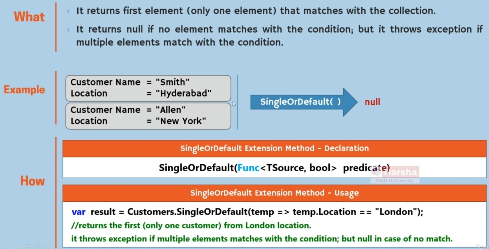

### Take

Will receive the first number of elements

### Select

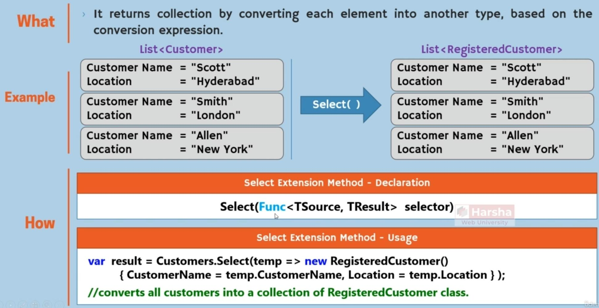

### Add

Will add one element into the collection

### AddRange

Will add multiple elements into the collection at once

### Remove

Will remove one element from the collection

### RemoveRange

Will remove multiple elements from the collection at once

### Min, Max, Sum, Average, Count

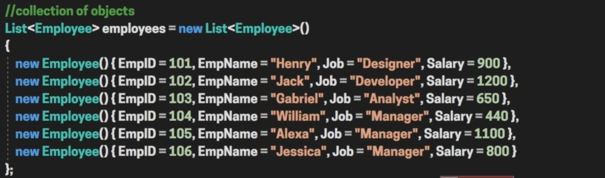

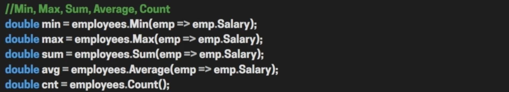
