# List & Hashset & ArrayList & Stack & Queue

## List

Syntax:

Description:

- Will use array in its underlying layer

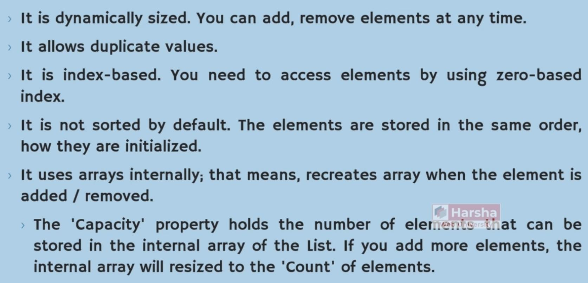

Features:

Overview:

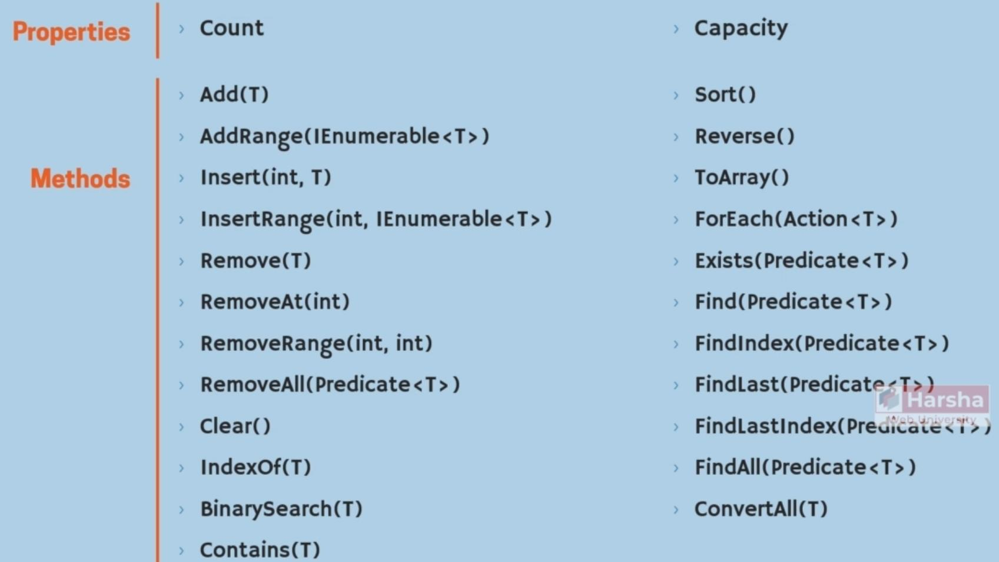

Capacity:

We can set List capacity (underlying Array capacity) like the below, List class will not create a new array for new items until its capacity, after that will create a new array for each element:

RemoveAll:

ForEach:

Exists:

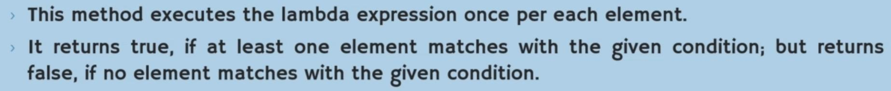

Find:

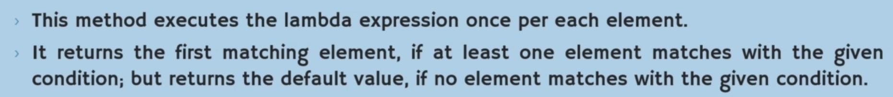

FindIndex:

FindLast:

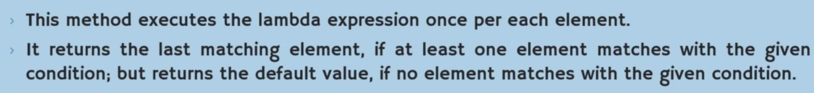

FindLastIndex:

FindAll:

ConvertAll:

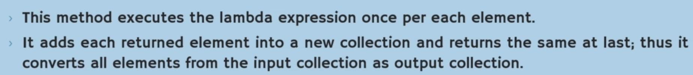

## Hashset

Syntax:

Description:

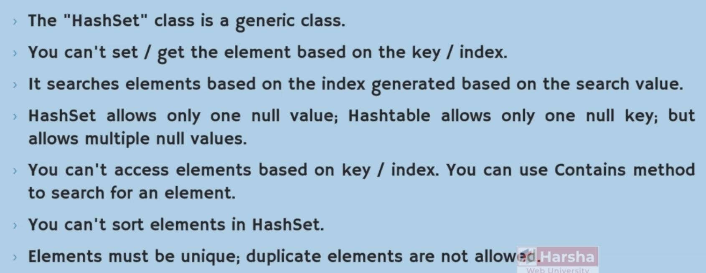

Features:

Overview:

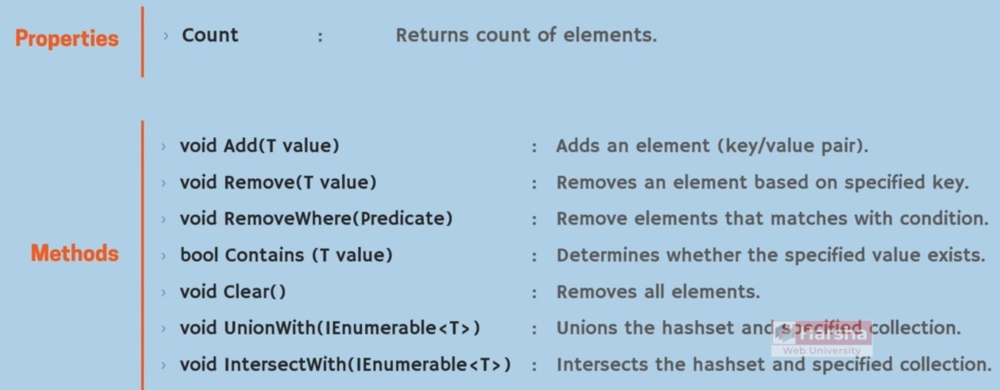

RemoveWhere:

UnionWith:

IntersectWith:

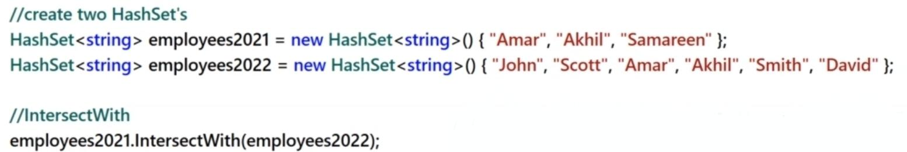

## ArrayList

Syntax:

Description:

- Exactly like List, except in the ArrayList we can store any type of data at the same time

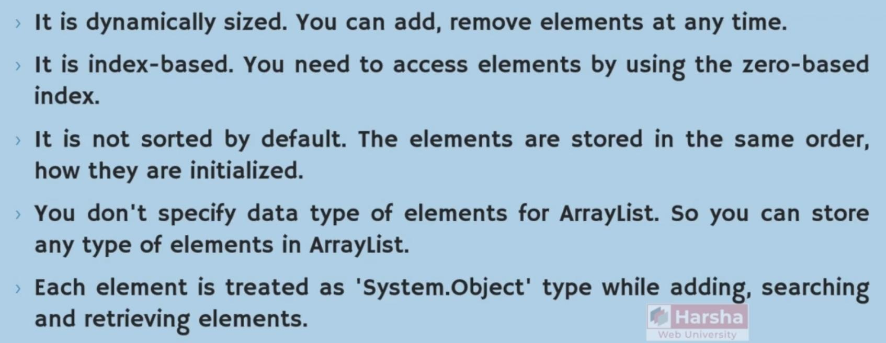

Features:

Overview:

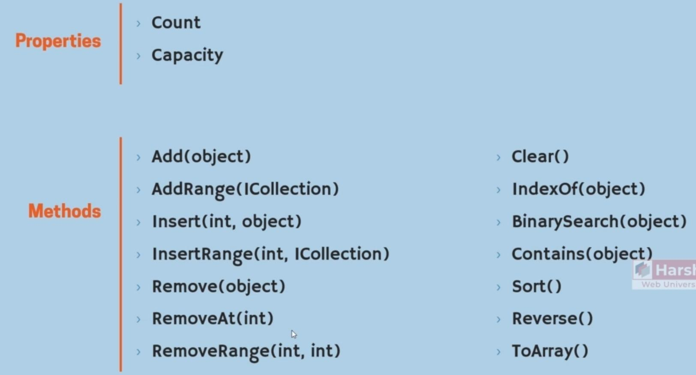

## Stack

Syntax:

Description:

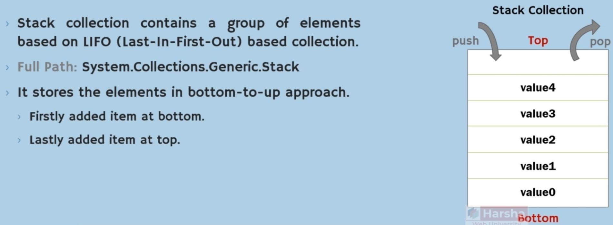

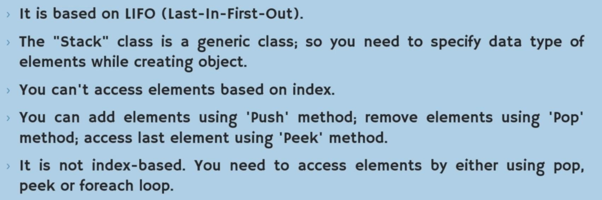

Features:

Overview:

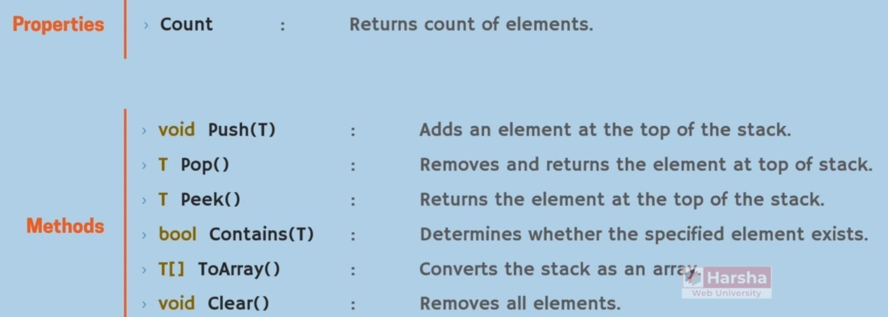

Push:

Pop:

- Will remove the returned element

## Queue

Syntax:

Description:

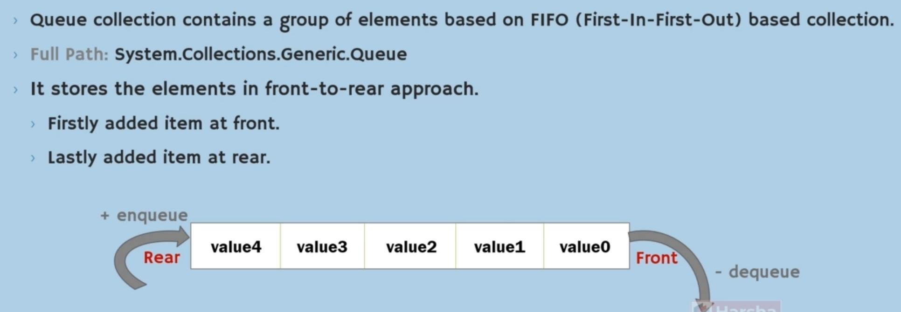

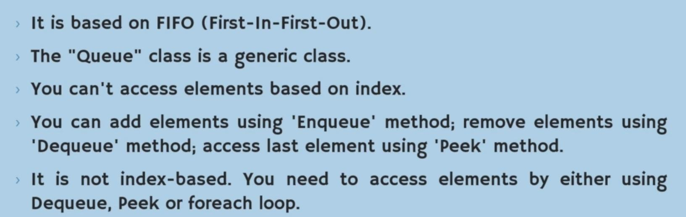

Features:

Overview:

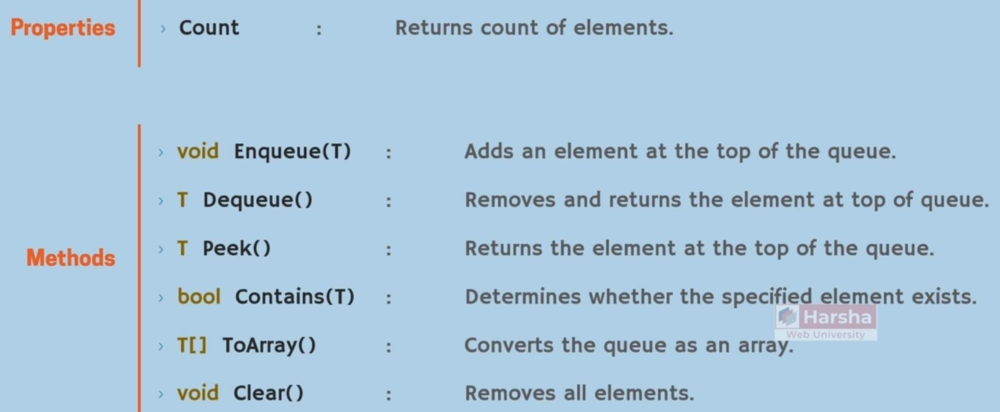

Enqueue:

Dequeue:

- Will remove the returned element

## Shared Features

Add:

AddRange:

Insert:

InsertRange:

Remove:

RemoveAt:

RemoveRange:

Clear:

IndexOf:

BinarySearch:

Contains:

- This method performs a linear search in the List but will have O(1) in the Hashset

Sort:

Reverse:

- For sorting a list in descending order, first we should call it's Sort method then we should fire its Reverse method

ToArray:

Peek:

- Will not remove the returned element
