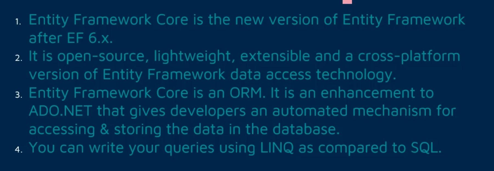

# Overview & Installation

## Description

### Features

### ORM Stands For

## Packages

### Core

- Will add core functionality

### EF SQLServer Support

- Will add SQLServer support
- For other databases, there are other similar packages

### EF Migration Support

- Will add migration functionality
