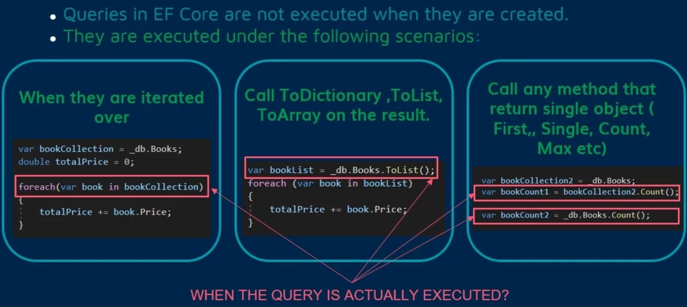
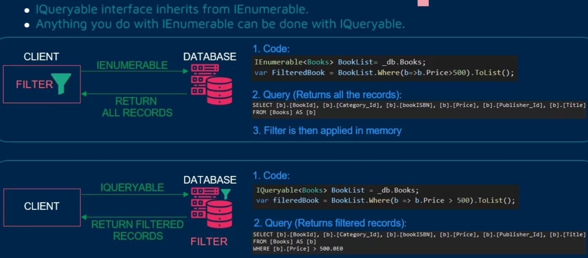

# Command & Query

## Concepts

### Deferred Execution

### Projection

### IQueryable vs IEnumerable

- IQueryable does inherited from IEnumerable

### Entity States

Tracked entities can be in one of four states. The state of an entity determines how it is processed when SaveChanges is called.

- **Added:** The entity does not yet exist in the database. SaveChanges should **insert** it
- **Unchanged:** The entity exists in the database and has not been modified on the client. SaveChanges should **ignore** it
- **Modified:** The entity exists in the database and has been modified on the client. SaveChanges should send **updates** for it
- **Deleted:** The entity exists in the database but should be deleted. SaveChanges should **delete** it
- **Detached:** The Detached state is given to any entity that is not being tracked by the context

### Graph

The main entity and all of the entities that has relation with it (should be included while query)

### Tracking & No-Tracking Query

- There is an object named ChangeTracker inside each DbContext object that will store this data

  

## Command

### Add

Add puts all entities in the graph into the Added state. This means they will be inserted into the database on SaveChanges.

### Attach

Attach puts all entities in the graph into the Unchanged state. However, entities will be put in the Added state if they have store-generated keys (e.g. Identity column) and no key value has been set.

This means that when exclusively using store-generated keys, Attach can be used to start tracking a mix of new and existing entities where the existing entities have not changed. The new entities will be inserted while the existing entities will not be saved other than to update any necessary FK values.

### Update

Update works the same as Attach except that entities are put in the Modified state instead of the Unchanged state.

This means that when exclusively using store-generated keys, Update can be used to start tracking a mix of new and existing entities where the existing entities may have some modifications. The new entities will be inserted while the existing entities will be updated.

### Remove

Remove affects only the entity passed to the method. It does not traverse the graph of reachable entities.

If the entity is in the Unchanged or Modified state, indicating that it exists in the database, then it is put in the Deleted state.

If the entity is in the Added state, indicating that it has not yet been inserted, then it is detached from the context and is no longer tracked.

Remove is usually used with entities that are already being tracked. If the entity is not tracked, then it is first Attached and then placed in the Deleted state.

### Range Methods

The AddRange, AttachRange, UpdateRange, and RemoveRange methods work exactly the same as calling the non-Range methods multiple times. They are slightly more efficient than multiple calls to the non-Range methods, but the efficiency gain is very small because none of these methods now automatically call DetectChanges.

## Query

### Include (Eager Loading)

- Will run proper join command
- Over FK or many-to-one or one-to-one relation

  

- Over one-to-many or many-to-many relation

  

- Over one-to-many or many-to-many relation with inner query

  

- Over nested relation

  

### Include vs Join

- An Included is intended to retain the original object structures and graphs.
- A Join is needed to project a flattened representation of the object graph or to join types which are not naturally related through the graph (ie. join the customer's city with a shipping facility's city)

### AsNoTracking

- Will tell to the DbContext to don't track returned entities
- Is useful for read-only queries
