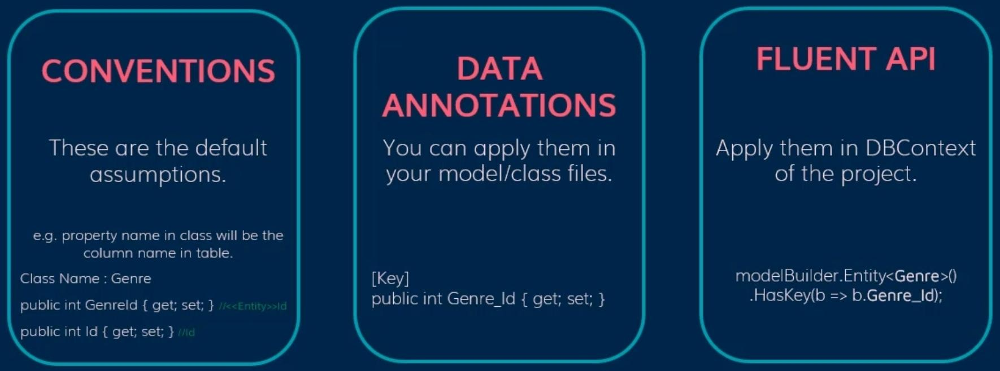
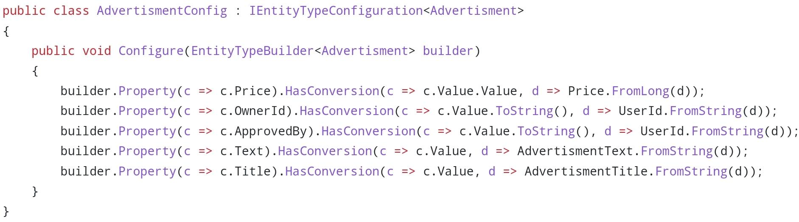

# Model & Fields

## Mappings

### Description

This means mapping one class and its properties to the database table and its fields

### Conventions

Will be done automatically by EF

### Annotations

This will be done by the C# annotations

### Fluent API

- This will be done inside of the DbContext class and within the below method

  

- Or we can create separate config classes for each model

  

  We should add them inside of OnModelCreating method

  

## Model

### Table Name

- Convention: By default, EF will use the DbSet property name for the table name, for example in the below code EF will use Categories for table name

  

- Data Annotation:

  

- Fluent API:

  

### ToView

- Fluent API:

  

## Fields

### Primary Key

- Convention: By default EF will use the Id field or `<ModelName>Id` field as primary key without need any annotation

  

- Data Annotation: For the fields other than Id or `<ModelName>Id`, we can explicitly define our primary key like the below

  

- Fluent API:

  Example 1: The below code will create a composite-key

  

  Example 2: The below code will tell EF that this table doesn't have primary key

  

### Foreign Key

- Convention: EF will create FK and CategoryId field in the below code

  

- Data Annotation: If want to have a field name other than CategoryId, we can use the below code

  

### One-to-One Relation

- Convention:

  

- Data Annotation:

  

- Fluent API:

  

### One-to-Many Relation

- Convention:

  

  tip: can be List<> or ICollection<>

- Data Annotation:

  

- Fluent API:

  

### Many-to-Many Relation

- Convention:

  

  tip: can be ICollection<> or List<>

- Fluent API:

  

### Column Name

- Data Annotation:

  

- Fluent API:

  

### Required

- Data Annotation:

  

- Fluent API:

  

### Max Length

- Data Annotation:

  

- Fluent API:

  

### Not Mapped

- Data Annotation:

  

- Fluent API:

  

### Database Generated

Data Annotation & Fluent API:

- Identity: Will set by the DB at row creation
- None: Will prevent the DB to set
- Computed: Will set by the DB at row creation or update
