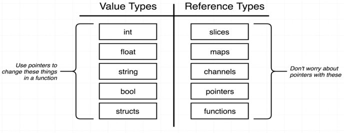
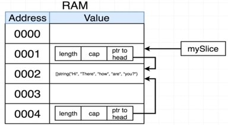

# Passed by Value/Reference

## Overview

## Why Slices Will Passed by Reference

Slices use an underlying array, so when Go tries to copy it, it'll copy the slice information instead of the underlying array.
