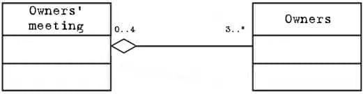

# Aggregation (Constructor List)

## Description

- Represents a weaker form of "has-a" relationship compared to composition.
- It is shown as an empty diamond shape with a line connecting the aggregate class to the component class.
- The component class can exist independently, and there is a more relaxed relationship between the two.



## Example

```python
class Department:
    def __init__(self, name: str) -> None:
        self.name: str = name

class University:
    def __init__(self) -> None:
        # Aggregation with Department
        self.departments: List[Department] = []

    def add_department(self, department: Department) -> None:
        self.departments.append(department)
```
