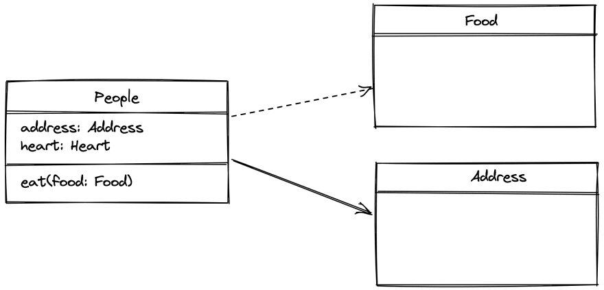

# Association (Constructor Access)

## Description

- Represents a relationship between two or more classes.
- Shown as a simple line (or arrowed line) connecting the participating classes.
- It can be unidirectional or bidirectional, depending on the presence of arrowheads.
- Multiplicity notations (such as "1", "0..1", "\*", etc.) indicate the number of instances involved in the association.
- Captures connections between classes without implying any specific type of relationship.



- The Food relation is a Dependency
- The Address relation is the Association

## Example

```python
class ClassA:
    pass

class ClassB:
    def __init__(self, objA: ClassA) -> None:
        # Association with ClassA
        self.objA = objA
```
