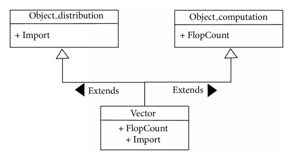

# Generalization (Extend)

## Description

- Inheritance from other classes
- Represents an "is-a" relationship between classes.
- Shown as a solid line with a hollow arrowhead pointing from the subclass to the superclass.
- Enables code reuse and establishes a hierarchy among classes.



## Example

```python
class Animal:
    def make_sound(self) -> None:
        pass

class Dog(Animal):
    def make_sound(self) -> None:
        print("Woof!")

class Cat(Animal):
    def make_sound(self) -> None:
        print("Meow!")
```
