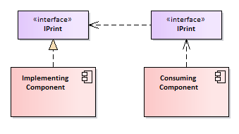

# Realization (Implementation)

## Description

- Inheritance from other interfaces
- Represents the implementation of an interface by a class or component.
- Shown as a dashed line with a hollow triangle arrowhead pointing from the class realizing the interface to the interface itself.
- Indicates that the realizing class provides the actual implementation for the operations defined in the interface.



## Example

```python
from abc import ABC, abstractmethod

class Shape(ABC):
    @abstractmethod
    def draw(self) -> None:
        pass

class Circle(Shape):
    def draw(self) -> None:
        print("Drawing a circle")

class Square(Shape):
    def draw(self) -> None:
        print("Drawing a square")
```
