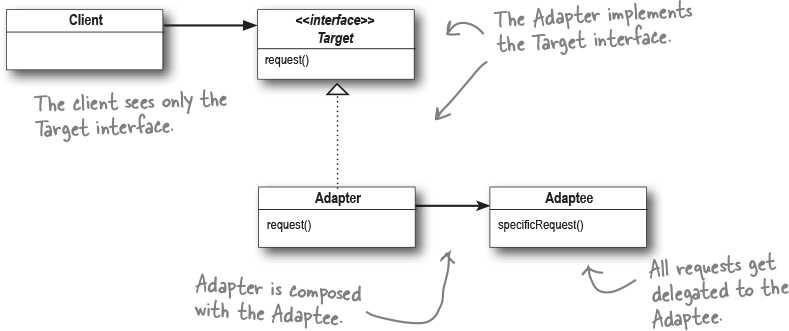
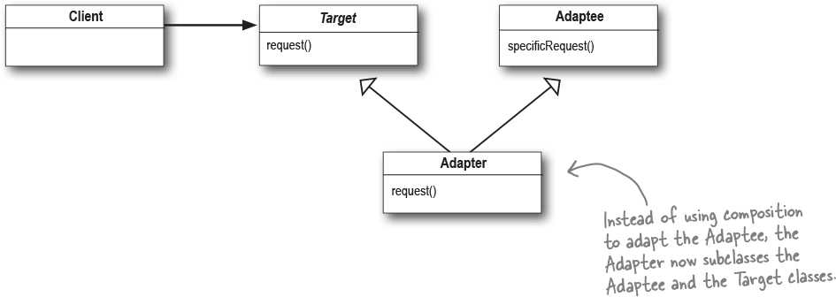

# Adapter (Interface compatibility bridge) {Structural}

## Description

The Adapter Pattern converts the interface of a class into another interface the clients expect.
The adapter lets classes work together that couldn't otherwise because of incompatible interfaces.

!!! info

    - کار آداپتور ها فقط تبدیل و تغییر اینترفیس هستش، بنا نیست رفتار چیزی رو که دارن اداپت میکنن بخوان تغییر بدن
    - به بیان دیگه اگه قراره ما رفتار یک کلاس رو چیزی بهش اضافه کنیم یا به هر شکلی تغییرش بدیم راهش دیزاین پترن آداپتور نیست، راهش دیزاین پترن دکوراتور هستش

Object adapter:

Class adapter:

