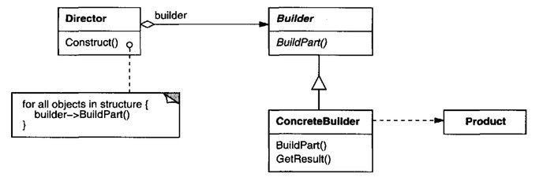
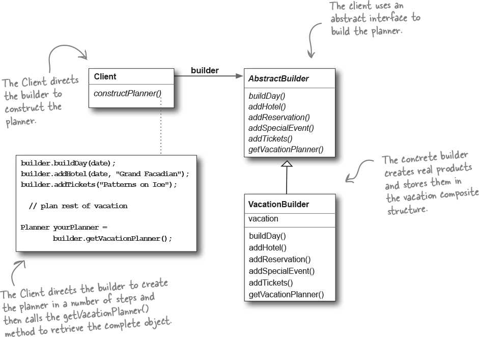

# Builder (Step-by-step construction) [Creational]

## Description

Separate the construction of a complex object from its representation so that the same construction process can create different representations.

!!! info

    - بر خلاف فکتوری پترن که در یک مرحله آبجکت رو میسازه و بر میگردونه، این پترن در چندین مرحله مختلف این کارو میکنه
    - او آر ام جنگو از این پترن برای ساخت کوئری اس کیو ال استفاده میکنه
    - خیلی مناسب جاییه که بسته به دلخواه کلاینت در هر استپ، میخوایم یه خروجی نهایی بهش بدیم
