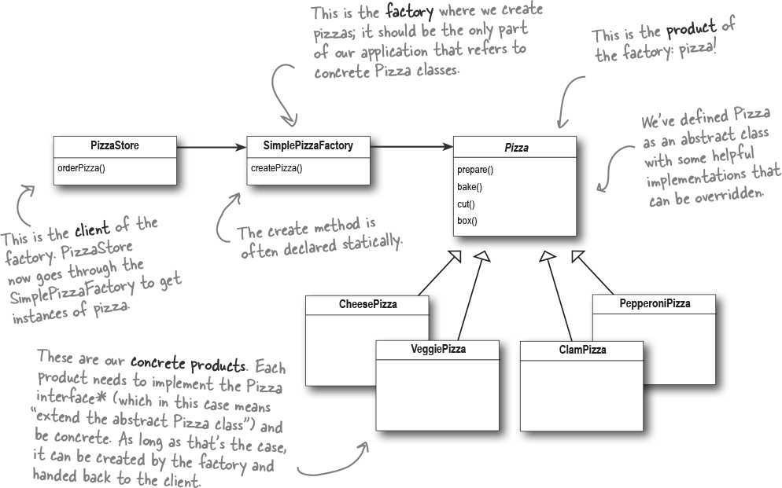
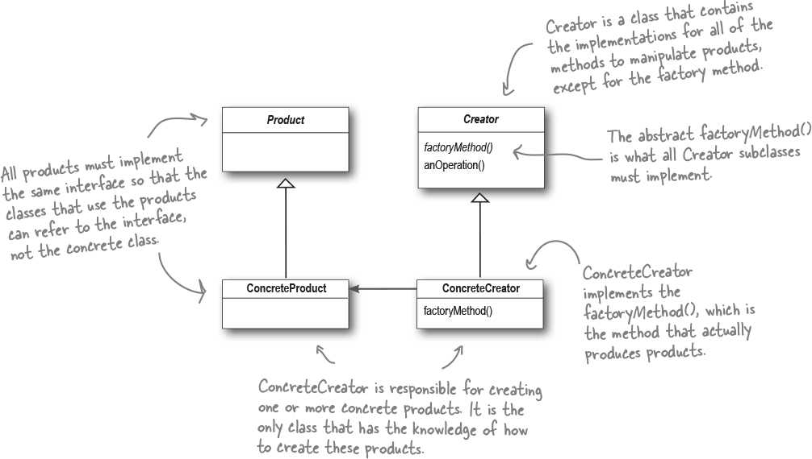
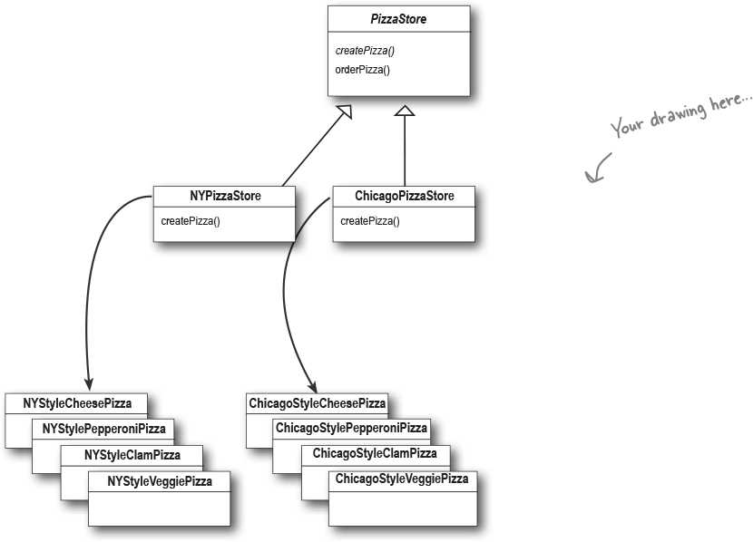
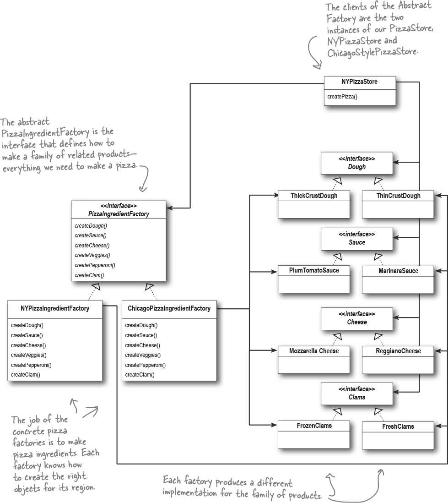
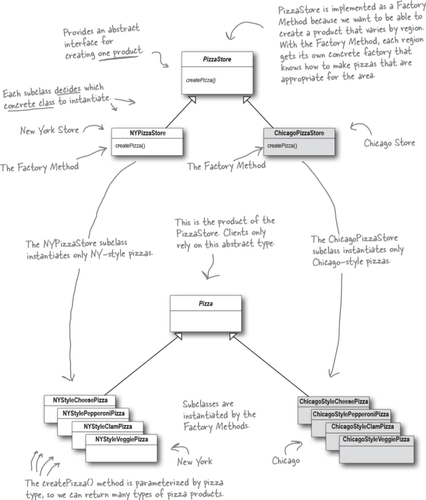
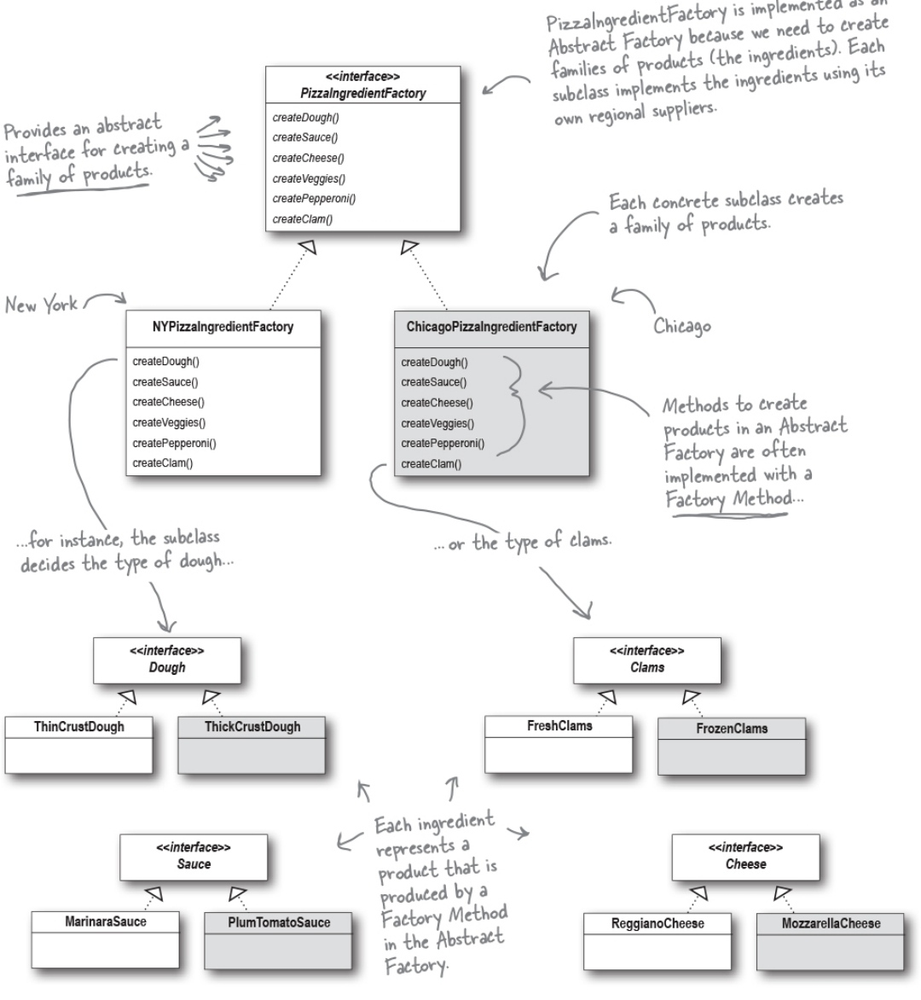

# Factory (Object creation delegation) {Creational}

## Description

The Factory design pattern is a creational pattern used to create objects without specifying the exact class of the object that will be created. It provides a way to encapsulate object creation, making the code more flexible and easier to maintain.

There are three types of the Factory pattern:

- **Simple Factory**: where a single factory class creates objects based on input.
- **Factory Method**: where subclasses decide which object to instantiate.
- **Abstract Factory**: which provides an interface for creating families of related or dependent objects without specifying their concrete classes.

!!! info

    هر موقع دیدیم که بجای کار با اینترفیس، داریم یک کلاس رو خودمون میسازیم، این پترن به کارمون میاد.

## Varieties

### Simple Factory

!!! info

    در اصل یک دیزاین پترن نیست و فقط یه تریک ساده س

### Factory Method

Defines an interface for creating an object, but lets subclasses decide which class to instantiate. Factory Method lets a class defer instantiation to subclasses.

!!! info

    میشه ازش برای ساخت مراحل مختلف یه بازی استفاده کرد، چجوری؟ تصور کن یه گیم مثل دینو ران داری که هرچی میری جلوتر مانع های بزرگتر با سرعت بیشتری باید بیان سمتت، ولی کلیت بازی تو ثابته، خب تو گیم لوپ رو مینویسی و توش از اینترفیس سازنده موانع استفاده میکنی، حالا بسته به هر مرحله یه کلاسی رو توش دپندنسی اینجکت میکنی که موانع بزرگتر و با سرعت بیشتری رو تولید میکنه، این مدلی بدون این که برای هر مرحله از بازیت گیم لوپ اختصاصی داشته باشی به مرور بازیت سخت تر میشه و رفتارهاش تغییر میکنه.

### Abstract Factory

Provides an interface for creating families of related or dependent objects without specifying their concrete classes.

!!! info

    تصور کن کلاس های مختلفی داری که این ها دو به دو با هم مچ میشن، مثلا آلرت لینوکس با دکمه لینوکس و آلرت ویندوز با دکمه ویندوز، خب اتفاقی که می افته اینه که برنامه نویس بعدی میاد و به اشتباه آلرت لینوکس رو با دکمه ویندوز نشون میده به کاربر، برای این که این مشکل حل بشه، به راحتی میای و یه اینترفیس سازنده کلاس میسازی که توش دوتا متد داره برای گرفتن دکمه و گرفتن آلرت، بعدش میای دوتا کلاس سازننده کلاس از این اینترفیس ایمپلیمنت میکنی و تو هر کدوم دکمه مناسب رو با آلرت مناسبش بر میگردونی، حالا برنامه نویس بعدی دیگه با خود کلاس های دکمه و آلرت مستقیم کاری نداره و میاد از یکی از کلاس های سازنده کلاس تورو انتخاب میکنه و ازش استفاده میکنه. همونطور که مشخصه این پترن نه تنها خوبی های پترن فکتوری متد رو داره، بلکه میاد یه پله بالاتر و بجای تحویل یه کلاس، کامبینیشن های صحیحی از کلاس های مختلف رو ارائه میده.

## Simple Factory VS Factory Method

Q: I'm still a bit confused about the difference between Simple Factory and Factory Method. They look very similar, except that in Factory Method, the class that returns the pizza is a subclass. Can you explain?

A: You're right that the subclasses do look a lot like Simple Factory; however, think of Simple Factory as a one-shot deal, while with Factory Method you are creating a framework that lets the subclasses decide which implementation will be used. For example, the orderPizza() method in the Factory Method Pattern provides a general framework for creating pizzas that rely on a factory method to create the concrete classes that go into making a pizza. By subclassing the PizzaStore class, you decide what concrete products go into making the pizza that orderPizza() returns. Compare that with Simple Factory, which gives you a way to encapsulate object creation, but doesn't give you the flexibility of Factory Method because there is no way to vary the products you're creating.

## Factory Method VS Abstract Factory

