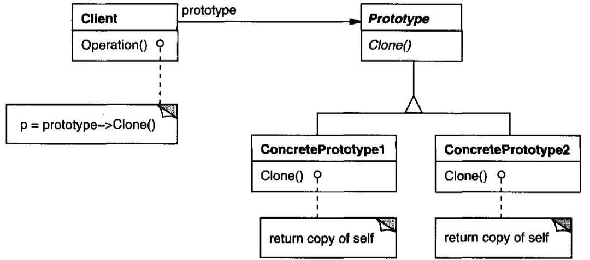

# Prototype (Object cloning) {Creational}

## Description

Specify the kinds of objects to create using a prototypical instance, and create new objects by copying this prototype

!!! info

    برای آبجکت هایی که ساخته شدنشون هزینه بر هستش، میایم در زمان بالا اومدن پراسس، آبجکت هایی میسازیم و در زمان نیاز از بین این آبجکت ها انتخاب میکنیم و یکیش رو کلون (دیپ کپی) میکنیم.
