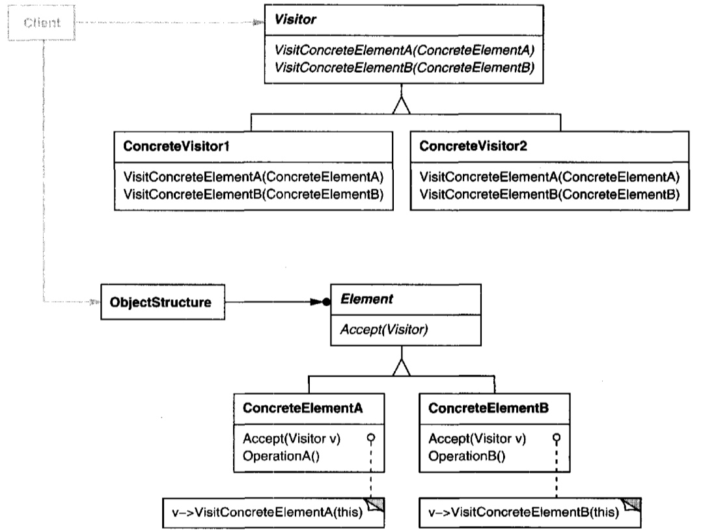

# Visitor (Element-specific operations) {Behavioral}

## Description

Represent an operation to be performed on the elements of an object structure.
Visitor lets you define a new operation without changing the classes of the elements on which it operates.
