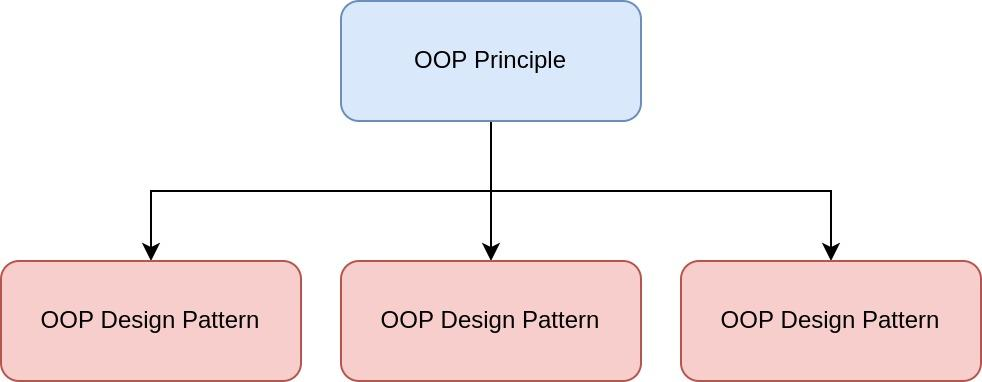

# Overview

## Description

Some important principles:

- Encapsulate what varies
- Favor composition over inheritance
- Program to interface, not implementations

<!-- -->

- Identify the aspects of your application that vary and separate them from what stays the same
- Program to an interface, not an implementation
- Strive for loosely coupled designs between objects that interact
- Classes should be open for extension but closed for modification
- Depend upon abstractions, do not depend upon concrete classes

## Principles vs Design Patterns

