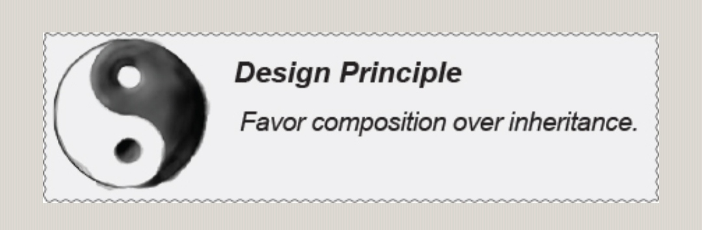

# Favour Composition Over Inheritance Principle

## Description

Creating systems using composition gives you a lot more flexibility.
Not only does it let you encapsulate a family of algorithms into their own set of classes, but it also lets you change behavior at runtime as long as the object you're composing implements the correct behavior interface.
