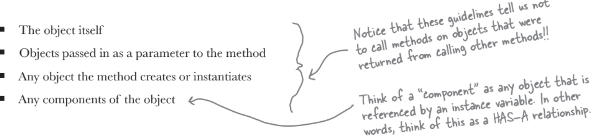
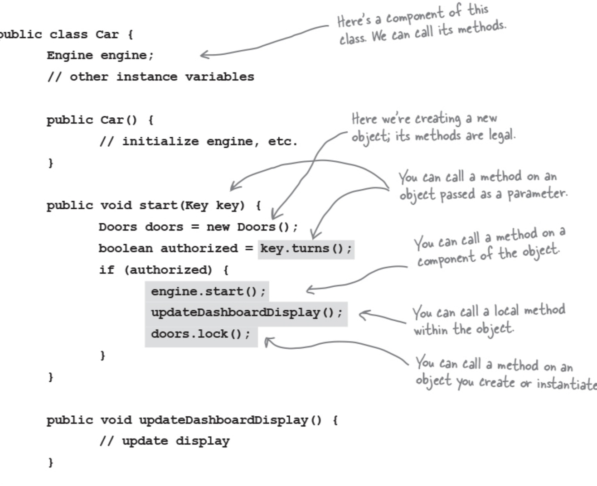

# Least Knowledge Principle

## Description

The Principle of Least Knowledge guides us to reduce the interactions between objects to just a few close "friends."

It means when you are designing a system, for any object, be careful of the number of classes it interacts with and also how it comes to interact with those classes.

This principle prevents us from creating designs that have a large number of classes coupled together so that changes in one part of the system cascade to other parts.
When you build a lot of dependencies between many classes, you are building a fragile system that will be costly to maintain and complex for others to understand.

but how do you keep from doing this?
The principle provides some guidelines: take any object, and from any method in that object, invoke only methods that belong to:

The principle forces us to ask the object to request us; that way, we don't have to know about its component objects (and we keep our circle of friends small).
For example:

Here's a Car class that demonstrates all the ways you can call methods and still adhere to the Principle of Least Knowledge:

