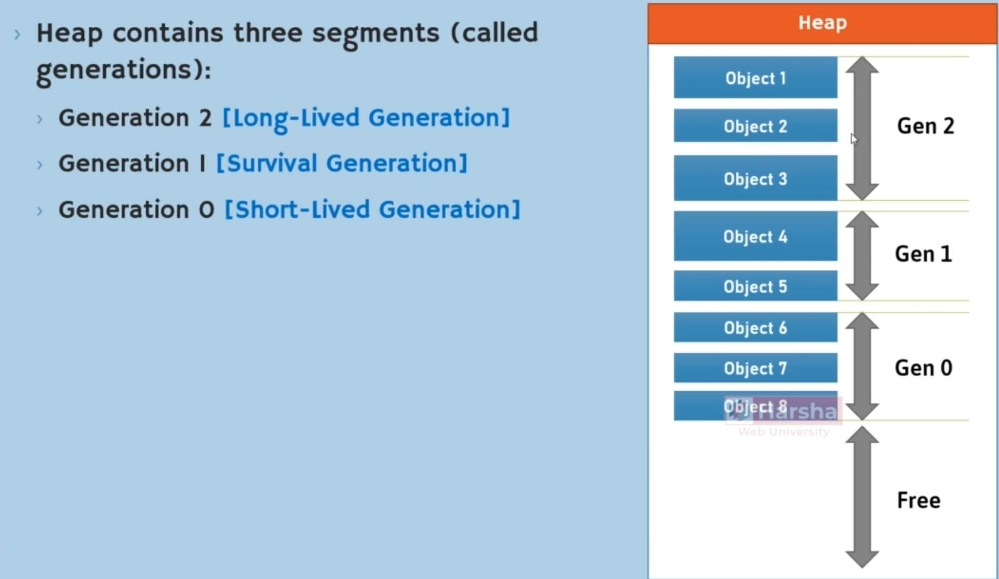
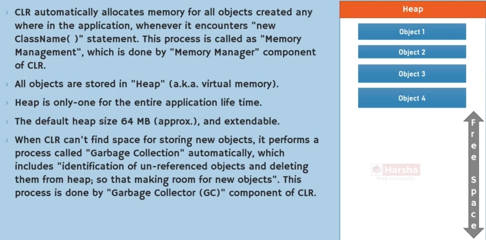
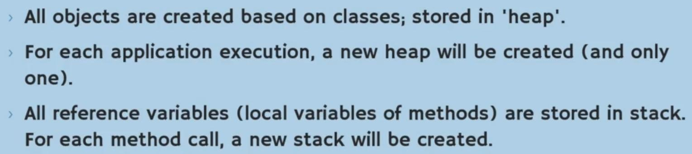
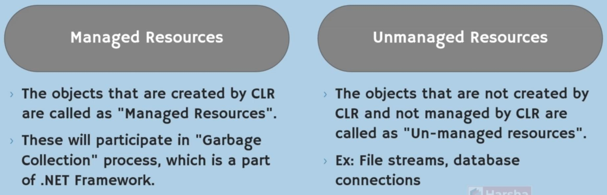

# Memory Management

## Schema

## Stack

- Part of ram
- Very fast
- Last in, first out
- All the local variables will store in here
- Reference of one obj will store here

## Heap (a.k.a Virtual Memory)

Key Points:

- Part of ram
- Slower than stack
- All the objects will store here
- Has 64 MB space

Generation:

- اول موقع ساخت object اون آبجکت داخل G0 ساخته میشه، بعد از یه مدتی منتقل میشه به G1 و بعدش هم به G2

## Garbage Collector (GC)

Description:

GC Trigger:

Tips:

## Managed vs Unmanaged Resources

