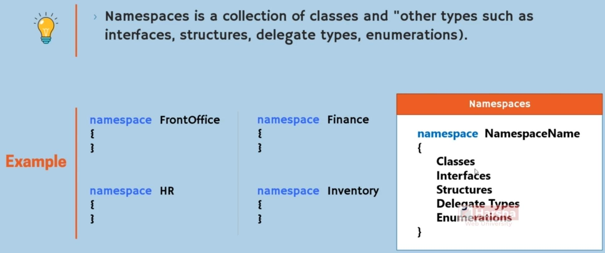
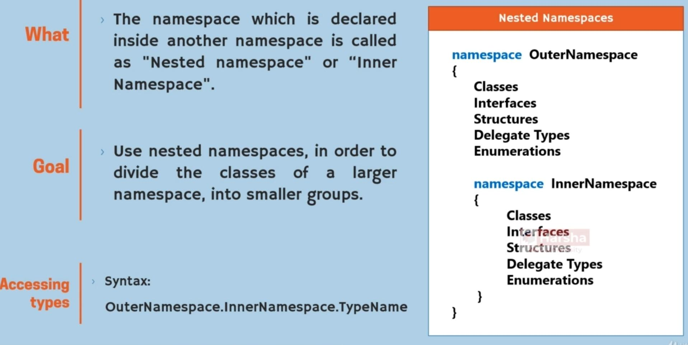
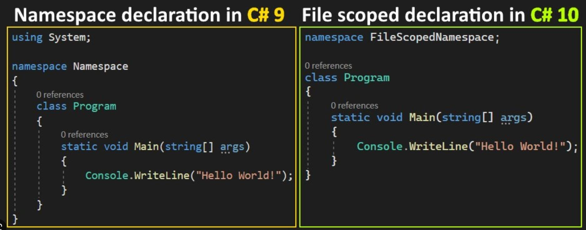
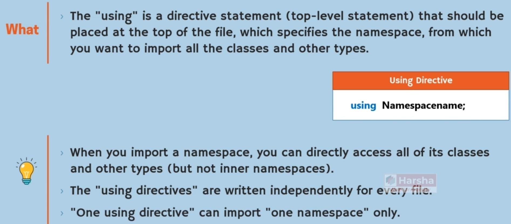
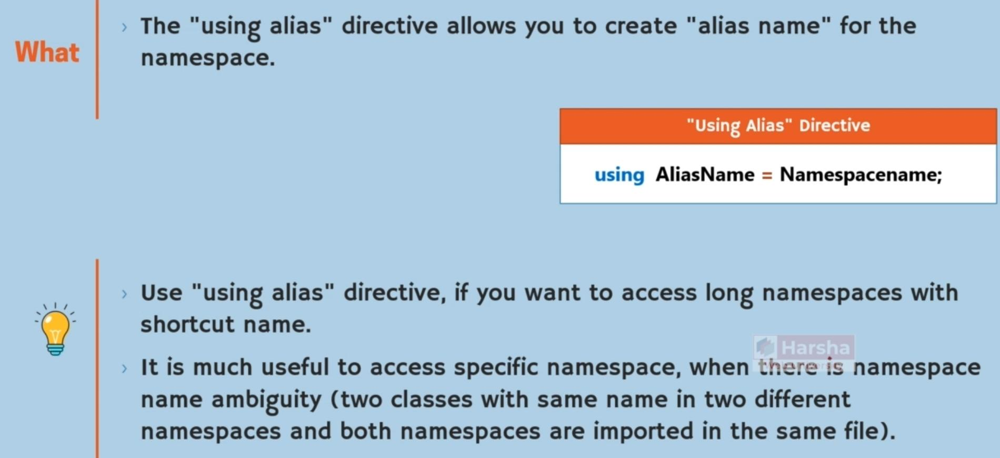
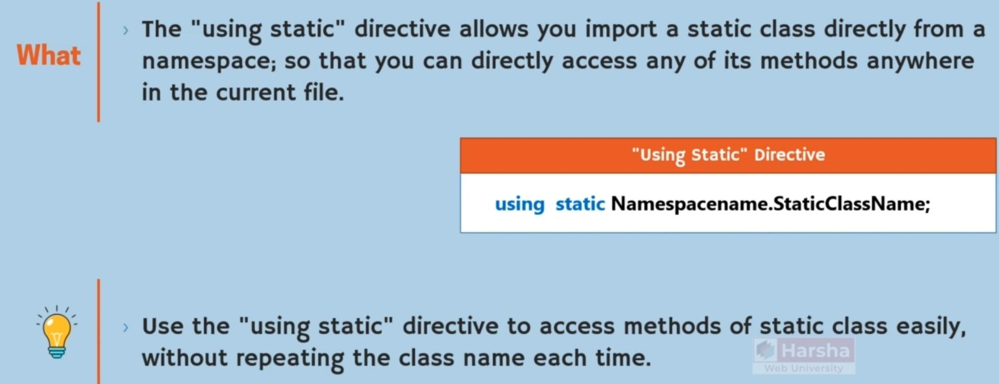

# Namespace

## Description

- Will help us to spread our classes into multiple files
- In the future, when we want to refactor out project and moving some classes into other files, without any effort we can do it

## Nested Namespace

## File Scoped Namespace

## ‘using’ Directive

Description:

Alias:

Using Static:

- With this feature we can treat a static class like namespace
