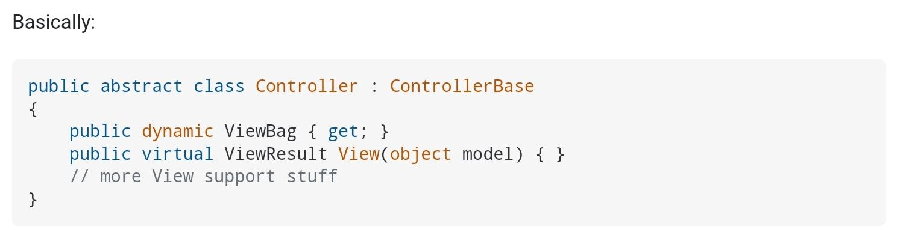
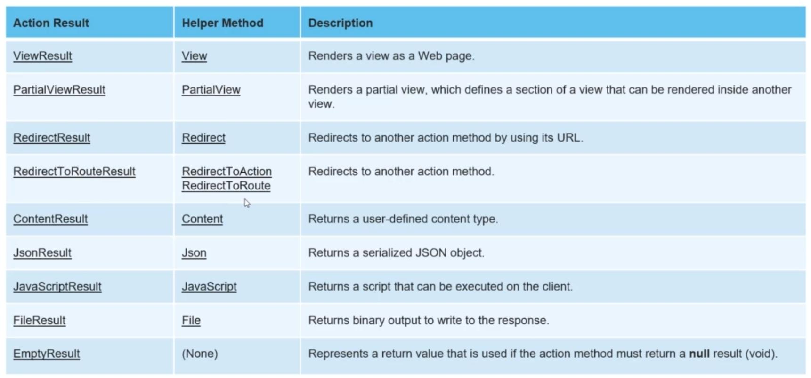
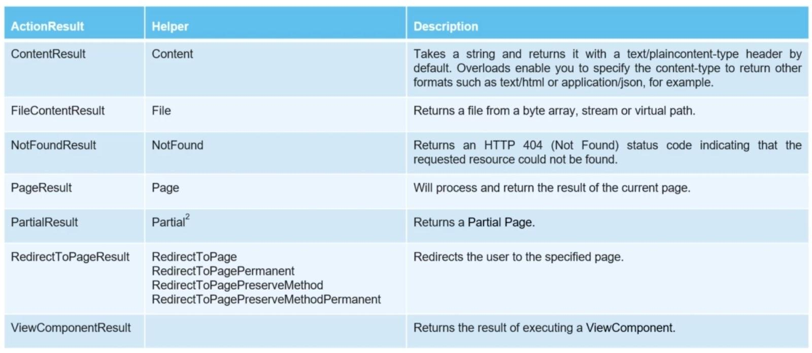
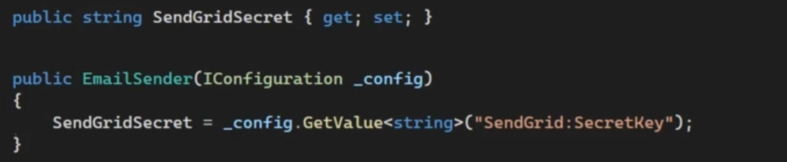
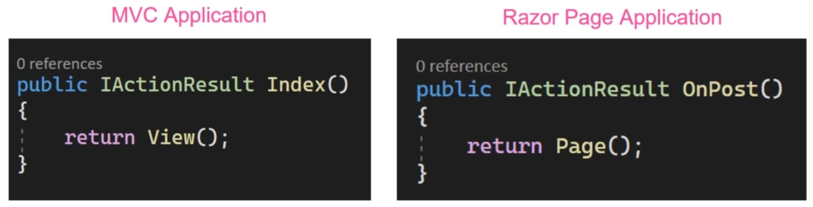
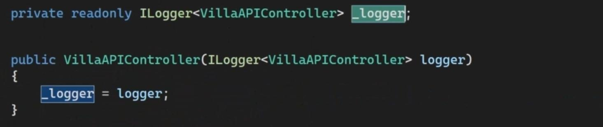
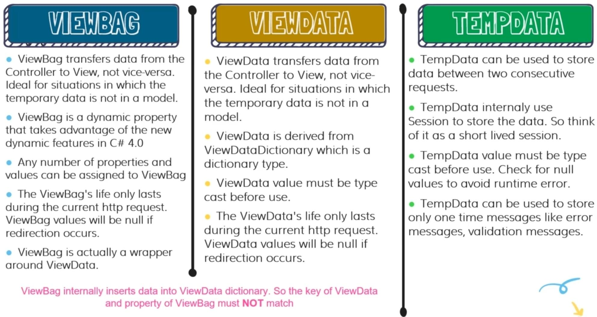
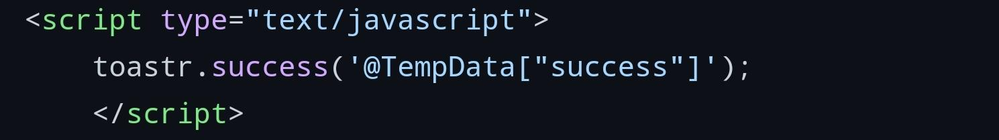
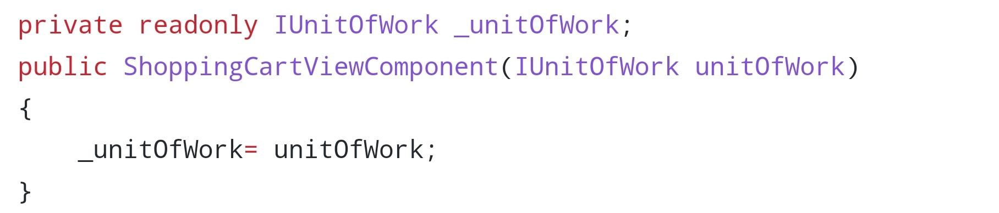
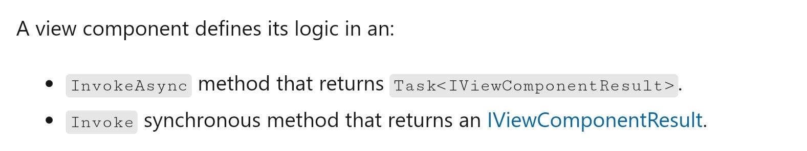

# Controller

## Description

For API:

- It inherited form ControllerBase
- Every controller name must end with the suffix Controller
- If we don’t mention to the \[HttpGet\] annotation directly, the \[HttpGet\] will be used as the default one
- The \[ApiController\] annotation will add some automatic functionalities to the controller, for example by default will check the ModelState property and will generate 400 response if it isn’t valid
- The \[ProducesResponseType\] annotation will help to ASP.NET to generate a better swagger page

For MVC:

- It inherited form Controller
- In the above image, the View() method, automatically will find the proper view and will render it
- Every controller name must end with the suffix Controller

For Razor Page:

- In the above image, the \[BindProperties\] code will automatically bind incoming data inside of HTTP form-data into the class properties, so no need to write a parameter for the OnPost method

Controller vs ControllerBase:

The Controller class inherited from ControllerBase and added some members that are only needed to support Views.

## Methods

For API:

- Ok: return 200 status code
- NotFound: return 404 status code
- BadRequest: return 400 status code
- CreatedAtRoute: return 201 status code with the record url in the header
- NoContent: return 204 status code

For MVC:

For Razor Page:

Configurations (Content of appsettings.json):

By injecting IConfiguration into the class constructor, easily we can access to the settings.

Model Binding:

Controllers and Razor pages work with data that comes from HTTP requests. For example, route data may provide a record key, and posted form fields may provide values for the properties of the model. Writing code to retrieve each of these values and convert them from strings to .NET types would be tedious and error-prone. Model binding automates this process. The model binding system:

- Retrieves data from various sources such as route data, form fields, and query strings.
- Provides the data to controllers and Razor pages in method parameters and public properties.
- Converts string data to .NET types.
- Updates properties of complex types.

Action Result (Return Type):

- With the IActionResult interface, easily we can return everything that we want as the response, for example rendering the view, or redirecting to the home page, because all of this response types are child of IActionResult

## Properties

Logger:

- We can easily inject the logger into the controller inside of constructor

User:

ModelState:

- Will store the form validation result
- For example like the below code we can check does our form is valid or not

  

Data Interpolation:

- Sending data from controller into the corresponding view

1. passing data directly

  

  

2. passing data with \[ViewData\] annotation and receiving it via ViewModel

  

## View Component

Description:

View components are similar to partial views, but they're much more powerful. View components **don't use model binding**, they depend on the data passed when calling the view component

A view component:

- Renders a chunk rather than a whole response.
- Includes the same separation-of-concerns and testability benefits found between a controller and view.
- Can have parameters and business logic.
- Is typically invoked from a layout page.

View components are intended anywhere reusable rendering logic that's too complex for a partial view, such as:

- Dynamic navigation menus
- Tag cloud, where it queries the database
- Sign in panel
- Shopping cart
- Recently published articles
- Sidebar content on a blog
- A sign in panel that would be rendered on every page and show either the links to sign out or sign in, depending on the sign in state of the user

A view component consists of two parts:

- The class, typically derived from ViewComponent
- The result it returns, typically a view

Class Syntax:

1. A view component should inherit from ViewComponent

  

2. It can have DI

  

3. And should have the InvokeAsync method

  

  

4. And finally should return the View method result (The corresponding .cshtml file to the view component)

  
