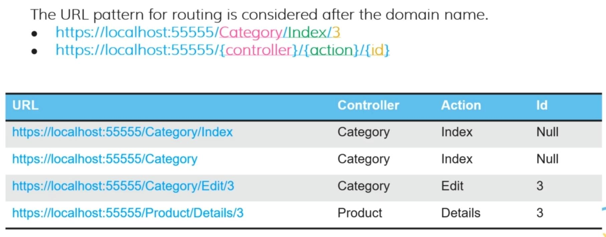

# Routing

## Description

### For MVC

- We should have a file followed the &lt;ControllerName&gt;Controller.cs naming convention inside the Controllers directory
- Inside the Views directory, we should have a directory followed the &lt;ControllerName&gt; convention that contains one &lt;ActionName&gt;.cshtml file for each action method inside the controller

### For Razor Page

- All of the pages and codes are combined in one directory named Pages
- For each page there are two files, &lt;PageName&gt;.cshtml and &lt;PageName&gt;.cshtml.cs
