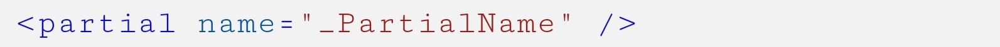
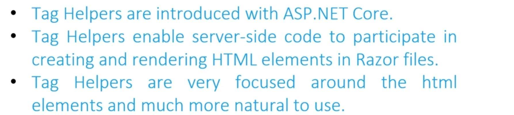
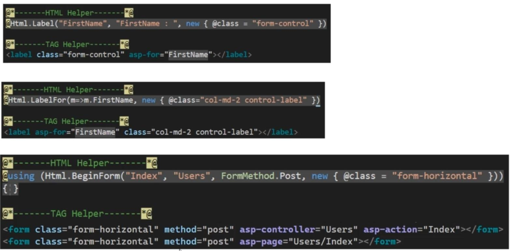
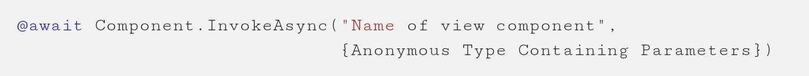

# View

## Layout View

The Views/Shared/\_Layout.cshtml is the mother of all pages

## Partial Views

- A partial view is a .cshtml markup file without an @page directive maintained within the Views folder (MVC) or Pages folder (Razor Pages)
- ASP.NET will look at the below path for resolving a partial view:

  

- Name of them should start with \_
- Simply with the below syntax we can import them inside of the other pages:

  

## View Model

At the top of each .html file, we should have a @model tag, this tag will point into the ViewModel of the HTML file, like the below image:

For this tag we can easily pass the Entity model, or for the complex scenarios, we can create a custom ViewModel like the below:

## Tag Helpers

## View Component

1. The runtime searches for the view in the following paths:

  

2. The default view name for a view component is Default, which means view files will typically be named Default.cshtml

3. Render syntax

  
