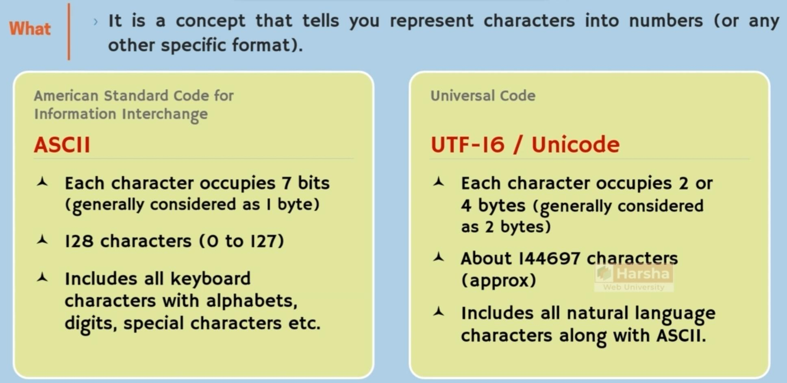
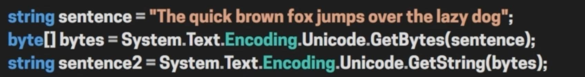
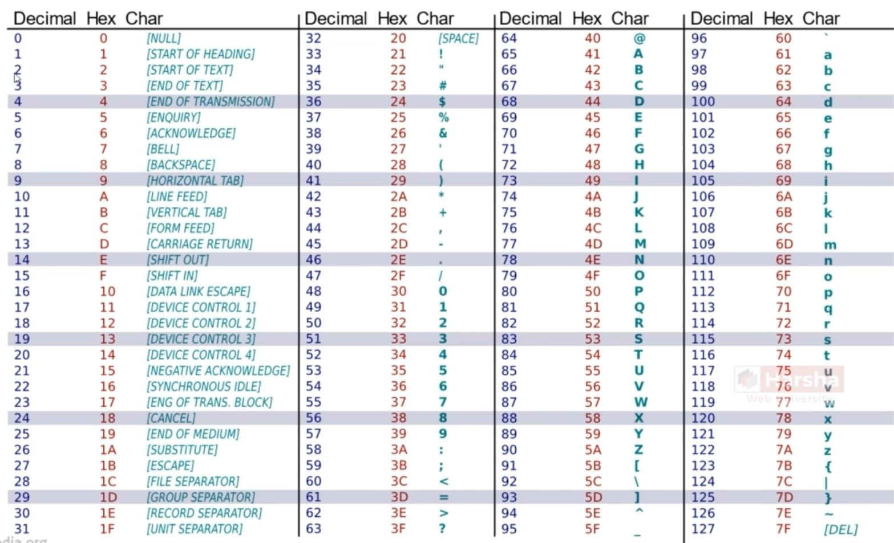

# Character Encoding

## Overview

- Each Unicode has its hexadecimal unique number
- The U+ before each Unicode is the hexadecimal identifier
- In C# the \\u prefix means Unicode

## Popular Encodings

### ASCII Table

### Unicode Table

[Link](https://en.m.wikipedia.org/wiki/List_of_Unicode_characters)
