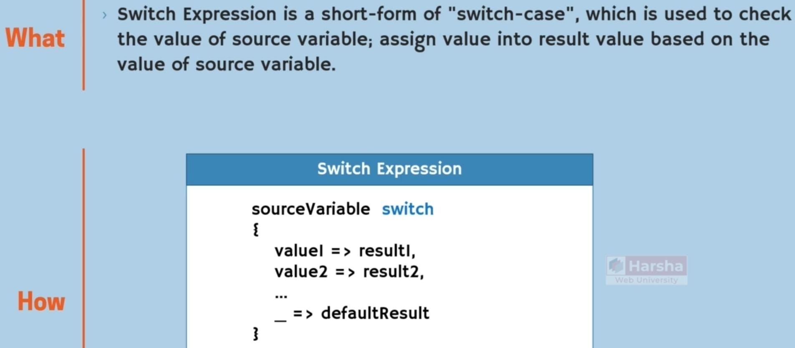
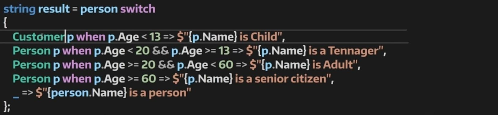
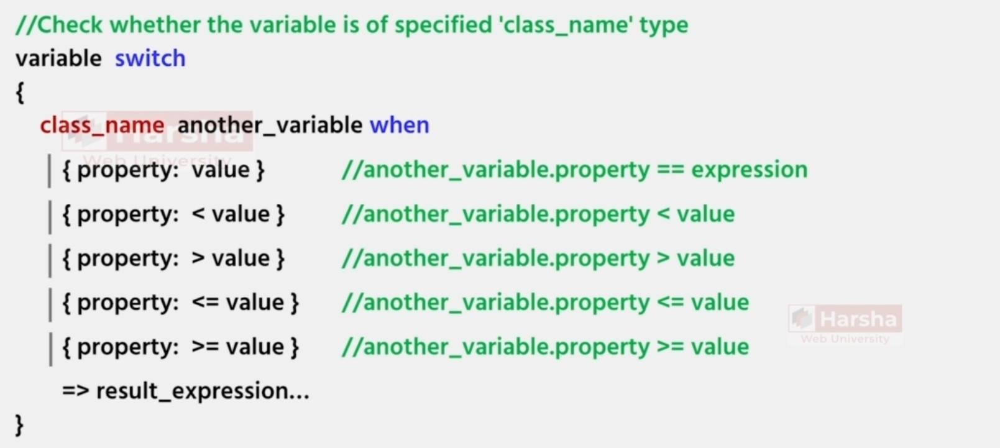
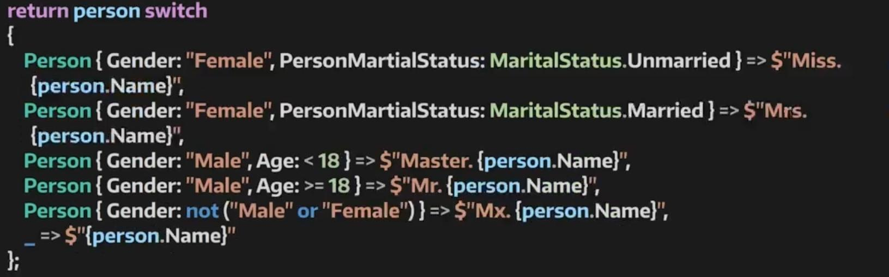
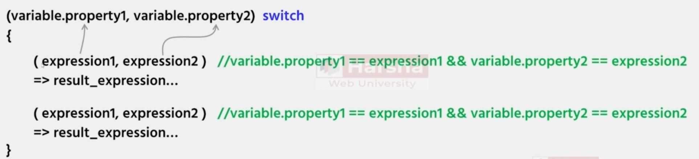
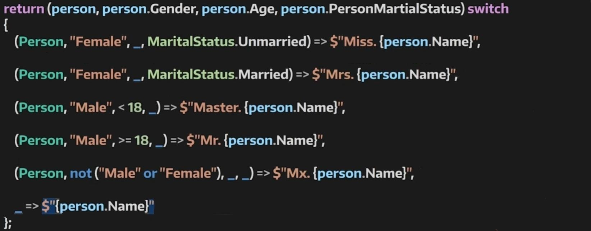
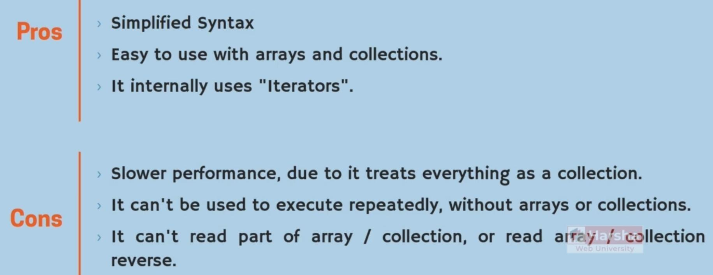
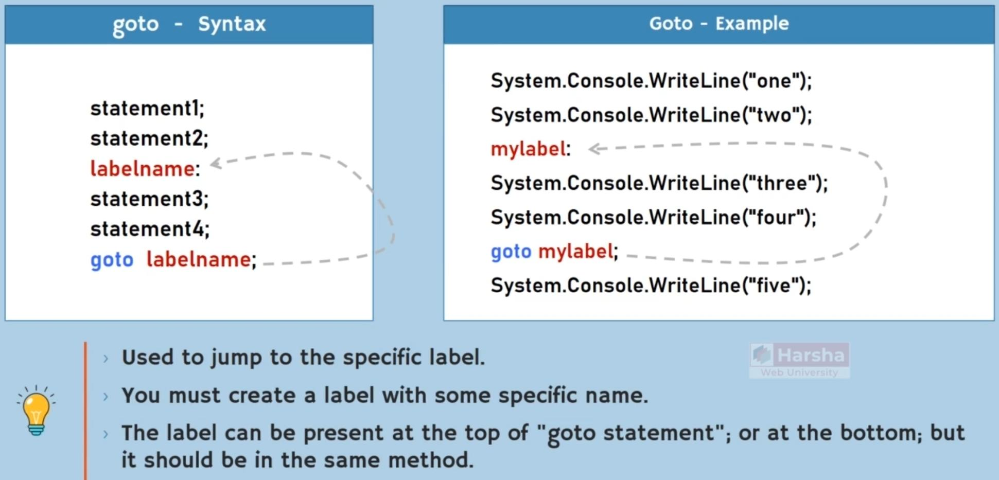

# Control Statements

## Overview

## Switch-Case

Normal:

With Type Casting:

## Switch Expression

Normal:

With Type Casting & When Pattern:

With Type Casting & Property Pattern:

Nested property pattern:

Extended property pattern:

With Type Casting & Tuple Pattern:

## Loops

Do-While:

For:

Foreach:

## Goto

