# Exception Handling

## Description

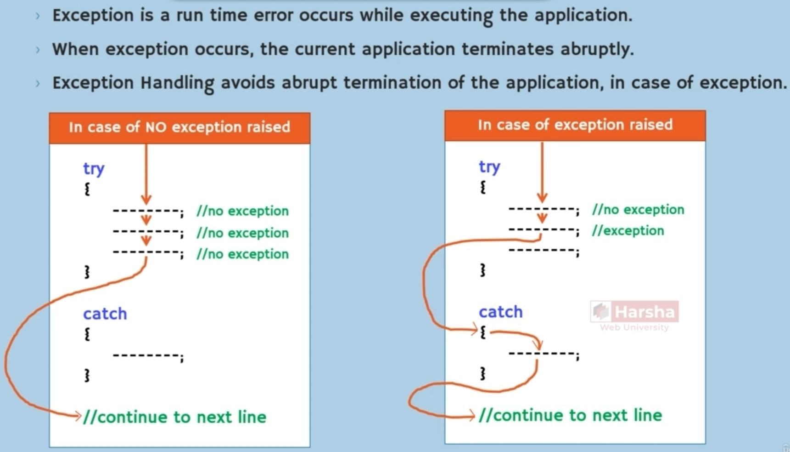

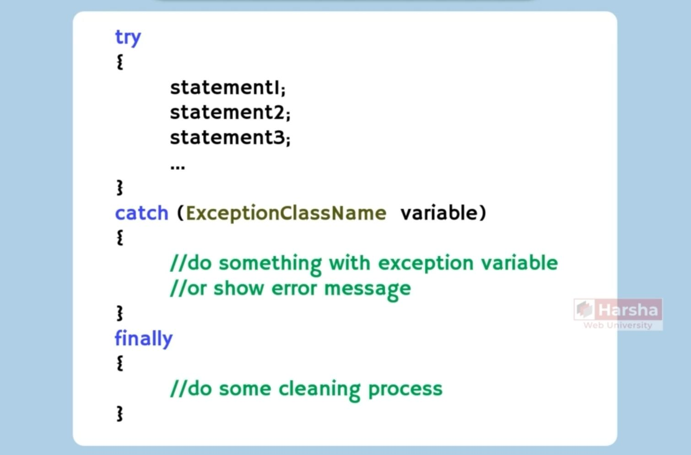

## Key Notes

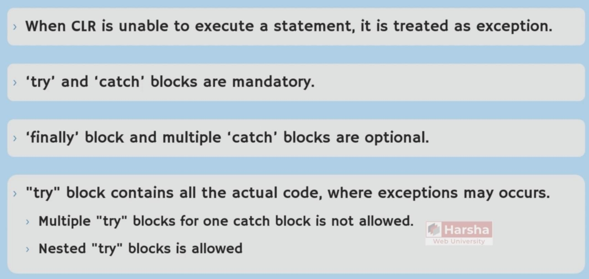

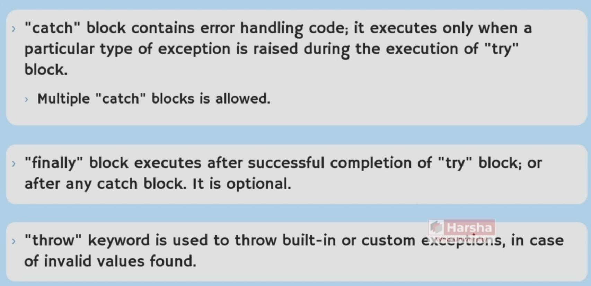

## Custom Exception

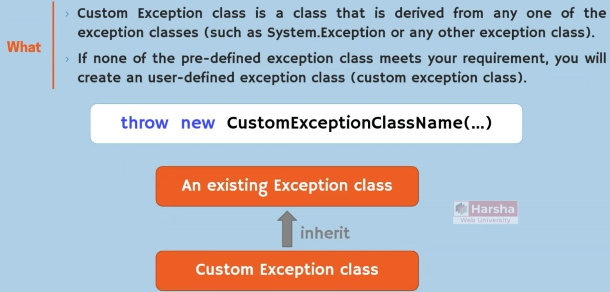

## Catch When (Catch Filter)

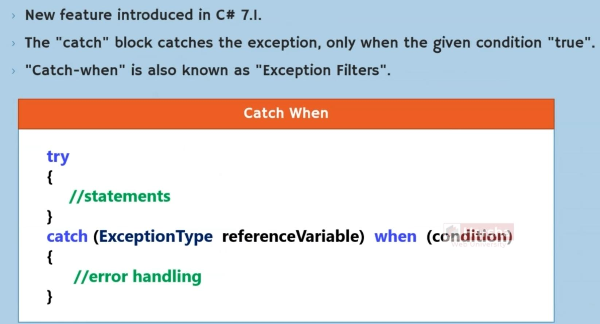

## Popular Exceptions

### Hierarchy

### FormatException

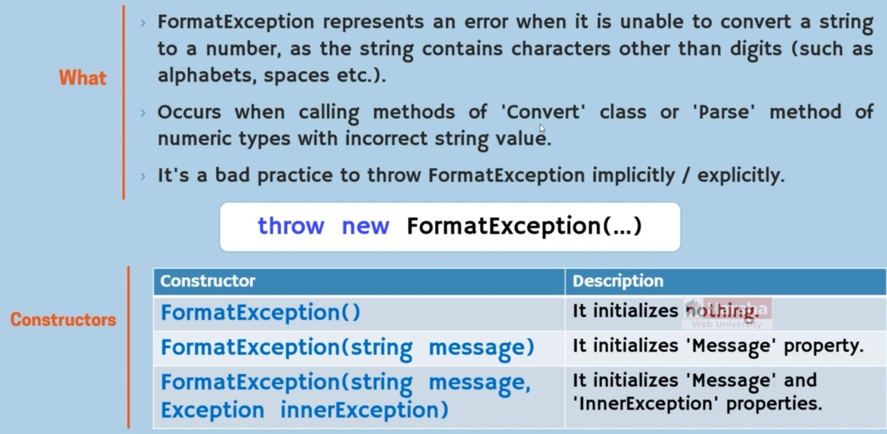

### IndexOutOfRangeException

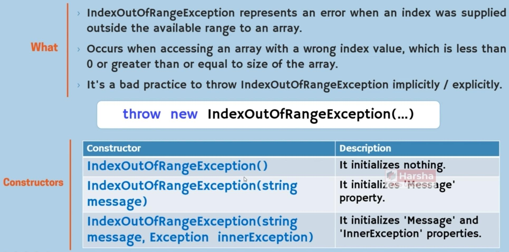

### NullReferenceException

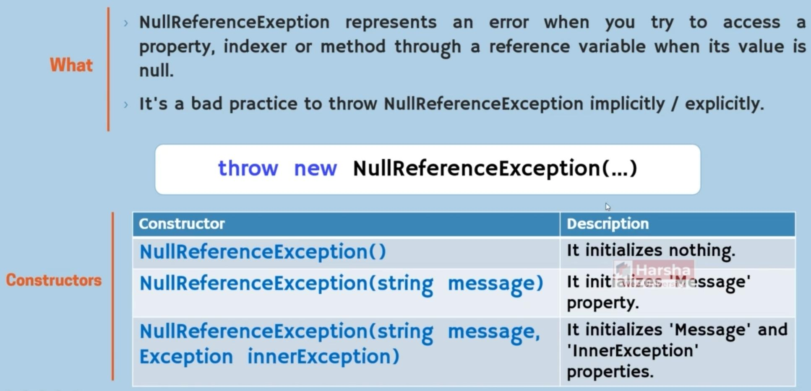

### ArgumentNullException

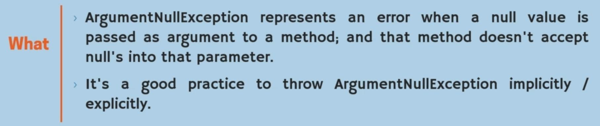

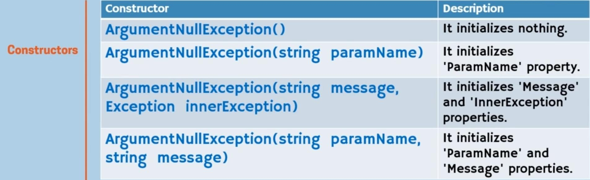

### ArgumentOutOfRangeException

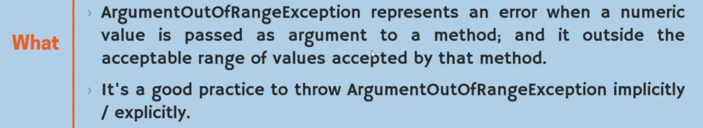

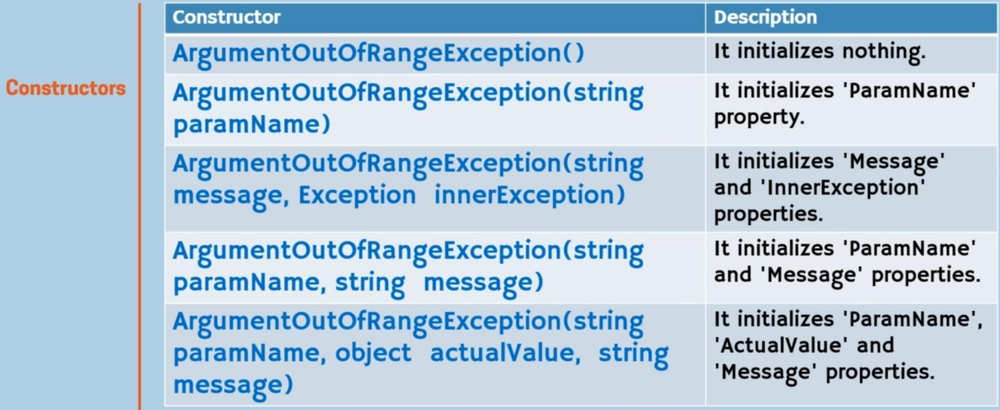

### ArgumentException

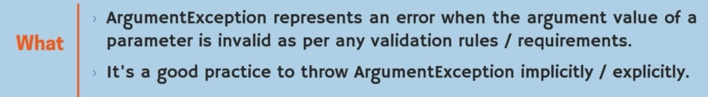

- Is the parent of the ArgumentNullException and ArgumentOutOfRangeException exceptions

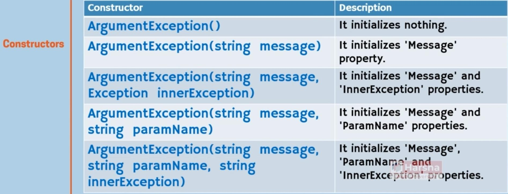

### InvalidOperationException

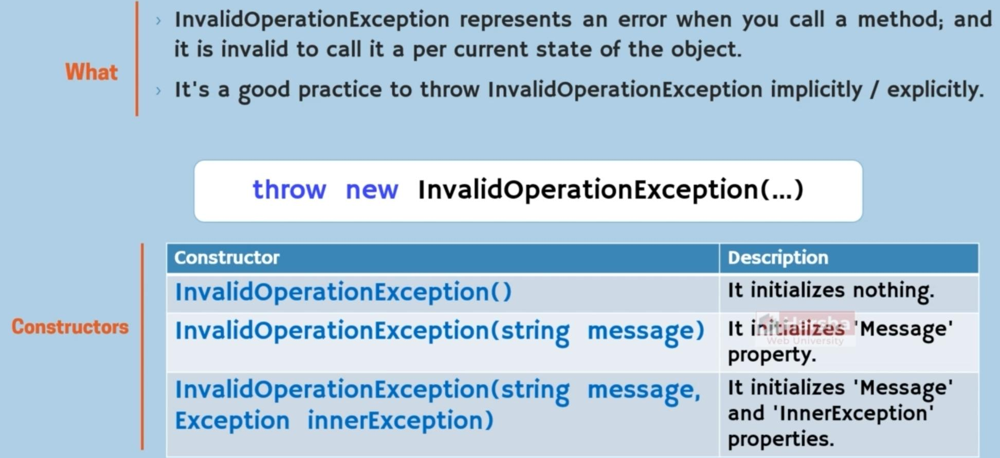
