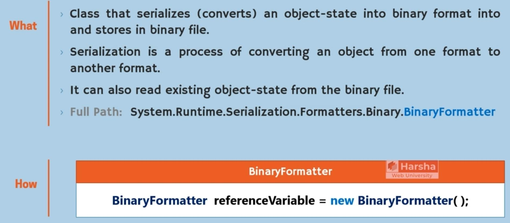
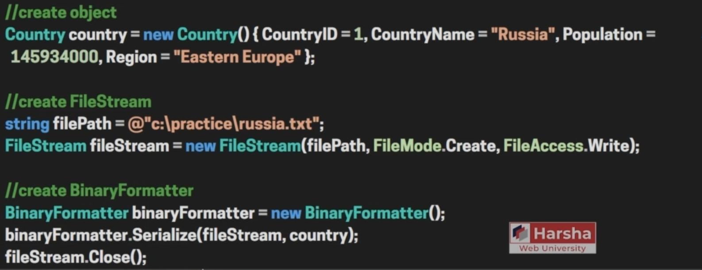
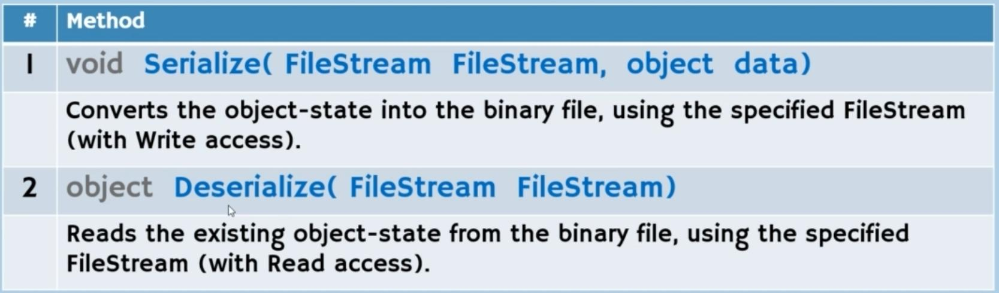
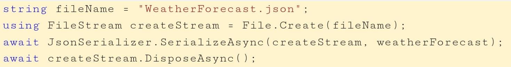
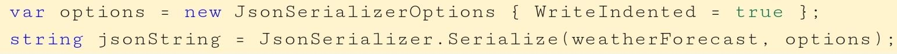
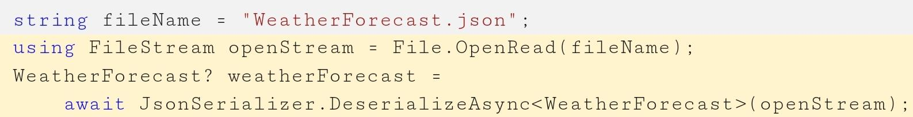
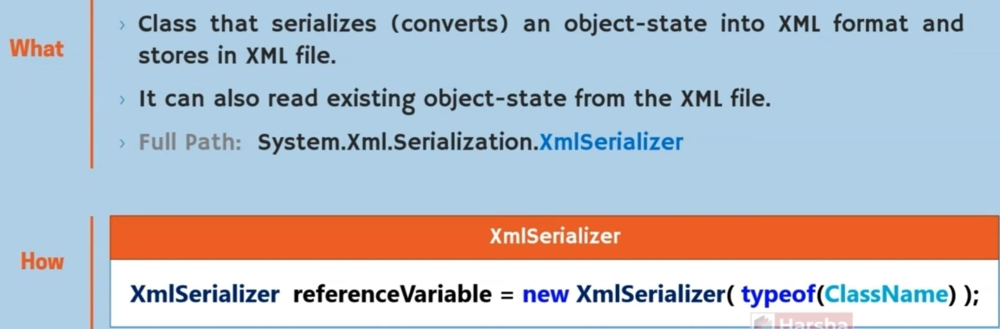
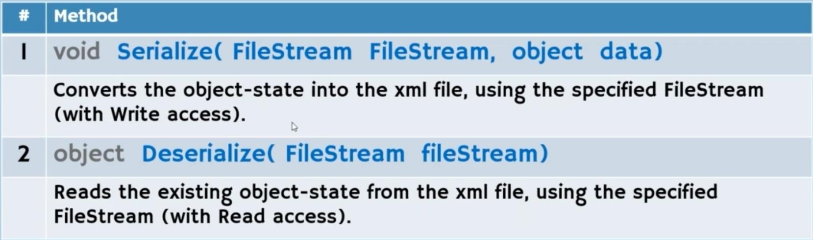

# Serialization

## BinaryFormatter

Description:

Methods:

## JsonSerializer

Description:

A flexible static class for serializing objects and deserializing jsons

Methods:

serialize:

deserialize:

## JavaScriptSerializer (JSON for .NET Framework)

Description:

Methods:

## XmlSerializer

Description:

Methods:

