# String

## Description

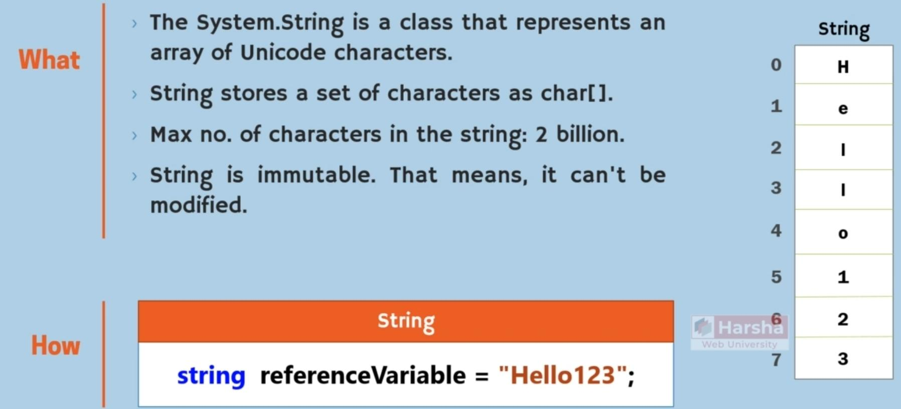

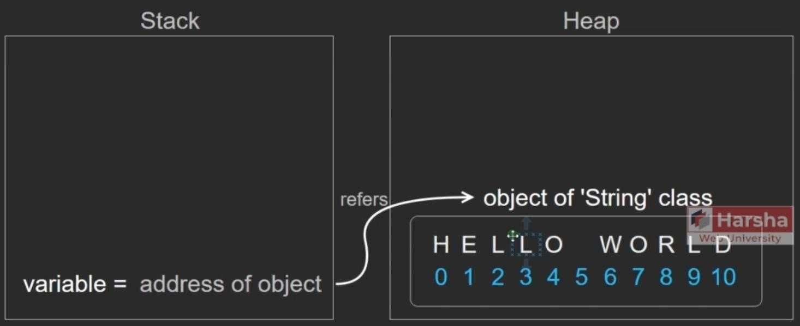

## Features

Overview:

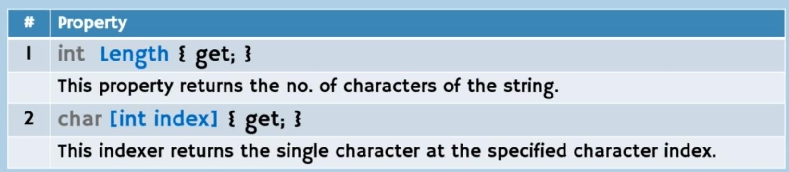

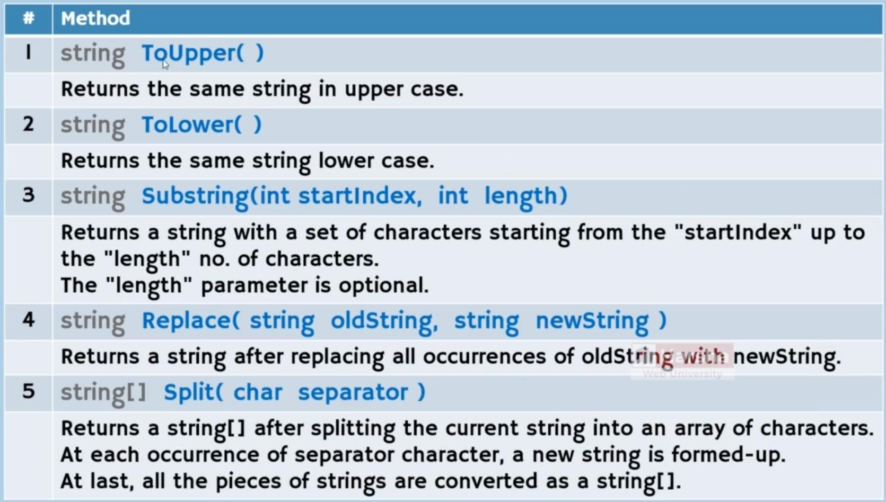

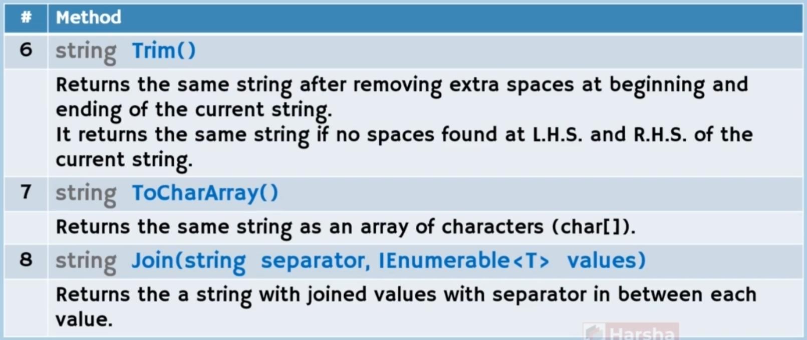

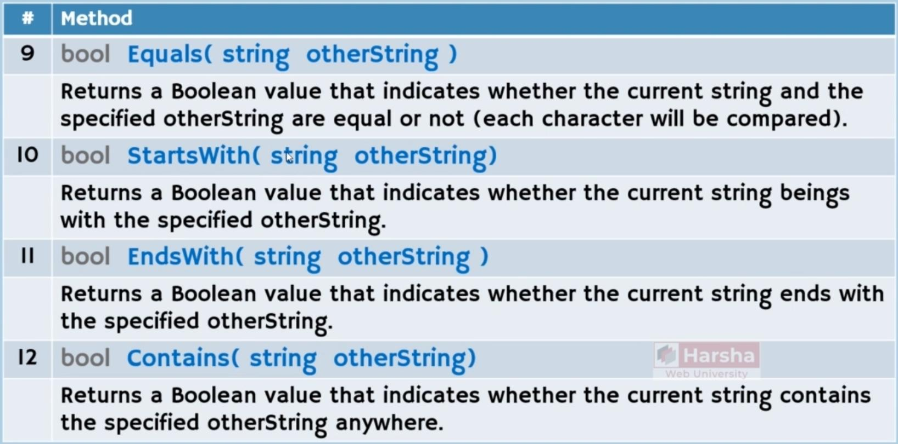

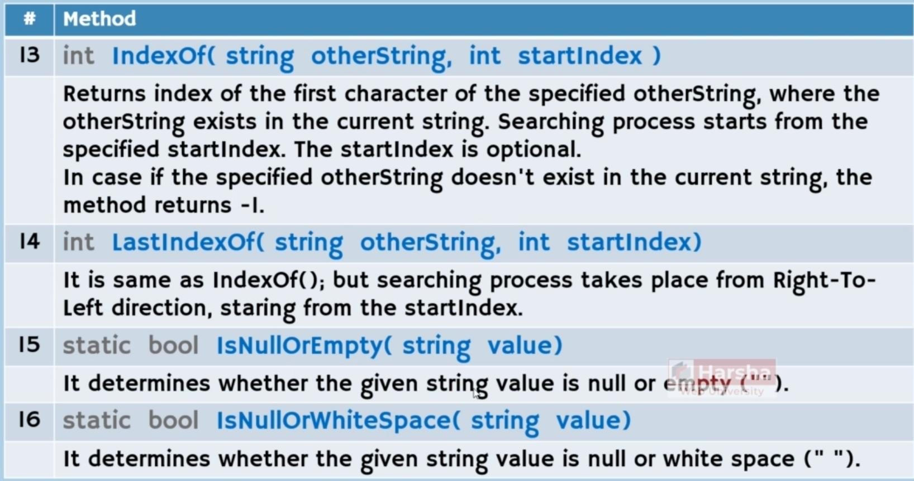

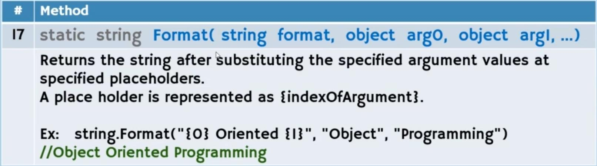

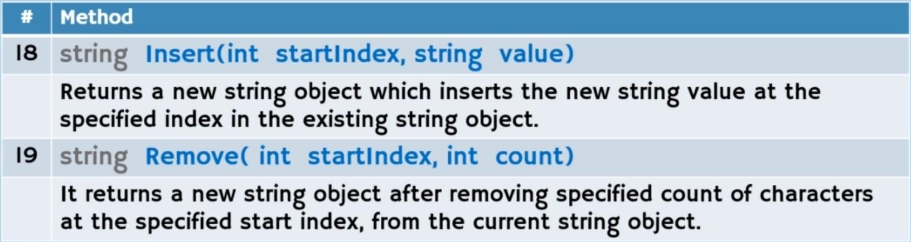

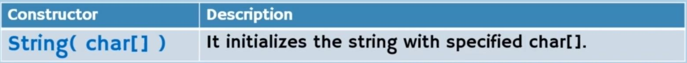

ToUpper & ToLower:

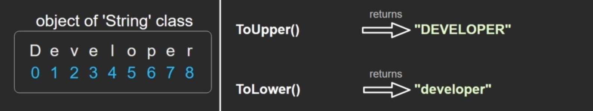

Substring:

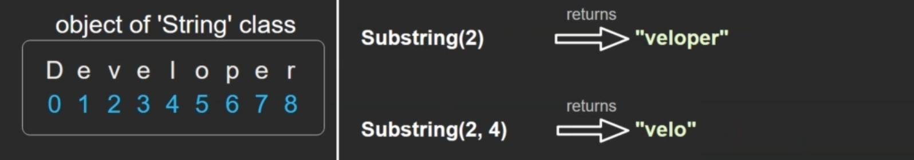

Replace:

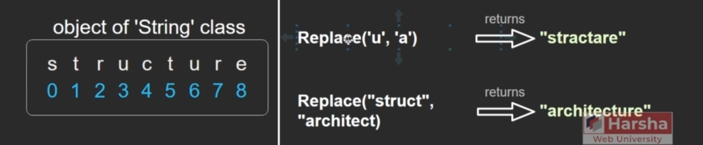

Split:

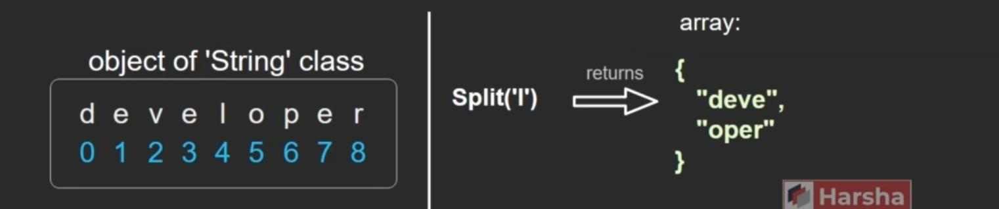

Trim:

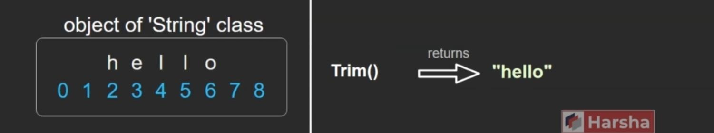

ToCharArray:

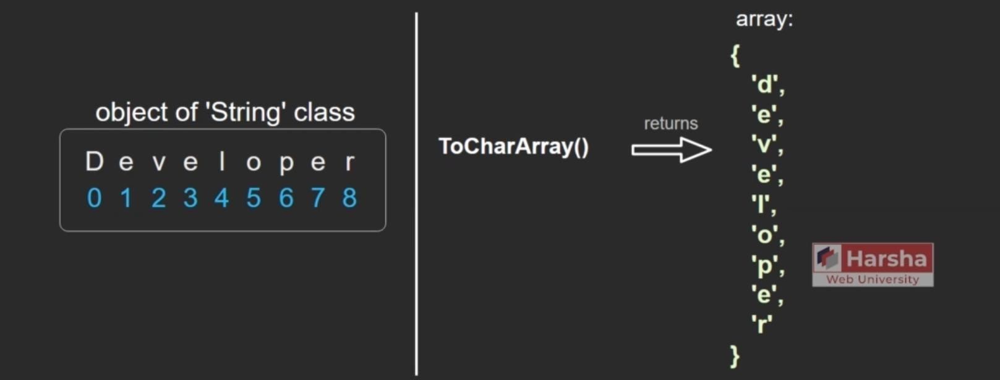

Join:

Equals:

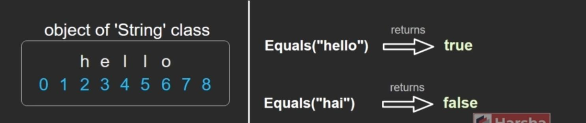

StartsWith:

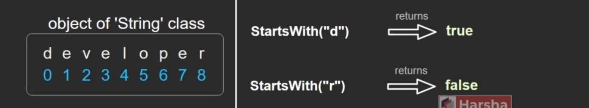

EndsWith:

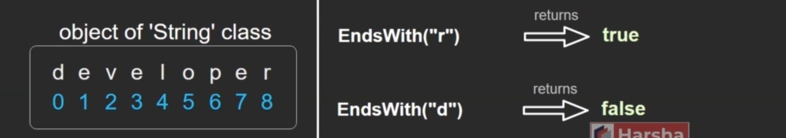

Contains:

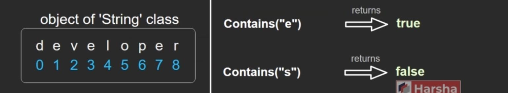

IndexOf:

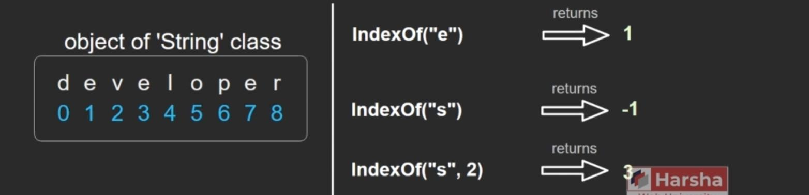

LastIndexOf:

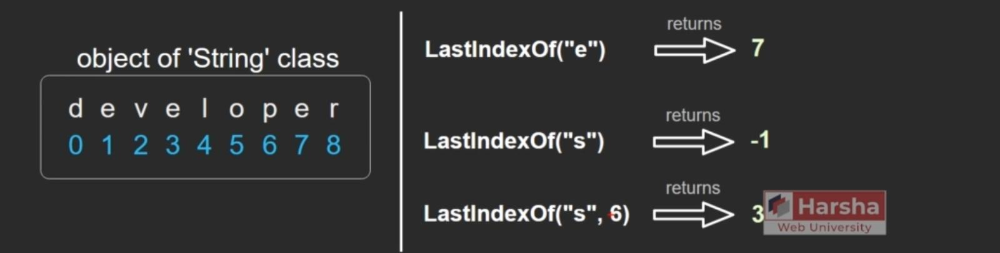

IsNullOrEmpty:

IsNullOrWhiteSpace:

Format & Dollar String:

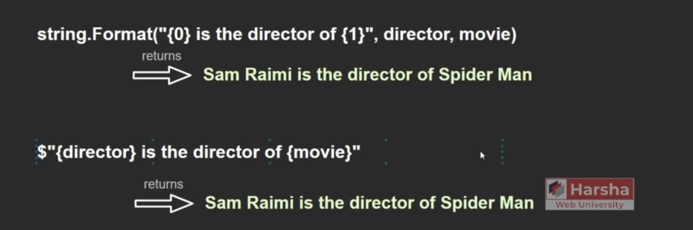

Insert:

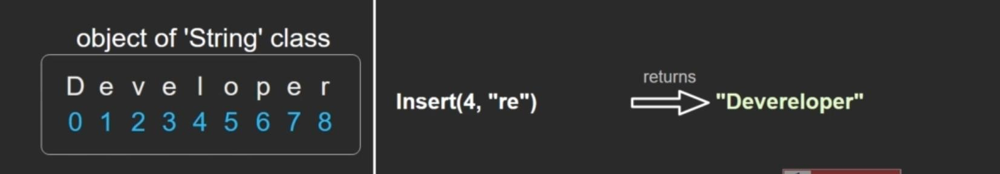

Remove:

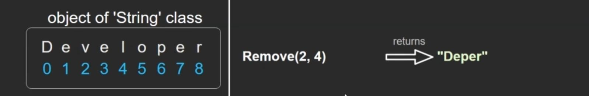

## StringBuilder

Description:

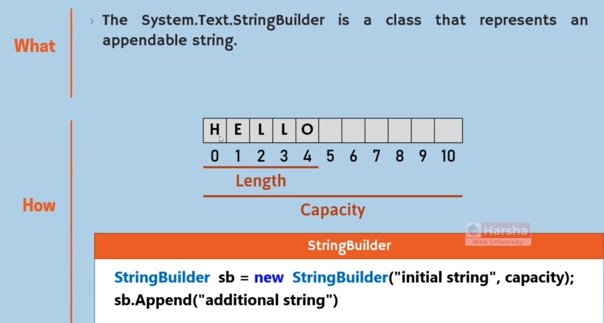

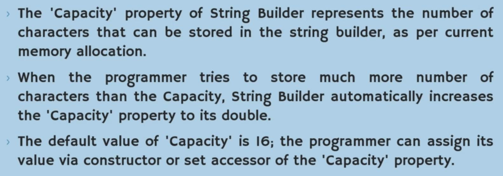

Features:

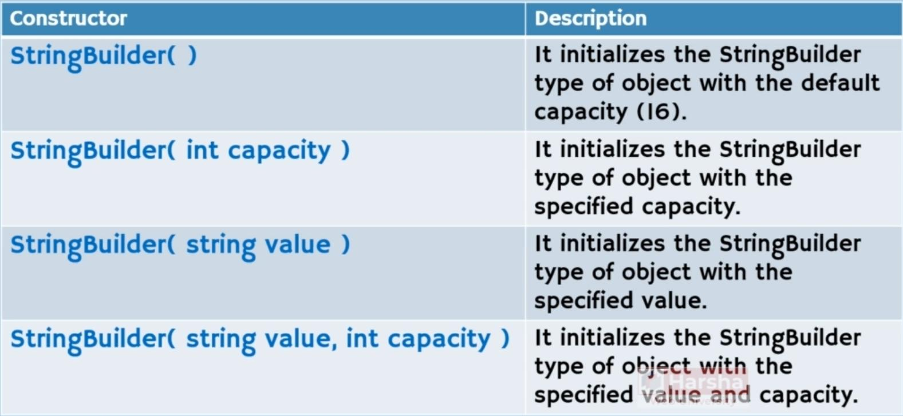

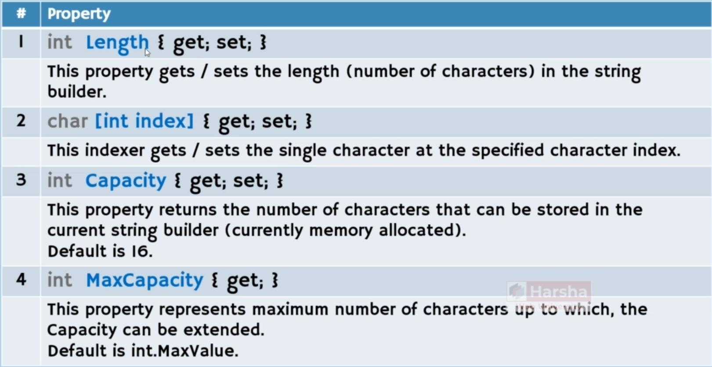

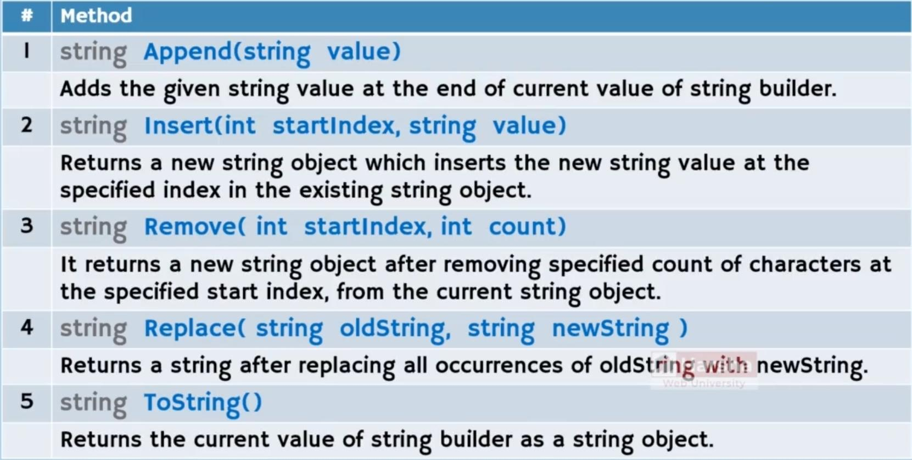

vs Normal String:

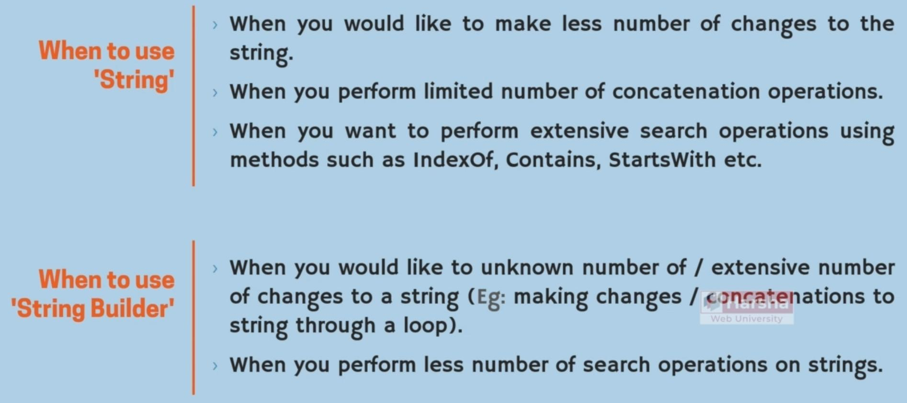
