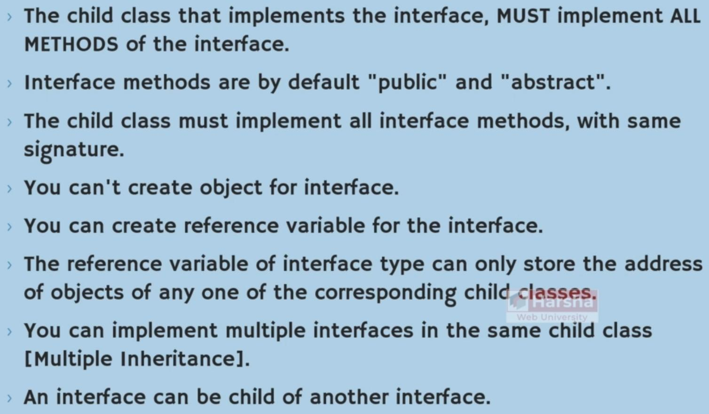
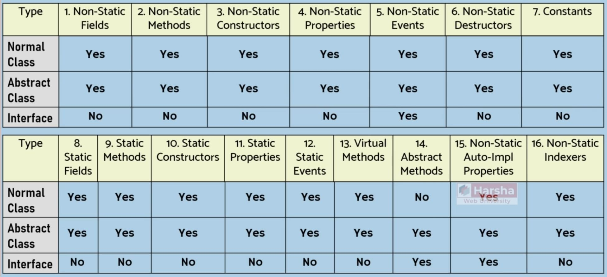
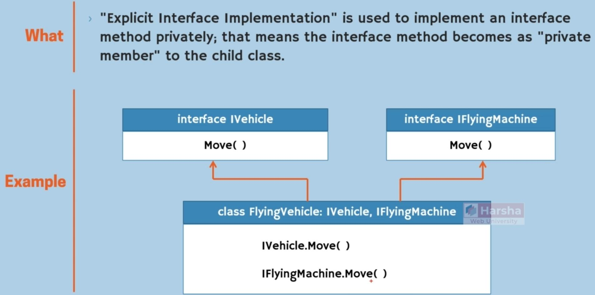
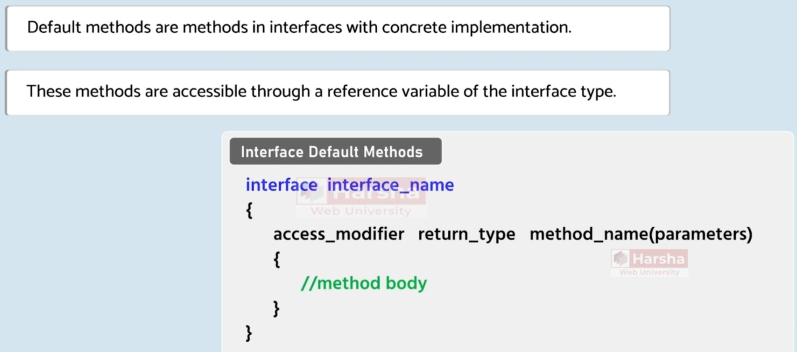
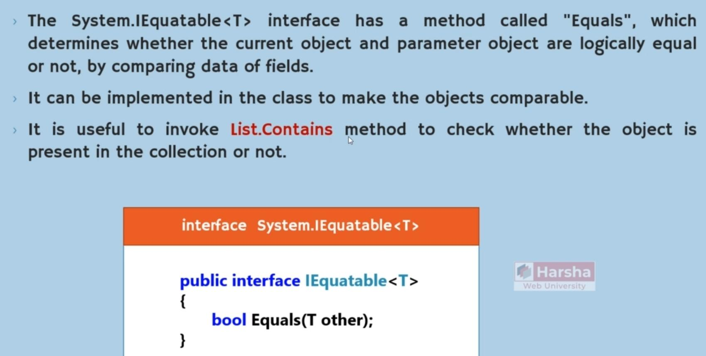
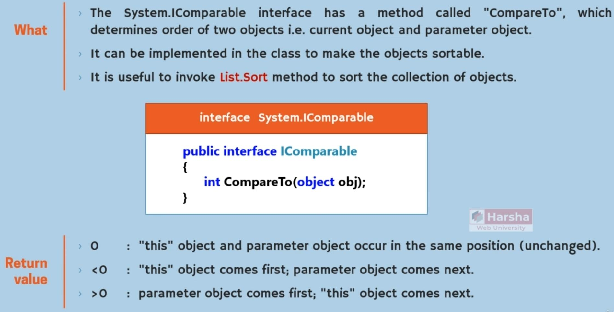
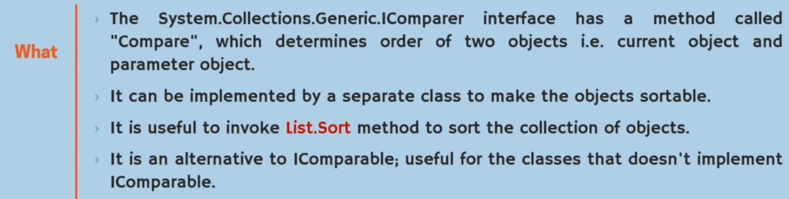
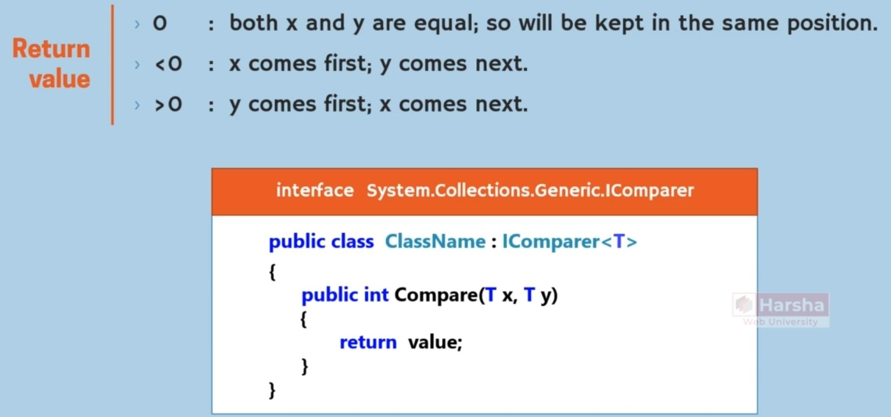
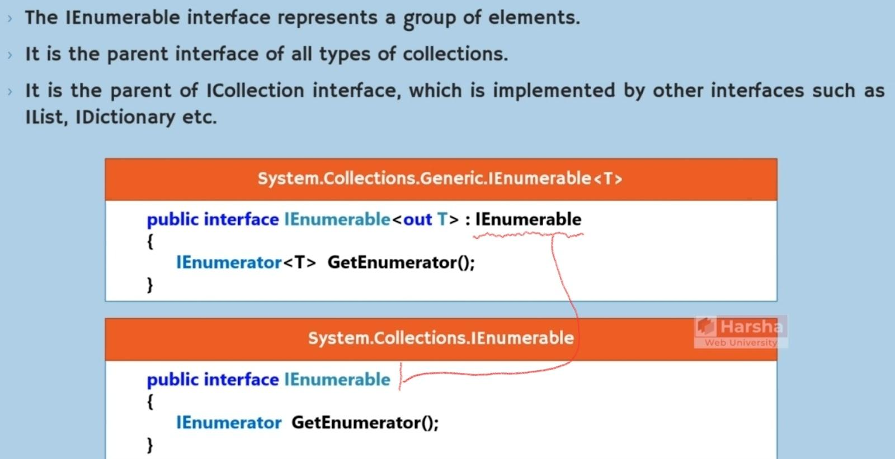
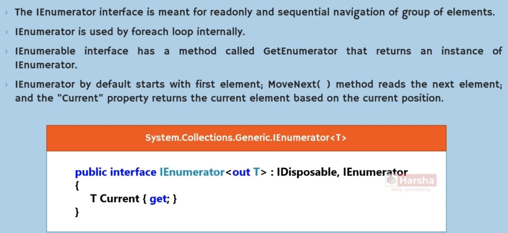

# Interface

## Syntax

## Key Notes

- Interfaces name, should start with capital i
- Interfaces file name, should start with capital i also

## Features

- Can have abstract methods
- Can have setter and getters (properties), but can’t implement them
- Can’t have constructors

## Explicit Implementation

- برای زمانی است که یک متد هم نام داخل دو interface وجود داره و ما لازم داریم که حتما implementation های مختلفی برای هر کدام پیاده کنیم
- در صورتی که یک implementation برای هر دو interface کافی باشد، دیگر نیازی به پیاده سازی آنها به شکل بالا نیست
- در صورت استفاده از explicit implementation این متد ها همگی به صورت اجباری باید private باشند، اما زبان به طور خودکار امکان صدا زدن public آنها به شکل ذکر شده در interface را به ما میدهد!

## Default Method

## Popular Predefined Interfaces

### IEquatable

### IComparable

### IComparer

### IEnumerable

### IEnumerator

