# Array

## Description

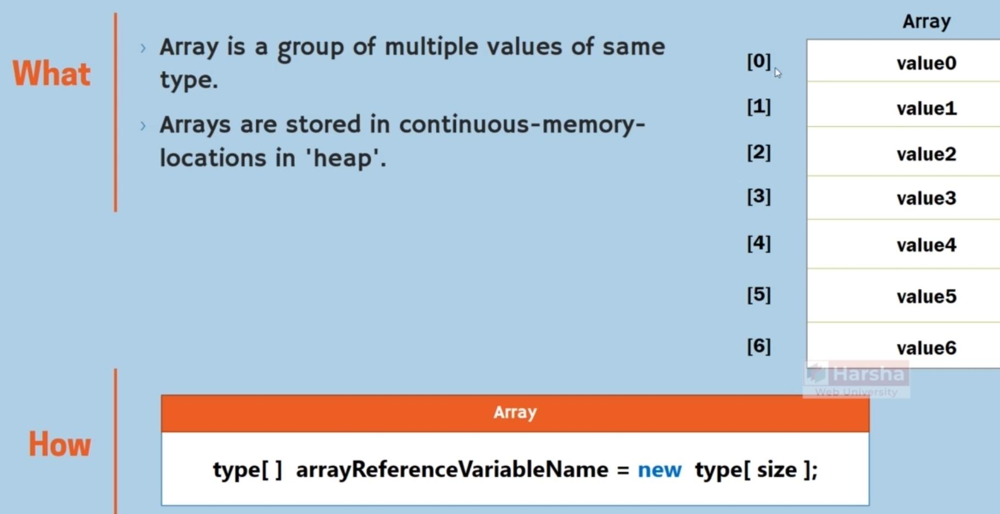

## Key Points

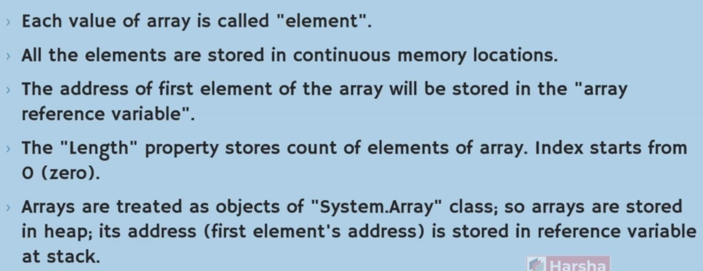

- By default, all of the array elements will store by their default value (int: 0, bool: false, string and other obj: null)
- Arrays will store the reference of objects not the actual object
- Arrays are object, so their elements (regardless of being primitive or non-primitive) will store in heap

## Array Initializer

## Nested Arrays

### Multidimensional Array

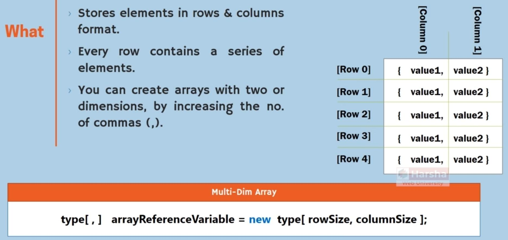

- Childe arrays should be the same size

### Jagged Arrays

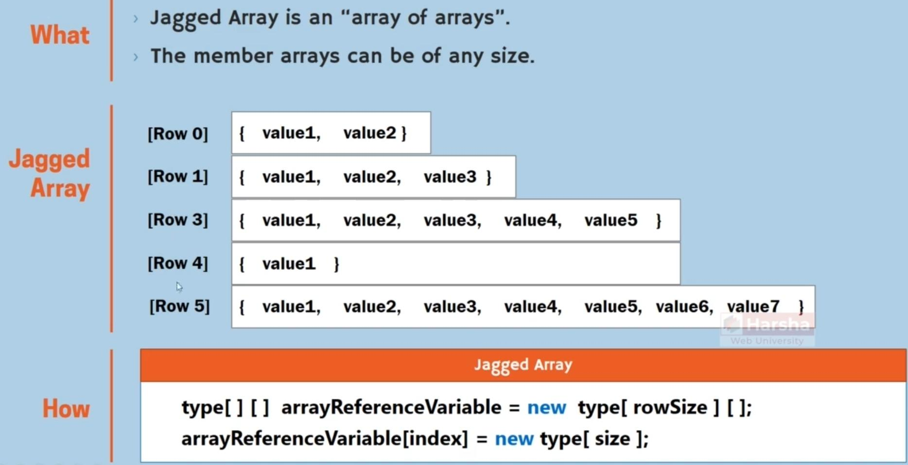

## System.Array

### Features

- All of the arrays internally will convert into this class

### IndexOf

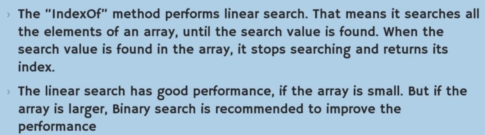

### BinarySearch

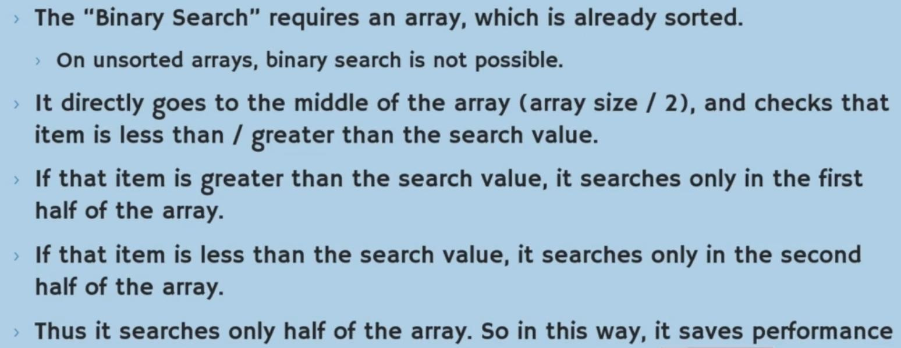

### Clear

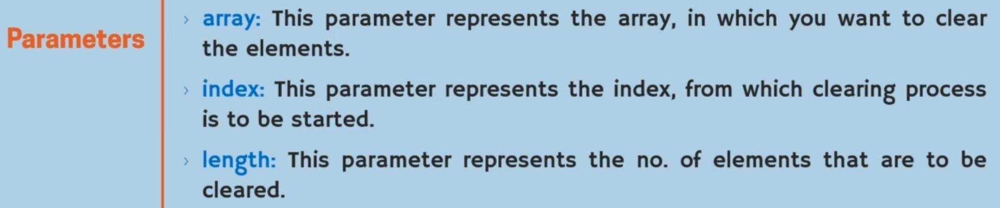

### Resize

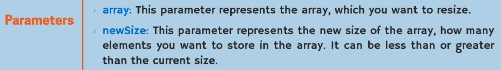

- In case of increase, the new elements will fill with the type default value
- Actually, this method will create a new array and will copy the elements into the new one

### Sort

- By default will sort the array in ascending order

### Reverse

- For sorting an array in descending order, first we should use sort method and then passing the result into this method

### IndexFromEnd and Range Operator

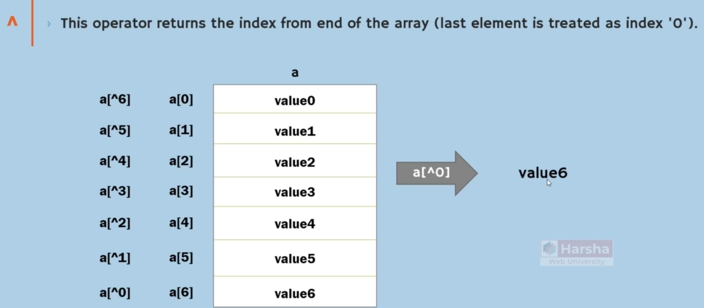

## Copy One Array

### Shallow (CopyTo & Clone)

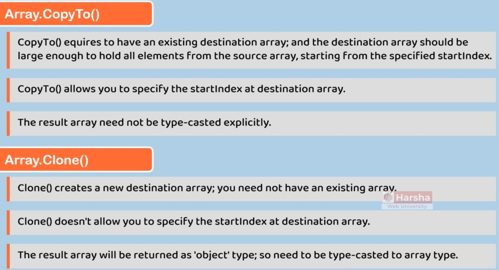

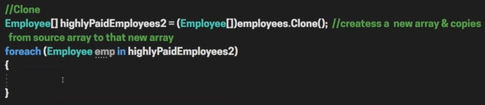

### Deep

There isn’t any specific way for deep copy in .NET but we can write the deep clone behaviour with ICloneable like the below:

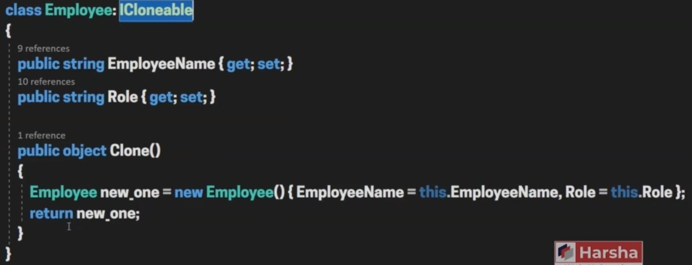

## Anonymous Array

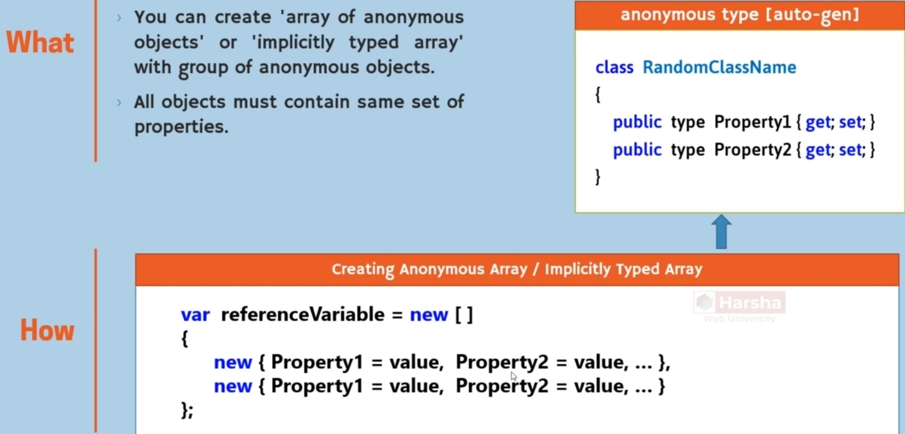
