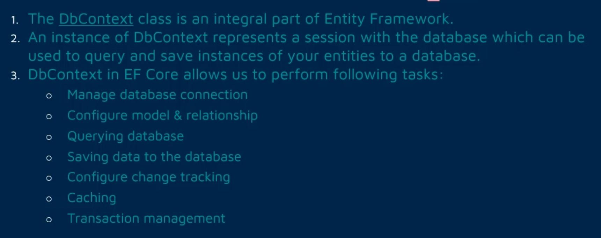
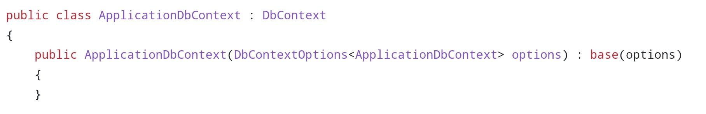
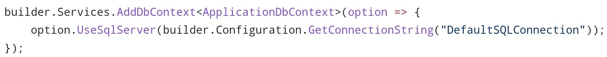
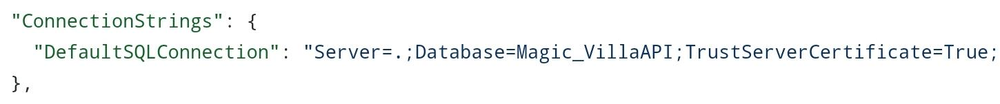

# DB Context & DB Set

## Description

## Syntax

- It should inherit from DbContext
- It should be a public class

## Connecting to Project

For EF inside our project, we should add it into the project services by the below code

- The GetConnectionString method will read the below part of the appsettings.json file

  

## DB Set

Is a property inside of the DbContext that will make one model accessible from the DbContext

